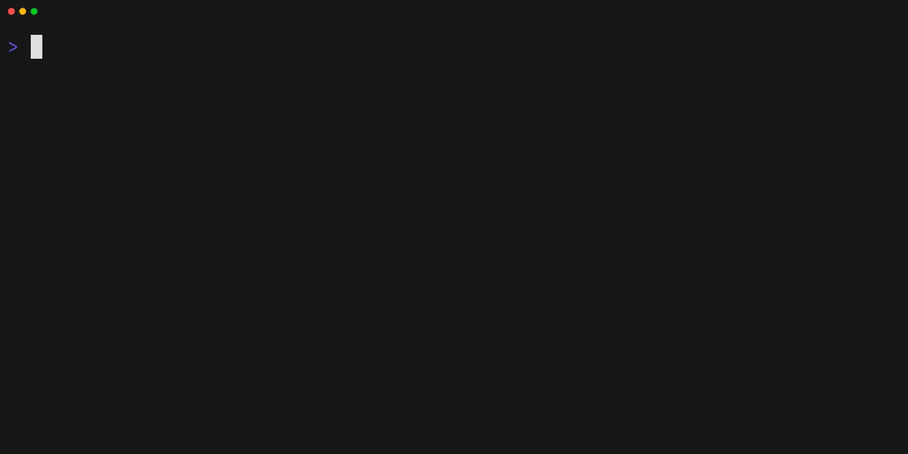

<div align="center">

<h1 align="center">
  <a href="https://mise.jdx.dev">
    <picture>
      <source media="(prefers-color-scheme: dark)" srcset="docs/public/logo-dark.svg" />
      
    </picture>
    <br>
    mise-en-place
  </a>
</h1>

<p>
  <a href="https://crates.io/crates/mise"></a>
  <a href="https://github.com/jdx/mise/blob/main/LICENSE"></a>
  <a href="https://github.com/jdx/mise/actions/workflows/test.yml"></a>
  <a href="https://discord.gg/mABnUDvP57"></a>
</p>

<p><b>Dev tools, env vars, and tasks in one CLI</b></p>

<p align="center">
  <a href="https://mise.jdx.dev/getting-started.html">Getting Started</a> •
  <a href="https://mise.jdx.dev">Documentation</a> •
  <a href="https://mise.jdx.dev/dev-tools/">Dev Tools</a> •
  <a href="https://mise.jdx.dev/environments/">Environments</a> •
  <a href="https://mise.jdx.dev/tasks/">Tasks</a>
</p>

<p align="center">
  Sponsored by<br><br>
  <a href="https://entire.io">
    <picture>
      <source media="(prefers-color-scheme: dark)" srcset="https://jdx.dev/sponsors/entire-lockup.svg">
      
    </picture>
  </a>
  &nbsp;&nbsp;&nbsp;
  <a href="https://omarchy.org/patrons/">
    <picture>
      <source media="(prefers-color-scheme: dark)" srcset="https://jdx.dev/sponsors/omacom-foundation.svg">
      
    </picture>
  </a>
  <br><br>
  <a href="https://jdx.dev/sponsors.html">View all sponsors</a>
</p>

<hr />

</div>

## What is mise?

mise manages your development tools, environment variables, and project tasks.
Declare them in `mise.toml`, commit the file, and use the same setup in your shell,
your editor, and CI.

- **[Tools](https://mise.jdx.dev/dev-tools/):** install Node.js, Python, Go, and [hundreds more](https://mise.jdx.dev/registry.html), with different versions for each project.
- **[Environments](https://mise.jdx.dev/environments/):** set project environment variables and load `.env` files.
- **[Tasks](https://mise.jdx.dev/tasks/):** run build, test, and other commands with the tools and environment they need.
- **[Bootstrap](https://mise.jdx.dev/bootstrap.html):** declare machine setup, including system packages, dotfiles, and services.

Use the parts you need. Start with one tool or task and add more to the same config.

## Quickstart

### 1. Install mise

On macOS or Linux:

```sh
curl https://mise.run | sh
~/.local/bin/mise --version
```

On Windows, install with `winget install jdx.mise`. See the
[installation guide](https://mise.jdx.dev/installing-mise.html) for package managers
and other installation methods.

The examples below use `mise`. If it isn't on your `PATH` yet, use
`~/.local/bin/mise` instead on macOS or Linux.

### 2. Try a tool

```sh
mise exec node@24 -- node --version
```

This installs Node.js if needed and runs it for this command, without changing
your project configuration. No shell activation is required.

For an existing project that already has a reviewed `mise.toml`, run `mise install`
from its directory and `mise tasks ls` to discover its tasks.

### 3. Give a project its own environment

In a project directory, create `mise.toml`:

```toml
[tools]
node = "24"

[env]
NODE_ENV = "development"

[tasks.hello]
description = "Print the project's Node.js version and environment"
run = '''node -e "console.log(process.version, process.env.NODE_ENV)"'''
```

Run the task:

```sh
mise run hello
```

mise installs the configured tool if needed, loads `NODE_ENV`, and runs the task.
The output includes the Node.js version and `development`. Commit `mise.toml` so
teammates and CI can run the same command.

To add tools later, run `mise use python@3.14` from the project directory.
Use `mise use --global` to set personal defaults. Version requests such as `"24"`
select a release in that series; use [exact pins or a lockfile](https://mise.jdx.dev/dev-tools/mise-lock.html)
when you need everyone to use the same resolved version.

### 4. Activate your shell (optional)

Activation makes project tools and environment variables available directly when
you enter a directory. For an installation from `mise.run`, add **one** of these
lines to the corresponding shell config:

```bash
# ~/.bashrc
eval "$(~/.local/bin/mise activate bash)"
```

```zsh
# ~/.zshrc
eval "$(~/.local/bin/mise activate zsh)"
```

```fish
# ~/.config/fish/config.fish
~/.local/bin/mise activate fish | source
```

Restart your shell, then run `node --version` inside the project. For PowerShell
and other installation methods, follow the
[shell setup guide](https://mise.jdx.dev/getting-started.html#activate-mise).

## Check your project setup

```sh
mise config ls
mise ls --current
mise exec -- node --version
```

These show which configuration files are loaded, which versions are selected,
and whether the tool runs in the project environment. If `mise exec` works but
`node --version` does not, check shell activation with `mise doctor`.

## Where to go next

| I want to…                             | Read                                                                                                                                      |
| -------------------------------------- | ----------------------------------------------------------------------------------------------------------------------------------------- |
| Set up mise for the first time         | [Getting started](https://mise.jdx.dev/getting-started.html)                                                                              |
| Add mise to an existing project        | [Walkthrough](https://mise.jdx.dev/walkthrough.html)                                                                                      |
| Understand configuration and overrides | [Configuration](https://mise.jdx.dev/configuration.html)                                                                                  |
| Use mise in an editor or CI            | [IDE integration](https://mise.jdx.dev/ide-integration.html) · [Continuous integration](https://mise.jdx.dev/continuous-integration.html) |
| Find a command or solve a problem      | [CLI reference](https://mise.jdx.dev/cli/) · [Troubleshooting](https://mise.jdx.dev/troubleshooting.html)                                 |
| Contribute to mise                     | [Contributing](CONTRIBUTING.md) · [Writing docs](docs/README.md)                                                                          |

## Demo

Watch mise install tools and switch Node.js versions as you change directories.

[](https://mise.jdx.dev/demo.html)

A [text transcript](https://mise.jdx.dev/demo.html) is also available.

## GitHub Issues & Discussions

Use [GitHub Discussions](https://github.com/jdx/mise/discussions) for support and
feature requests. GitHub Issues are not used for new reports.

- [Troubleshooting & Bug Reports](https://github.com/jdx/mise/discussions/categories/troubleshooting-and-bug-reports): include a minimal config, the command you ran, expected behavior, and relevant error output. See the [troubleshooting guide](https://mise.jdx.dev/troubleshooting.html) first.
- [Ideas](https://github.com/jdx/mise/discussions/categories/ideas): suggest a feature or describe a workflow mise could support.
- [Announcements](https://github.com/jdx/mise/discussions/categories/announcements): follow project updates.

## Special Thanks

<p>
  <a href="https://namespace.so">
    
  </a>
  <br>
  Thanks to <a href="https://namespace.so">Namespace</a> for providing CI services for mise.
</p>

## Contributors

[](https://github.com/jdx/mise/graphs/contributors)
