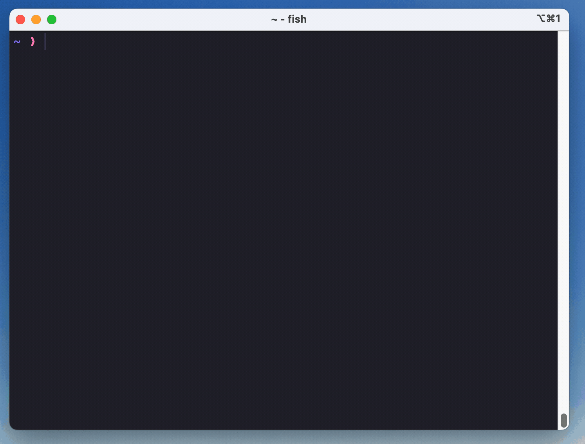

<div align="center">
<h1><a href="https://mise.jdx.dev">
  <br />
  mise-en-place
</a></h1>
<!-- <a href="https://mise.jdx.dev"><picture> -->
<!--   <source media="(prefers-color-scheme: dark)" width="617" srcset="./docs/logo-dark@2x.png"> -->
<!--    -->
<!-- </picture></a> -->
<a href="https://crates.io/crates/mise"></a>
<a href="https://github.com/jdx/mise/blob/main/LICENSE"></a>
<a href="https://github.com/jdx/mise/actions/workflows/test.yml"></a>
<a href="https://app.codacy.com/gh/jdx/mise/dashboard?utm_source=gh&utm_medium=referral&utm_content=&utm_campaign=Badge_coverage"></a>
<a href="https://discord.gg/mABnUDvP57"></a>
<p><em>The front-end to your dev env.</em></p>
</div>

## What is it?

- Like [asdf](https://asdf-vm.com) (or [nvm](https://github.com/nvm-sh/nvm) or [pyenv](https://github.com/pyenv/pyenv) but for any language) it manages [dev tools](https://mise.jdx.dev/dev-tools/) like node, python, cmake, terraform, and [hundreds more](https://mise.jdx.dev/plugins.html).
- Like [direnv](https://github.com/direnv/direnv) it manages [environment variables](https://mise.jdx.dev/environments.html) for different project directories.
- Like [make](https://www.gnu.org/software/make/manual/make.html) it manages [tasks](https://mise.jdx.dev/tasks/) used to build and test projects.

## 30 Second Demo

The following shows using mise to install different versions
of [node](https://nodejs.org).
Note that calling `which node` gives us a real path to node, not a shim.

[](./docs/demo.gif)

## Quickstart

Install mise (other methods [here](https://mise.jdx.dev/getting-started.html)):

```sh-session
$ curl https://mise.run | sh
$ ~/.local/bin/mise --version
2024.9.9 macos-arm64 (a1b2d3e 2024-09-25)
```

or install a specific a version:

```sh-session
$ curl https://mise.run | MISE_VERSION=v2024.5.16 sh
$ ~/.local/bin/mise --version
2024.5.16 macos-arm64 (8838098 2024-05-14)
```

Hook mise into your shell (pick the right one for your shell):

```sh-session
# note this assumes mise is located at ~/.local/bin/mise
# which is what https://mise.run does by default
echo 'eval "$(~/.local/bin/mise activate bash)"' >> ~/.bashrc
echo 'eval "$(~/.local/bin/mise activate zsh)"' >> ~/.zshrc
echo '~/.local/bin/mise activate fish | source' >> ~/.config/fish/config.fish
```

Install a runtime and set it as the global default:

```sh-session
$ mise use --global node@20
$ node -v
v20.0.0
```

## Full Documentation

See [mise.jdx.dev](https://mise.jdx.dev)

## Contributors

[](https://github.com/jdx/mise/graphs/contributors)
