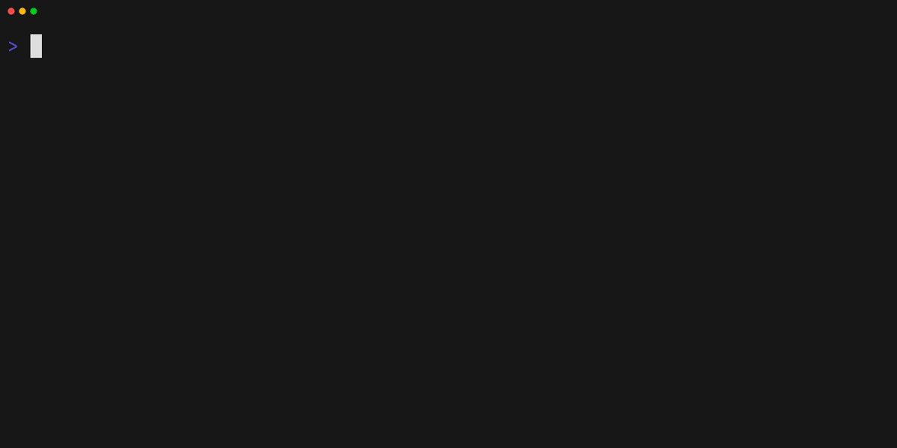

<div align="center">

<h1 align="center">
  <a href="https://mise.jdx.dev">
    
    <br>
    mise-en-place
  </a>
</h1>

<p>
  <a href="https://crates.io/crates/mise"></a>
  <a href="https://github.com/jdx/mise/blob/main/LICENSE"></a>
  <a href="https://github.com/jdx/mise/actions/workflows/test.yml"></a>
  <a href="https://discord.gg/mABnUDvP57"></a>
</p>

<p><b>The front-end to your dev env</b></p>

<p align="center">
  <a href="https://mise.jdx.dev/getting-started.html">Getting Started</a> •
  <a href="https://mise.jdx.dev">Documentation</a> •
  <a href="https://mise.jdx.dev/dev-tools/">Dev Tools</a> •
  <a href="https://mise.jdx.dev/environments/">Environments</a> •
  <a href="https://mise.jdx.dev/tasks/">Tasks</a>
</p>

<hr />

</div>

## What is it?

- Like [asdf](https://asdf-vm.com) (or [nvm](https://github.com/nvm-sh/nvm) or [pyenv](https://github.com/pyenv/pyenv) but for any language) it manages [dev tools](https://mise.jdx.dev/dev-tools/) like node, python, cmake, terraform, and [hundreds more](https://mise.jdx.dev/registry.html).
- Like [direnv](https://github.com/direnv/direnv) it manages [environment variables](https://mise.jdx.dev/environments/) for different project directories.
- Like [make](https://www.gnu.org/software/make/manual/make.html) it manages [tasks](https://mise.jdx.dev/tasks/) used to build and test projects.

## Demo

The following demo shows how to install and use `mise` to manage multiple versions of `node` on the same system.
Note that calling `which node` gives us a real path to node, not a shim.

It also shows that you can use `mise` to install and many other tools such as `jq`, `terraform`, or `go`.

[](https://mise.jdx.dev/demo.html)

See [demo transcript](https://mise.jdx.dev/demo.html).

## Quickstart

### Install mise

See [Getting started](https://mise.jdx.dev/getting-started.html) for more options.

```sh-session
$ curl https://mise.run | sh
$ ~/.local/bin/mise --version
              _                                        __
   ____ ___  (_)_______        ___  ____        ____  / /___ _________
  / __ `__ \/ / ___/ _ \______/ _ \/ __ \______/ __ \/ / __ `/ ___/ _ \
 / / / / / / (__  )  __/_____/  __/ / / /_____/ /_/ / / /_/ / /__/  __/
/_/ /_/ /_/_/____/\___/      \___/_/ /_/     / .___/_/\__,_/\___/\___/
                                            /_/                 by @jdx
2026.1.2 macos-arm64 (2026-01-13)
```

Hook mise into your shell (pick the right one for your shell):

```sh-session
# note this assumes mise is located at ~/.local/bin/mise
# which is what https://mise.run does by default
echo 'eval "$(~/.local/bin/mise activate bash)"' >> ~/.bashrc
echo 'eval "$(~/.local/bin/mise activate zsh)"' >> ~/.zshrc
echo '~/.local/bin/mise activate fish | source' >> ~/.config/fish/config.fish
echo '~/.local/bin/mise activate pwsh | Out-String | Invoke-Expression' >> ~/.config/powershell/Microsoft.PowerShell_profile.ps1
```

### Execute commands with specific tools

```sh-session
$ mise exec node@24 -- node -v
mise node@24.x.x ✓ installed
v24.x.x
```

### Install tools

```sh-session
$ mise use --global node@24 go@1
$ node -v
v24.x.x
$ go version
go version go1.x.x macos/arm64
```

See [dev tools](https://mise.jdx.dev/dev-tools/) for more examples.

### Manage environment variables

```toml
# mise.toml
[env]
SOME_VAR = "foo"
```

```sh-session
$ mise set SOME_VAR=bar
$ echo $SOME_VAR
bar
```

Note that `mise` can also [load `.env` files](https://mise.jdx.dev/environments/#env-directives).

### Run tasks

```toml
# mise.toml
[tasks.build]
description = "build the project"
run = "echo building..."
```

```sh-session
$ mise run build
building...
```

See [tasks](https://mise.jdx.dev/tasks/) for more information.

### Example mise project

Here is a combined example to give you an idea of how you can use mise to manage your a project's tools, environment, and tasks.

```toml
# mise.toml
[tools]
terraform = "1"
aws-cli = "2"

[env]
TF_WORKSPACE = "development"
AWS_REGION = "us-west-2"
AWS_PROFILE = "dev"

[tasks.plan]
description = "Run terraform plan with configured workspace"
run = """
terraform init
terraform workspace select $TF_WORKSPACE
terraform plan
"""

[tasks.validate]
description = "Validate AWS credentials and terraform config"
run = """
aws sts get-caller-identity
terraform validate
"""

[tasks.deploy]
description = "Deploy infrastructure after validation"
depends = ["validate", "plan"]
run = "terraform apply -auto-approve"
```

Run it with:

```sh-session
mise install # install tools specified in mise.toml
mise run deploy
```

Find more examples in the [mise cookbook](https://mise.jdx.dev/mise-cookbook/).

## Full Documentation

See [mise.jdx.dev](https://mise.jdx.dev)

## GitHub Issues & Discussions

Due to the volume of issue submissions mise received, using GitHub Issues became unsustainable for
the project. Instead, mise uses GitHub Discussions which provide a more community-centric platform
for communication and require less management on the part of the maintainers.

Please note the following discussion categories, which match how issues are often used:

- [Announcements](https://github.com/jdx/mise/discussions/categories/announcements)
- [Ideas](https://github.com/jdx/mise/discussions/categories/ideas): for feature requests, etc.
- [Troubleshooting & Bug Reports](https://github.com/jdx/mise/discussions/categories/troubleshooting-and-bug-reports)

## Special Thanks

We're grateful for Cloudflare's support through [Project Alexandria](https://www.cloudflare.com/lp/project-alexandria/).

## Contributors

[](https://github.com/jdx/mise/graphs/contributors)
