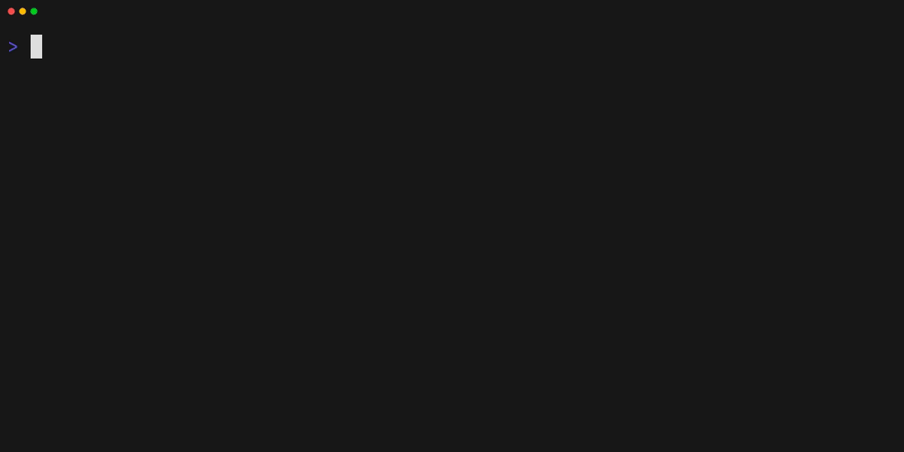

<div align="center">

<h1 align="center">
  <a href="https://mise.jdx.dev">
    <picture>
      <source media="(prefers-color-scheme: dark)" srcset="docs/public/logo-dark.svg" />
      
    </picture>
    <br>
    mise-en-place
  </a>
</h1>

<p>
  <a href="https://crates.io/crates/mise"></a>
  <a href="https://github.com/jdx/mise/blob/main/LICENSE"></a>
  <a href="https://github.com/jdx/mise/actions/workflows/test.yml"></a>
  <a href="https://discord.gg/mABnUDvP57"></a>
</p>

<p align="center">
  <a href="https://www.star-history.com/jdx/mise">
    <picture><source media="(prefers-color-scheme: dark)" srcset="https://api.star-history.com/badge?repo=jdx/mise&type=rank&theme=dark" /><source media="(prefers-color-scheme: light)" srcset="https://api.star-history.com/badge?repo=jdx/mise&type=rank" /></picture> <picture><source media="(prefers-color-scheme: dark)" srcset="https://api.star-history.com/badge?repo=jdx/mise&type=trending&theme=dark" /><source media="(prefers-color-scheme: light)" srcset="https://api.star-history.com/badge?repo=jdx/mise&type=trending" /></picture>
  </a>
</p>

<p><b>Dev tools, env vars, and tasks in one CLI</b></p>

<p align="center">
  <a href="https://mise.jdx.dev/getting-started.html">Getting started</a> •
  <a href="https://mise.jdx.dev">Docs</a> •
  <a href="https://mise.jdx.dev/dev-tools/">Dev tools</a> •
  <a href="https://mise.jdx.dev/environments/">Environments</a> •
  <a href="https://mise.jdx.dev/tasks/">Tasks</a> •
  <a href="https://mise.jdx.dev/bootstrap.html">Bootstrap</a>
</p>

<p align="center">
  Sponsored by<br><br>
  <a href="https://entire.io">
    <picture>
      <source media="(prefers-color-scheme: dark)" srcset="https://jdx.dev/sponsors/entire-lockup.svg">
      
    </picture>
  </a>
  &nbsp;&nbsp;&nbsp;
  <a href="https://omarchy.org/patrons/">
    <picture>
      <source media="(prefers-color-scheme: dark)" srcset="https://jdx.dev/sponsors/omacom-foundation.svg">
      
    </picture>
  </a>
  <br><br>
  <a href="https://jdx.dev/sponsors.html">View all sponsors</a>
</p>

<hr />

</div>

## What is mise?

mise (pronounced "meez", short for _mise-en-place_) installs a project's tools,
sets its environment variables, and runs its tasks from one `mise.toml` that
works in your shell, editor, and CI. With `mise bootstrap`, it can also set up a
whole machine: packages, dotfiles, and services.

- Install [tools](https://mise.jdx.dev/dev-tools/) such as Node.js, Python, and
  Terraform from a [registry of 1,000+](https://mise.jdx.dev/registry.html),
  with a different version in each project.
- Set [environment variables](https://mise.jdx.dev/environments/) and load
  `.env` files for each project.
- Run [tasks](https://mise.jdx.dev/tasks/), such as build and test, with the
  project's tools and environment variables.
- Set up a machine with [`mise bootstrap`](https://mise.jdx.dev/bootstrap.html),
  which applies the system packages, [dotfiles](https://mise.jdx.dev/dotfiles.html),
  repositories, and services you declare for it.

Use only the parts you need. You can start with one tool or one task.

## Demo

Watch mise run a tool once with `mise exec`, set global defaults, and switch
Node.js versions as you move into and out of a project.

[](https://mise.jdx.dev/demo.html)

The [demo transcript](https://mise.jdx.dev/demo.html#transcript) lists the
commands with current versions.

## Quickstart

### 1. Install mise

On macOS or Linux:

```sh
curl -fsSL https://mise.run | sh
~/.local/bin/mise --version
```

On Windows, run `winget install jdx.mise`. For Homebrew, apt, Scoop, and other
methods, see [Installing mise](https://mise.jdx.dev/installing-mise.html).

The installer puts mise in `~/.local/bin`. If that directory is not on your
`PATH`, type `~/.local/bin/mise` wherever the steps below say `mise`, until you
activate mise in step 4.

### 2. Try a tool

```sh
mise exec node@24 -- node --version
# v24.x.x
```

`mise exec` installs Node.js 24 if needed and runs one command with it. It does
not change your shell or any config file, and it works without activation.

### 3. Set up a project

```sh
mkdir my-project && cd my-project
mise use node@24
```

`mise use` installs Node.js 24 and writes it to a new `mise.toml`. Add an
environment variable and a task to that file:

```toml
[tools]
node = "24"

[env]
NODE_ENV = "development"

[tasks.hello]
description = "Print the Node.js version and NODE_ENV"
run = 'node -e "console.log(process.version, process.env.NODE_ENV)"'
```

Run the task:

```sh
mise run hello
```

```text
[hello] $ node -e "console.log(process.version, process.env.NODE_ENV)"
v24.x.x development
```

The task runs with the project's Node.js and `NODE_ENV`. Commit `mise.toml` so
teammates and CI get the same setup. `"24"` is a version request for the
Node.js 24 series, not an exact pin; to share exact versions, use a
[lockfile](https://mise.jdx.dev/dev-tools/mise-lock.html). Run
`mise use python@3.14` to add another tool to the project, or
`mise use --global node@24` to set a personal default in
`~/.config/mise/config.toml`.

To see what mise loaded in this directory:

```sh
mise config ls     # config files in use here
mise ls --current  # tool versions selected by those files
mise doctor        # checks the installation and shell activation
```

### 4. Activate mise in your shell (optional)

Activation puts a project's tools on your `PATH` and sets its environment
variables when you enter the project, so you can run `node` without
`mise exec`. If you installed with `mise.run`, run the commands for your
shell once:

```sh
# bash
echo 'eval "$(~/.local/bin/mise activate bash)"' >> ~/.bashrc
```

```sh
# zsh
echo 'eval "$(~/.local/bin/mise activate zsh)"' >> "${ZDOTDIR:-$HOME}/.zshrc"
```

```sh
# fish
mkdir -p ~/.config/fish
echo '~/.local/bin/mise activate fish | source' >> ~/.config/fish/config.fish
```

Open a new shell. In `my-project`, `node --version` now prints `v24.x.x`. For
PowerShell, Nushell, and other shells, or for mise installed another way, see
[Shell setup](https://mise.jdx.dev/shell-setup.html).

## Where to go next

| To                                            | Read                                                                                                                                                             |
| --------------------------------------------- | ---------------------------------------------------------------------------------------------------------------------------------------------------------------- |
| Follow the full tutorial                      | [Getting started](https://mise.jdx.dev/getting-started.html)                                                                                                     |
| Add mise to a project you already work on     | [Existing projects](https://mise.jdx.dev/walkthrough.html)                                                                                                       |
| Join a project that already has a `mise.toml` | Review its config, then run `mise install` and `mise tasks ls` ([details](https://mise.jdx.dev/walkthrough.html#share-the-setup))                                |
| Set up another shell or completions           | [Shell setup](https://mise.jdx.dev/shell-setup.html)                                                                                                             |
| Find a tool                                   | [Registry](https://mise.jdx.dev/registry.html)                                                                                                                   |
| Use mise in an editor or CI                   | [Editors and IDEs](https://mise.jdx.dev/ide-integration.html) · [Continuous integration](https://mise.jdx.dev/continuous-integration.html)                       |
| Learn the main features                       | [Dev tools](https://mise.jdx.dev/dev-tools/) · [Environments](https://mise.jdx.dev/environments/) · [Tasks](https://mise.jdx.dev/tasks/)                         |
| Set up a new machine                          | [Bootstrap](https://mise.jdx.dev/bootstrap.html) · [Dotfiles](https://mise.jdx.dev/dotfiles.html)                                                                |
| Look up a command, setting, or config key     | [CLI reference](https://mise.jdx.dev/cli/) · [Settings](https://mise.jdx.dev/configuration/settings.html) · [mise.toml](https://mise.jdx.dev/configuration.html) |
| Fix a problem                                 | [Troubleshooting](https://mise.jdx.dev/troubleshooting.html) · [FAQ](https://mise.jdx.dev/faq.html)                                                              |
| Contribute to mise or its docs                | [Contributing](CONTRIBUTING.md) · [Writing docs](docs/README.md)                                                                                                 |

## Get help

- Report bugs in [GitHub Issues](https://github.com/jdx/mise/issues). Check
  [Troubleshooting](https://mise.jdx.dev/troubleshooting.html) first, and
  include the command you ran, a minimal `mise.toml`, the expected and actual
  behavior, and your `mise doctor` output after you review it for private
  details.
- Ask questions and share ideas in
  [GitHub Discussions](https://github.com/jdx/mise/discussions).
- Chat with other users on [Discord](https://discord.gg/mABnUDvP57).

For security reports and other contacts, see
[Contact](https://mise.jdx.dev/contact.html). Before you use AI to reply to an
Issue or Discussion, read the
[AI reply policy](https://mise.jdx.dev/contributing.html#community-participation).

## Special thanks

<p>
  <a href="https://namespace.so">
    
  </a>
  <br>
  Thanks to <a href="https://namespace.so">Namespace</a> for providing CI services for mise.
</p>

## Contributors

[](https://github.com/jdx/mise/graphs/contributors)
