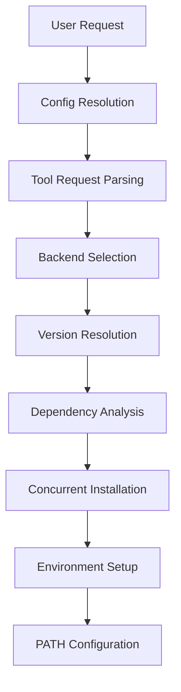
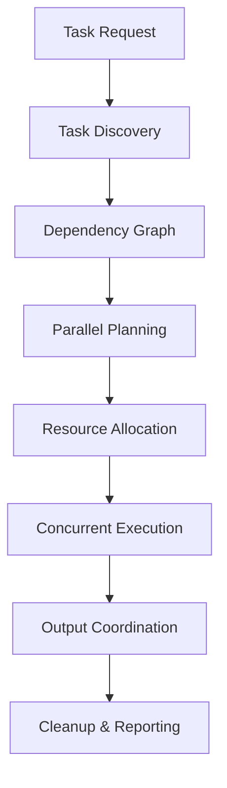
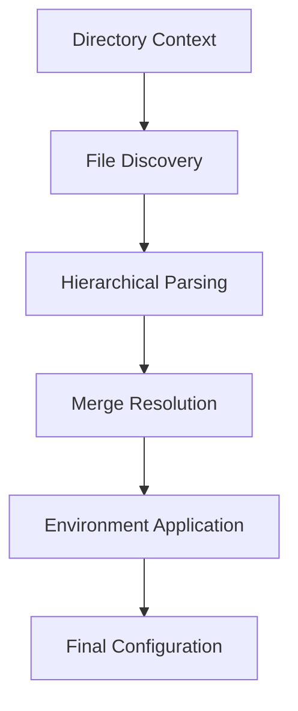

# mise Architecture

This document provides a comprehensive overview of mise's architecture, designed primarily for contributors and those interested in understanding how mise works internally.

## System Overview

mise is a Rust-based tool with a modular architecture centered around three core concepts:

1. **Tool Version Management** - Installing and managing different versions of development tools
2. **Environment Management** - Setting up environment variables and project contexts  
3. **Task Running** - Executing project tasks with dependency management

These three pillars work together to provide a unified development environment management experience.

## Core Architecture Components

### 1. Entry Point and Runtime (`src/main.rs`)

mise uses an asynchronous architecture built on Tokio:

- **Multi-threaded Runtime**: Configurable worker threads (default: number of CPU cores, minimum 8)
- **Global Error Handling**: Centralized error management with `color_eyre`
- **CLI Argument Processing**: Entry point for all user interactions
- **Multi-Progress Reporting**: Coordinated progress display for concurrent operations

### 2. Command Layer (`src/cli/`)

The CLI layer provides the user interface and delegates to core functionality:

- **Modular Commands**: Each command is a separate module (`install.rs`, `use.rs`, `run.rs`, etc.)
- **Argument Parsing**: Leverages `clap` for robust CLI parsing and validation
- **Async Command Execution**: All commands support concurrent operations
- **Unified Error Handling**: Consistent error reporting across all commands

**Key Commands Architecture:**
- `install` - Tool installation coordination
- `use` - Tool activation and configuration management
- `run` - Task execution with dependency resolution
- `env` - Environment variable management
- `shell` - Shell integration and activation

### 3. Backend System (`src/backend/`)

The backend system is mise's core abstraction for tool management, implementing a trait-based architecture:

```rust
pub trait Backend: Debug + Send + Sync {
    async fn list_remote_versions(&self) -> Result<Vec<String>>;
    async fn install_version(&self, ctx: &InstallContext, tv: &ToolVersion) -> Result<()>;
    async fn uninstall_version(&self, tv: &ToolVersion) -> Result<()>;
    // ... additional methods for lifecycle management
}
```

**Backend Categories:**
- **Core Backends**: Native Rust implementations for maximum performance
- **Language Package Managers**: npm, pipx, cargo, gem, go modules
- **Universal Installers**: ubi (GitHub releases), aqua (comprehensive package management)
- **Plugin Systems**: asdf (legacy compatibility), vfox (cross-platform)

### 4. Configuration System (`src/config/`)

A hierarchical configuration system that merges settings from multiple sources:

**Config Trait Architecture:**
```rust
pub trait ConfigFile: Debug + Send + Sync {
    fn get_path(&self) -> &Path;
    fn to_tool_request_set(&self) -> Result<ToolRequestSet>;
    fn env_entries(&self) -> Result<Vec<EnvDirective>>;
    fn tasks(&self) -> Vec<&Task>;
    // ... additional configuration methods
}
```

**Concrete Implementations:**
- `MiseToml` - Primary configuration format with full feature support
- `ToolVersions` - asdf compatibility layer
- `IdiomaticVersion` - Language-specific version files (`.node-version`, etc.)

**Configuration Hierarchy:**
1. System config (`/etc/mise/config.toml`) - Highest precedence
2. Global user config (`~/.config/mise/config.toml`)
3. Project configs (searched up directory tree)
4. Environment-specific configs (`mise.{ENV}.toml`)

### 5. Toolset Management (`src/toolset/`)

Coordinates tool resolution, installation, and environment setup:

**Core Components:**
- `Toolset` - Immutable collection of resolved tools for a context
- `ToolVersion` - Represents a specific, resolved tool version
- `ToolRequest` - User's tool specification (e.g., `node@18`, `python@latest`)
- `ToolsetBuilder` - Constructs toolsets from configuration with dependency resolution

**Tool Resolution Pipeline:**
1. **Configuration Parsing**: Extract tool requirements from config files
2. **Version Resolution**: Resolve version specifications (latest, semver ranges, etc.)
3. **Backend Selection**: Choose appropriate backend for each tool
4. **Dependency Analysis**: Resolve tool dependencies (e.g., npm requires Node.js)
5. **Installation Coordination**: Install missing tools in dependency order
6. **Environment Configuration**: Set up PATH and environment variables

### 6. Task System (`src/task/`)

Sophisticated task execution with dependency graph management:

**Architecture Components:**
- `Task` - Task definition with metadata, dependencies, and execution configuration
- `Deps` - Dependency graph manager using `petgraph` for DAG operations
- `TaskFileProvider` - Discovers tasks from files and configuration
- Parallel execution engine with configurable concurrency

**Task Discovery:**
1. File-based tasks from configured directories
2. TOML-defined tasks in configuration files
3. Inherited tasks from parent directories

**Dependency Resolution:**
- Uses directed acyclic graph (DAG) for dependency modeling
- Supports multiple dependency types: `depends`, `depends_post`, `wait_for`
- Parallel execution within dependency constraints
- Circular dependency detection and prevention

### 7. Plugin System (`src/plugins/`)

Extensibility layer supporting multiple plugin architectures:

**Plugin Trait:**
```rust
pub trait Plugin: Debug + Send {
    fn name(&self) -> &str;
    fn path(&self) -> PathBuf;
    async fn install(&self, config: &Arc<Config>, pr: &Box<dyn SingleReport>) -> Result<()>;
    async fn update(&self, pr: &Box<dyn SingleReport>, gitref: Option<String>) -> Result<()>;
    // ... lifecycle management methods
}
```

**Plugin Types:**
- **Core Plugins**: Built into mise binary
- **External Plugins**: Downloaded from repositories
- **Local Plugins**: Custom local implementations

### 8. Shell Integration (`src/shell/`)

Cross-platform shell support with multiple activation methods:

**Shell Trait:**
```rust
pub trait Shell {
    fn activate(&self, opts: ActivateOptions) -> String;
    fn set_env(&self, k: &str, v: &str) -> String;
    fn unset_env(&self, k: &str) -> String;
    // ... shell-specific methods
}
```

**Supported Shells:** Bash, Zsh, Fish, PowerShell, Nushell
**Activation Methods:** PATH modification, shims, exec mode

### 9. Environment Management (`src/env*.rs`)

Comprehensive environment variable and PATH management:

- `EnvDiff` - Tracks and applies environment changes
- `EnvDirective` - Configuration-based environment variable management
- `PathEnv` - Intelligent PATH manipulation with precedence rules
- Context-aware resolution with inheritance

### 10. Caching System (`src/cache.rs`)

High-performance caching with automatic invalidation:

- `CacheManager<T>` - Generic caching with TTL support
- File-based persistence for tool metadata and versions
- Automatic cache invalidation based on timestamps
- Per-backend cache isolation for data integrity

## Key Design Patterns

### Trait-Based Architecture

mise leverages Rust's trait system for extensibility and modularity:

- **Backend Trait**: Uniform interface for all tool installation methods
- **ConfigFile Trait**: Consistent configuration handling across formats
- **Shell Trait**: Cross-platform shell integration
- **Plugin Trait**: Extensible plugin system

### Async/Await Concurrency

All I/O operations use async/await for maximum performance:

- **Parallel Tool Installation**: Multiple tools install concurrently
- **Concurrent Task Execution**: Tasks run in parallel within dependency constraints
- **Non-blocking Operations**: Network requests and file operations don't block the event loop
- **Resource Management**: Semaphores control concurrency limits

### Hierarchical Configuration

Configuration follows a layered approach with clear precedence rules:

- **Inheritance**: Child directories inherit parent configurations
- **Override Semantics**: More specific configurations override general ones
- **Merge Strategies**: Different configuration sections use appropriate merge behavior
- **Environment Contexts**: Support for environment-specific configurations

### Error Handling Strategy

Structured error handling with rich context:

- **eyre Integration**: Provides detailed error reporting with context
- **Error Propagation**: Consistent error handling across async boundaries
- **User-Friendly Messages**: Contextual error messages with suggested solutions
- **Graceful Degradation**: Continues operation when possible despite errors

### Dependency Management

Multiple levels of dependency resolution:

- **Tool Dependencies**: Automatic installation of prerequisite tools
- **Task Dependencies**: DAG-based task execution ordering
- **Configuration Dependencies**: Hierarchical configuration inheritance
- **Plugin Dependencies**: Managed plugin lifecycle with dependencies

## Data Flow Architecture

### Tool Installation Flow



### Task Execution Flow



### Configuration Resolution Flow



## Performance Characteristics

### Optimization Strategies

1. **Aggressive Caching**: Multi-layered caching reduces redundant operations
2. **Parallel Execution**: Concurrent operations maximize throughput
3. **Lazy Loading**: Components initialize only when needed
4. **Efficient Data Structures**: Uses optimized data structures for performance
5. **Memory Management**: Careful memory usage with Arc/Rc for shared data

### Scalability Considerations

- **Large Toolsets**: Efficient handling of projects with many tools
- **Complex Dependencies**: Optimized graph algorithms for dependency resolution
- **Concurrent Users**: Thread-safe design supports multiple concurrent operations
- **Large Repositories**: Efficient handling of large plugin repositories

## Security Model

### Trust and Verification

- **Configuration Trust**: Explicit trust model for configuration files
- **Checksum Verification**: Automatic verification of downloaded tools
- **Signature Validation**: Support for cryptographic signature verification
- **Sandbox Isolation**: Plugin execution isolation where possible

## Testing Architecture

### Test Organization

- **Unit Tests**: Component-level testing with mock dependencies
- **Integration Tests**: Cross-component interaction testing
- **End-to-End Tests**: Full workflow testing with real tools
- **Property Tests**: Randomized testing for edge case discovery

### Test Infrastructure

- **Mock Backends**: Simulate tool installation for testing
- **Temporary Environments**: Isolated test environments
- **Snapshot Testing**: Output consistency verification
- **Performance Benchmarks**: Automated performance regression detection

## Future Architectural Considerations

### Planned Enhancements

1. **GUI/TUI Integration**: Enhanced user interfaces for complex operations
2. **Distributed Caching**: Shared caching across development teams
3. **Container Integration**: Better container and virtualization support
4. **Language Server Protocol**: IDE integration improvements
5. **Plugin Security**: Enhanced plugin sandboxing and verification

### Design Principles

mise's architecture follows these core principles:

- **User Experience First**: Architecture serves usability, not the reverse
- **Performance by Default**: Optimized for common development workflows
- **Extensibility**: Plugin architecture supports diverse ecosystems
- **Reliability**: Robust error handling and recovery mechanisms
- **Cross-Platform**: Consistent behavior across operating systems

This architecture provides a solid foundation for managing complex development environments while remaining approachable for everyday use.