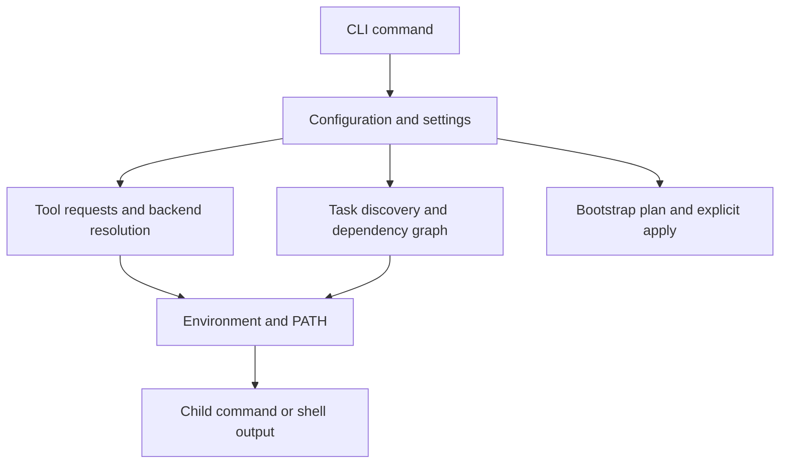

# mise Architecture

This map is for contributors deciding where a behavior belongs. Start with the command
that exposes the behavior, then follow configuration, tool resolution, or task execution
into the owning subsystem. The [contributing guide](/contributing.html) covers setup,
checks, and generated files.

## System Overview

mise combines versioned development tools, environment construction, task execution, and
explicit machine setup through [bootstrap](/bootstrap.html). These features share configuration
and execution helpers, but have different state and side effects. Installing a versioned
tool is not the same operation as applying a host package or dotfile declaration.


```mermaid
flowchart TD
    CLI[CLI command] --> Config[Configuration and settings]
    Config --> Tools[Tool requests and backend resolution]
    Tools --> Env[Environment and PATH]
    Env --> Exec[Child command or shell output]
    Config --> Tasks[Task discovery and dependency graph]
    Tasks --> Env
    Config --> Bootstrap[Bootstrap plan and explicit apply]
```

## Core Architecture Components

### Command Layer

[`src/cli`](https://github.com/jdx/mise/tree/main/src/cli) defines commands with `usage_rs`
derives and dispatches them from `src/cli/mod.rs`. The same usage specification feeds
help, completions, and generated CLI documentation. Change command descriptions at their
source and regenerate the outputs; do not edit generated reference pages by hand.

Commands delegate to subsystem code. Some are synchronous local queries; others perform
asynchronous requests or coordinate concurrent work. Avoid adding installation or network
side effects to a path intended to inspect local state.

Useful entry points are `use.rs` for install-and-select behavior, `install.rs` for installation,
`exec.rs` for a child environment, `run.rs` for tasks, and `bootstrap.rs` for machine setup.
`activate.rs` emits shell integration, while `shell.rs` sets session-specific tool requests.

### Backend System

The [`Backend` trait](https://github.com/jdx/mise/blob/main/src/backend/mod.rs) separates
shared policy from backend-specific metadata, installation, and environment logic. Public
wrapper methods handle common work such as caching and resolution; implementation hooks
such as `_list_remote_versions` and `install_version_` supply backend behavior.

Choose the implementation family that matches the source:

- Native core runtimes live under `src/plugins/core`.
- Release and registry integrations, including packslip, Aqua, GitHub, GitLab, and HTTP,
  live under `src/backend`.
- Language package integrations include npm, pipx, cargo, gem, and Go.
- asdf and vfox adapters bridge external plugin interfaces.

Backend choice can depend on registry metadata, explicit overrides, the requested version,
and a matching lock entry. It is not a one-time choice made after a generic version sorter.
Versions are opaque requests: use backend resolution methods rather than assuming SemVer
or sorting arbitrary installed versions at a new call site.

See [Backend Architecture](/dev-tools/backend_architecture.html) and
[Adding Backends](/contributing.html#adding-backends).

### Configuration System

[`src/config`](https://github.com/jdx/mise/tree/main/src/config) discovers, loads, and merges
configuration. `ConfigFile` implementations include `MiseToml`, `ToolVersions`, and
`IdiomaticVersionFile`. The full precedence rules belong in [Configuration](/configuration.html).

Keep three decisions distinct: which files are discovered, whether they may be trusted or
executed, and how each field merges. Settings, tools, environment directives, tasks, and
bootstrap entries do not all use the same merge strategy. A write command also has its own
[target-file selection](/configuration.html#target-file-for-write-operations).

`settings.toml` defines setting metadata and documentation. TOML examples use TOML 1.1,
including multiline inline tables; a TOML 1.0-only validator will reject valid examples.

### Toolset Management

[`src/toolset`](https://github.com/jdx/mise/tree/main/src/toolset) connects requests to selected
versions and installation state:

| Type             | Role                                                                                  |
| ---------------- | ------------------------------------------------------------------------------------- |
| `ToolRequest`    | A request such as `node@24`, a channel, or a ref, with backend/options context        |
| `ToolVersion`    | A resolved version and its installation metadata                                      |
| `Toolset`        | Requests and resolved versions for the current context                                |
| `ToolsetBuilder` | Combines config, runtime environment overrides, and explicit arguments, then resolves |

Resolution, dependency ordering, installation, and environment construction are related but
separate operations. A read-only listing need not install missing tools. An execution command
may install them according to its settings. Preserve lockfile backend and checksum information
when a request is resolved from a lock entry.

### Task System

[`src/task`](https://github.com/jdx/mise/tree/main/src/task) handles discovery, dependencies,
freshness/cache decisions, and execution. `Task` stores the definition; task file providers
load local and remote sources; `Deps` represents the dependency graph; the executor runs
ready tasks under the configured concurrency and output policy.

`depends` selects prerequisites, `depends_post` selects follow-up tasks, and `wait_for`
orders tasks only when they are already part of the selected graph. Task identity also
includes arguments, environment, and execution phase. Check [Task Architecture](/tasks/architecture.html)
before changing graph construction, duplicate handling, or completion propagation.

### Plugin System

[`src/plugins`](https://github.com/jdx/mise/tree/main/src/plugins) manages plugin sources and
installation metadata. [`crates/vfox`](https://github.com/jdx/mise/tree/main/crates/vfox)
provides the embedded Lua runtime and hook/module interfaces.

Tool hooks manage one SDK, backend hooks manage `plugin:tool` requests, environment hooks
return variables/PATH, and package hooks manage host package batches. asdf adapters execute
legacy shell scripts. Plugin source installation and tool-version installation have separate
state and update operations. See [Plugins](/plugins.html).

### Shell Integration

[`src/shell`](https://github.com/jdx/mise/tree/main/src/shell) emits shell-specific activation
and environment assignments. `mise activate` registers prompt/directory hooks; hook execution
computes an environment diff so mise can undo its previous changes before applying a new
context. `mise exec` constructs a child environment directly and does not need activation.

Preserve native Windows PATH inside mise and child processes. Translation belongs only at
a positively identified shell-output boundary; see the repository's
[agent guide](https://github.com/jdx/mise/blob/main/AGENTS.md) for implementation constraints.

### Environment Management

`src/config/env_directive` evaluates environment directives, `EnvDiff` tracks changes, and
`PathEnv` handles PATH entries. Tool-independent and tool-aware directives run at different
stages. Use the mise-constructed environment when invoking subprocesses; inheriting a stale
process environment can lose preceding directives or use the wrong runtime.

See [Environment Variables](/environments/) and [Templates](/templates.html).

### Bootstrap and host state

`src/cli/bootstrap.rs` coordinates plans and selected phases. Implementations under
`src/system` handle packages, files, edits, repositories, and platform-specific resources.
Status, preview, apply, and prune have distinct contracts. For example, package status must
not install anything, and a selected package batch is not a complete desired-state snapshot.

Read the relevant [bootstrap resource guide](/bootstrap.html) before changing ownership,
confirmation, rollback, or removal behavior. Host-managed state is not generally contained
in a versioned tool's installation directory.

### Caching System

[`src/cache.rs`](https://github.com/jdx/mise/blob/main/src/cache.rs) provides `CacheManager<T>`
with freshness policies and atomic writes. Its serialized cache uses MessagePack with zlib
compression. Other subsystems have their own formats and invalidation rules, including
session-keyed environment caching and local/remote task caches.

A cache key must include every input that changes the result, including relevant options,
environment, and source metadata. See [cache behavior](/cache-behavior.html) for user-visible
refresh controls and limitations.

## Test Architecture

Use the smallest test layer that demonstrates the behavior. Pure resolution or parsing
logic fits a unit test; shell boundaries, installation, and task execution often need an
end-to-end test. Network and host-package tests have prerequisites beyond a Rust compiler.

### Unit Tests

Tests live beside source modules and in workspace crates. The main binary's `src/test.rs`
initializes shared fixture directories and process environment. Tests are configured to run
single-threaded; this is not a fresh process or HOME per individual Rust test. Use existing
guards for temporary environment/current-directory changes and restore them on failure.

### End-to-End Tests

The `e2e` harness runs Bash tests with isolated mise configuration/data/state and temporary
working directories. Start it through `mise run test:e2e`, which builds mise and selects
files through the repository's task wrapper. Host programs and services are still external
prerequisites; isolation does not install Docker, a JDK, or every shell for you.

```sh
mise run test:e2e e2e/cli/test_version
mise run test:e2e '^test_task_'
mise run test:e2e --all
```

The wrapper matches test **basenames**, not directory prefixes. Inspect its current source
with `mise tasks info test:e2e` before changing test-selection instructions.

Use helpers in `e2e/assert.sh` and let the harness manage cleanup. Do not execute test files
directly or add executable permissions just to run them.

### Windows Testing

`e2e-win` uses PowerShell and Pester. Tests should run the emitted commands and check real
child-process behavior, particularly for PATH and activation, rather than only comparing
output strings. See [Windows E2E setup](/contributing.html#windows-e2e-tests).

### Snapshot Testing

`insta` snapshots record structured or user-visible output. Review each changed snapshot
as part of the behavior change; accepting all snapshots is not evidence that the new output
is correct. `mise run snapshots` updates snapshots using the project's task configuration.

### Test Infrastructure Features

The repository has file tasks under `xtasks/test` for E2E selection and performance work.
Slow E2E files end in `_slow` and require `TEST_ALL=1`. The full runner can partition work
with `TEST_TRANCHE` and `TEST_TRANCHE_COUNT`. CI supplies platform dependencies and instrumentation;
a task named `coverage` does not by itself instrument a local binary.

See [Testing](/contributing.html#testing) for exact commands and prerequisites.

## Related Architecture Documentation

- [Task Architecture](/tasks/architecture.html).
- [Backend Architecture](/dev-tools/backend_architecture.html).
- [Configuration](/configuration.html).
- [Contributing](/contributing.html).
