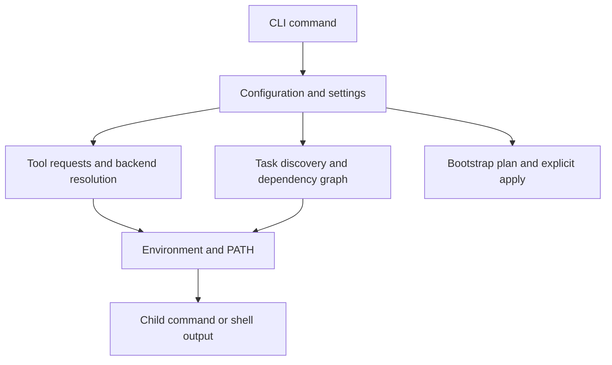

# Codebase architecture

Use this map to find the code that owns a behavior before you change it. For
setup, checks, and how to submit a change, see [Contributing](/contributing.html).

## Library, binary, and crates {#library-binary-and-crates}

The `mise` package builds two targets. The library, `src/lib.rs`, holds
everything except the command line: configuration, toolsets, backends, tasks,
environments, and bootstrap. The binary, `src/main.rs` plus `src/cli/`, sits on
top of it. `src/main.rs` imports the library's root with `use mise::*`, so code
in `src/cli/` still writes `crate::config::…`. A change confined to `src/cli/`
recompiles only the binary.

Library code must not refer to `crate::cli`. When core code needs command
behavior, it calls a hook in
[`src/frontend.rs`](https://github.com/jdx/mise/blob/main/src/frontend.rs),
which the binary fills in at startup with `cli::register_frontend`. The hooks
cover running `mise lock` after an install adds versions and listing subcommand
names for "did you mean" suggestions. When `cli` needs a core item, make that
item `pub`. The library denies `unreachable_pub`, so everything else stays
`pub(crate)`.

`cfg(test)` is set for the binary's tests but not for the library they call, so
core code that behaves differently under tests checks
`mise_util::testing::in_tests()` instead.

The workspace crates under `crates/` cannot depend on the `mise` package.
`register_util_hooks` in `src/lib.rs` gives them what they need from mise, such
as the settings loader and the build identity used in cache keys, before
anything else runs.

| Crate                     | Contents                                                                                  |
| ------------------------- | ----------------------------------------------------------------------------------------- |
| `mise-util`               | Environment, directory, file, HTTP, cache, template, and `EnvDiff`/`PathEnv` helpers      |
| `mise-settings`           | The `Settings` types, generated from `settings.toml`, and the process-wide settings cache |
| `vfox`                    | The embedded Lua runtime and the hook and module interfaces for vfox plugins              |
| `aqua-registry`           | Parsing, package lookup, and cache formats for aqua registries                            |
| `mise-bootstrap`          | Bootstrap resource planning and dependency ordering                                       |
| `mise-cache-core`         | The remote task cache protocol, content-addressed storage, authentication, and transport  |
| `mise-shim`               | `mise-shim.exe`, the native executable that Windows shims use in the default `exe` mode   |
| `mise-sigstore`           | Sigstore verification helpers                                                             |
| `mise-agent-env`          | Detection of AI coding agents from the process environment                                |
| `mise-interactive-config` | The interactive TOML editor behind `mise edit`                                            |
| `mise-brew-metadata`      | Homebrew formula metadata models                                                          |
| `mise-brew-relocation`    | Homebrew bottle placeholder and binary relocation                                         |
| `mise-dotenv`             | A dotenv parser with explicit control over variable substitution                          |

## Where things live {#where-things-live}

| Behavior                                 | Code                                                                                                               | User docs                                        |
| ---------------------------------------- | ------------------------------------------------------------------------------------------------------------------ | ------------------------------------------------ |
| Commands, flags, and help text           | `src/cli/`; `mod.rs` dispatches, and each command has a file or directory such as `use.rs`, `exec.rs`, or `tasks/` | [CLI reference](/cli/)                           |
| What each command changes                | `src/cli/command_effects.rs`                                                                                       |                                                  |
| Config discovery, loading, and merging   | `src/config/`; `config_file/` holds `MiseToml`, `ToolVersions`, and `IdiomaticVersionFile`                         | [mise.toml](/configuration.html)                 |
| Settings                                 | `settings.toml`, generated into `crates/mise-settings`; loading, trust, and CLI flags in `src/config/settings.rs`  | [Settings](/configuration/settings.html)         |
| Config file schema                       | `schema/mise.json`                                                                                                 | [mise.toml](/configuration.html)                 |
| Tool requests, resolution, install state | `src/toolset/`                                                                                                     | [Dev tools](/dev-tools/)                         |
| Backends                                 | `src/backend/`; the `Backend` trait is in `mod.rs` and `BackendType` in `backend_type.rs`                          | [Backends](/dev-tools/backends/)                 |
| Core tools                               | `src/plugins/core/`                                                                                                | [Core tools](/core-tools.html)                   |
| Plugins                                  | `src/plugins/` (asdf and vfox adapters) and `crates/vfox`                                                          | [Plugins](/plugins.html)                         |
| Tool shorthands                          | `registry/*.toml`, compiled in by `build.rs`; lookup in `src/registry.rs`                                          | [Registry](/registry.html)                       |
| aqua registry                            | `crates/aqua-registry`; the bundled snapshot is `vendor/aqua-registry/`, baked in by `build.rs`                    | [aqua](/dev-tools/backends/aqua.html)            |
| Lockfile                                 | `src/lockfile.rs` and `src/lockfile/`                                                                              | [Lockfile](/dev-tools/mise-lock.html)            |
| Environment directives                   | `src/config/env_directive/`; `EnvDiff` and `PathEnv` come from `crates/mise-util`                                  | [Environment variables](/environments/)          |
| Shell activation                         | `src/shell/` (one file per shell), `src/hook_env.rs`, `src/cli/activate.rs`                                        | [Shell setup](/shell-setup.html)                 |
| Shims                                    | `src/shims.rs` and `crates/mise-shim`                                                                              | [Shims](/dev-tools/shims.html)                   |
| Templates                                | `crates/mise-util/src/tera.rs`, re-exported as `src/tera.rs`                                                       | [Tera templates](/templates.html)                |
| Tasks                                    | `src/task/`                                                                                                        | [Tasks](/tasks/)                                 |
| Remote task cache                        | `crates/mise-cache-core`                                                                                           | [Remote task cache](/tasks/remote-cache.html)    |
| Bootstrap and host packages              | `src/cli/bootstrap.rs`, `src/system/` (packages under `src/system/packages/`), `crates/mise-bootstrap`             | [Bootstrap](/bootstrap.html)                     |
| Dotfiles                                 | `src/cli/dotfiles/`, `src/system/managed_files.rs`, `src/system/history/`                                          | [Dotfiles](/dotfiles.html)                       |
| Daemons                                  | `src/daemons/`                                                                                                     | [Daemons](/daemons.html)                         |
| Project dependencies                     | `src/deps/`                                                                                                        | [Project dependencies](/dev-tools/deps.html)     |
| Secrets                                  | `src/secrets/`, `src/sops.rs`, `src/agecrypt.rs`                                                                   | [Secrets](/environments/secrets/)                |
| Caches                                   | `crates/mise-util/src/cache.rs`: `CacheManager<T>`, MessagePack with zlib, written atomically                      | [Caches](/cache-behavior.html)                   |
| packslip manifests                       | `src/packslip.rs`, `src/backend/packslip.rs`                                                                       | [packslip](/dev-tools/backends/packslip.html)    |
| OCI images                               | `src/oci/`                                                                                                         | [OCI images](/dev-tools/mise-oci.html)           |
| OpenTelemetry                            | `src/otel/`                                                                                                        | [OpenTelemetry](/tasks/opentelemetry.html)       |
| Identity install layout                  | `src/install_layout/`                                                                                              | [Install layout](/dev-tools/install-layout.html) |
| Sandboxing                               | `src/sandbox.rs`                                                                                                   | [Sandboxing](/sandboxing.html)                   |
| Self-update                              | `src/cli/self_update.rs`                                                                                           | [Packaging mise](/packaging.html)                |

## How a command runs {#system-overview}

Most commands load the configuration, resolve the tools it requests, build an
environment from them, and then run a child process or print shell code. Tasks
and bootstrap start from the same configuration.

```mermaid
flowchart TD
    CLI[CLI command] --> Config[Configuration and settings]
    Config --> Tools[Tool requests and backend resolution]
    Tools --> Env[Environment and PATH]
    Env --> Exec[Child command or shell output]
    Config --> Tasks[Task discovery and dependency graph]
    Tasks --> Env
    Config --> Bootstrap[Bootstrap plan and explicit apply]
```

### Configuration {#configuration-system}

[`src/config`](https://github.com/jdx/mise/tree/main/src/config) finds config
files, loads them through the `ConfigFile` trait, and merges them. Which files
are found, whether they are trusted, and how each field merges are separate
decisions in the code. Settings, tools, environment directives, tasks, and
bootstrap entries do not merge the same way, and write commands pick their
[target file](/configuration.html#target-file-for-write-operations) separately.

### Toolsets {#toolset-management}

[`src/toolset`](https://github.com/jdx/mise/tree/main/src/toolset) connects
version requests to resolved versions and installation state:

| Type             | Role                                                                                  |
| ---------------- | ------------------------------------------------------------------------------------- |
| `ToolRequest`    | A request such as `node@24`, a channel, or a ref, with its backend and options        |
| `ToolVersion`    | A resolved version and its installation metadata                                      |
| `Toolset`        | The requests and resolved versions for the current context                            |
| `ToolsetBuilder` | Combines config, environment variable overrides, and command arguments, then resolves |

### Backends {#backend-system}

The [`Backend` trait](https://github.com/jdx/mise/blob/main/src/backend/mod.rs)
splits shared policy from backend-specific work. Its public wrapper methods
handle caching and resolution. A backend implements hooks such as
`_list_remote_versions`, which returns `VersionInfo` entries, and
`install_version_`. Core tools in `src/plugins/core/` implement the same trait.
For how mise picks a backend for a short name, see
[how backend selection works](/dev-tools/backends/#how-backend-selection-works);
to add one, see [Adding a backend](/contributing.html#adding-backends).

### Plugins {#plugins}

[`src/plugins`](https://github.com/jdx/mise/tree/main/src/plugins) installs
plugin sources and records their metadata.
[`crates/vfox`](https://github.com/jdx/mise/tree/main/crates/vfox) runs vfox
plugins in its embedded Lua runtime. Tool plugins install one tool, backend
plugins handle `plugin:tool` requests, environment plugins return variables and
`PATH` entries, and package plugins manage batches of host packages. asdf
adapters run legacy shell scripts. Installing or updating a plugin's source is
separate from installing a tool version, and each keeps its own state. See
[Plugins](/plugins.html).

### Tasks {#task-system}

[`src/task`](https://github.com/jdx/mise/tree/main/src/task) discovers, schedules,
and runs tasks. `Task` holds a definition, the providers in
`task_file_providers/` load local and remote task files, `Deps` is the
dependency graph, and the executor and scheduler run ready tasks under the
configured concurrency and output style. A node in the graph is a task with its
arguments, environment variables, and run phase, so the same task with
different arguments is a separate node. Read
[Dependencies and execution order](/tasks/architecture.html) before you change
how the graph is built or how `depends`, `depends_post`, and `wait_for` behave.

### Environment and shell activation {#shell-integration}

`src/config/env_directive` evaluates `[env]` directives. Directives marked
`tools = true` run after tools are resolved, and the rest run before.
`mise activate` emits a shell hook from `src/shell/` that runs `mise hook-env`
at each prompt. `hook-env` records an `EnvDiff` so the next run can undo the previous
directory's changes before applying new ones. `mise exec` and `mise run` build
the child environment directly and do not need activation.

### Bootstrap and host state {#bootstrap-and-host-state}

`src/cli/bootstrap.rs` builds a plan and runs the selected phases. The code in
`src/system/` manages packages, files, edits, repositories, services, and
platform-specific resources, which live outside any tool's install directory.
Status, preview, apply, and prune are separate operations: a status check reads
the host and changes nothing. A package batch can be a subset named on the
command line, so never treat a package's absence from a batch as a request to
remove it.

## Rules to preserve {#rules-to-preserve}

- Treat versions as opaque strings. Resolve a request through the backend
  (`Backend::latest_version`, `Backend::list_versions_matching`,
  `ToolRequest::resolve`), never with a semver sort at a new call site.
- Compare lockfile versions with `==`, keep the backend and checksum of an
  entry, and never write `latest`, `lts/*`, or a prefix into the lockfile.
- Do not add installs or network requests to a code path that only reports
  local state.
- Build a subprocess's environment from the one mise computed, not the
  inherited process environment, which can miss earlier directives or select
  the wrong tool.
- Include every input that changes a cached result in its cache key, such as
  options, environment variables, and source metadata. The environment cache
  (`src/toolset/env_cache.rs`) and the task caches (`src/task/task_cache.rs`)
  do not use `CacheManager` and have their own formats and invalidation rules.
- Keep Windows `PATH` in native form inside mise and in child processes.
  Convert it only when emitting assignments into a running, positively
  identified MSYS2 or Cygwin shell; the
  [agent guide](https://github.com/jdx/mise/blob/main/AGENTS.md) has the full
  rules.
- Classify every new command in `src/cli/command_effects.rs`; see
  [Changing a CLI command](/contributing.html#changing-a-cli-command).

## Generated files {#generated-files}

Edit the source, then regenerate. Commit the output with the change that
produced it.

| Output                                                                                 | Source                                                                                                       | Regenerate with                               |
| -------------------------------------------------------------------------------------- | ------------------------------------------------------------------------------------------------------------ | --------------------------------------------- |
| `mise.usage.kdl`, `docs/cli/`                                                          | Command definitions in `src/cli/`, `src/assets/mise-extra.usage.kdl`, and `docs/.vitepress/cli-reference.ts` | `mise run render:usage`                       |
| `tasks.md`                                                                             | The project's tasks in `tasks.toml`, `xtasks/`, and `mise.toml`, through `mise generate task-docs`           | `mise run render:usage`                       |
| `man/man1/mise.1`                                                                      | `mise.usage.kdl`                                                                                             | `mise run render:mangen`                      |
| `completions/`                                                                         | The usage spec, through `mise completion <shell>`                                                            | `mise run render:completions`                 |
| `docs/.vitepress/cli_commands.ts` and the idiomatic version file table                 | `src/cli/` and the `idiomatic_files` keys in `registry/*.toml`                                               | `mise run render:help`                        |
| The settings part of `schema/mise.json`, `schema/miserc.json`, `schema/mise-task.json` | `settings.toml`; `mise-task.json` also copies the task definitions from `schema/mise.json`                   | `mise run render:schema`                      |
| `docs/public/llms.txt`                                                                 | Page titles and leads, and `docs/.vitepress/sidebar.ts`                                                      | `mise run render:llms`                        |
| `Settings` types                                                                       | `settings.toml`                                                                                              | Every build (`crates/mise-settings/build.rs`) |
| The registry compiled into mise                                                        | `registry/*.toml`                                                                                            | Every build (`build.rs`)                      |
| The [settings reference](/configuration/settings.html)                                 | `settings.toml`                                                                                              | Every docs build                              |

`mise run render` runs every `render:*` task. The rest of `schema/mise.json` is
written by hand: change it when you change config syntax, then run
`mise run render:schema`.

## Tests {#tests}

Unit tests sit beside the code they test, E2E tests are Bash scripts under
`e2e/` run with `mise run test:e2e`, and the Windows E2E tests under `e2e-win/`
use Pester. See [Testing](/contributing.html#testing) for the commands and
prerequisites.
