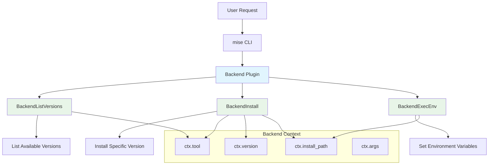

# Backend Plugin Development

Backend plugins in mise use enhanced backend methods to manage multiple tools using the `plugin:tool` format. These plugins are perfect for package managers, tool families, and custom installations that need to manage multiple related tools.

## What are Backend Plugins?

Backend plugins extend the standard vfox plugin system with enhanced backend methods. They support:

- **Multiple Tools**: One plugin can manage multiple tools (e.g., `vfox-npm:prettier`, `vfox-npm:eslint`)
- **Enhanced Performance**: Optimized backend methods for better performance
- **Cross-Platform Support**: Works on Windows, macOS, and Linux
- **Modern Architecture**: CamelCase method names and structured responses

## Plugin Architecture

Backend plugins use three main methods:



## Backend Methods

### BackendListVersions

Lists available versions for a tool:

```lua
function PLUGIN:BackendListVersions(ctx)
    local tool = ctx.tool
    local versions = {}
    
    -- Your logic to fetch versions for the tool
    -- Example: query an API, parse a registry, etc.
    
    return {versions = versions}
end
```

### BackendInstall

Installs a specific version of a tool:

```lua
function PLUGIN:BackendInstall(ctx)
    local tool = ctx.tool
    local version = ctx.version
    local install_path = ctx.install_path
    
    -- Your logic to install the tool
    -- Example: download files, extract archives, etc.
    
    return {}
end
```

### BackendExecEnv

Sets up environment variables for a tool:

```lua
function PLUGIN:BackendExecEnv(ctx)
    local install_path = ctx.install_path
    
    -- Your logic to set up environment variables
    -- Example: add bin directories to PATH
    
    return {
        env_vars = {
            {key = "PATH", value = install_path .. "/bin"}
        }
    }
end
```

## Creating a Backend Plugin

### 1. Plugin Structure

Create a directory with this structure:

```
vfox-npm/
├── metadata.lua                    # Plugin metadata
├── hooks/
│   ├── backend_list_versions.lua   # BackendListVersions hook
│   ├── backend_install.lua         # BackendInstall hook
│   └── backend_exec_env.lua        # BackendExecEnv hook
└── Injection.lua                   # Runtime injection (auto-generated)
```

### 2. Basic metadata.lua

```lua
PLUGIN = {
    name = "vfox-npm",
    version = "1.0.0",
    description = "Backend plugin for npm packages",
    author = "Your Name"
}
```

## Real-World Example: vfox-npm

Here's the complete implementation of the vfox-npm plugin that manages npm packages:

### metadata.lua

```lua
PLUGIN = {
    name = "vfox-npm",
    version = "1.0.0", 
    description = "Backend plugin for npm packages",
    author = "jdx"
}
```

### hooks/backend_list_versions.lua

```lua
function PLUGIN:BackendListVersions(ctx)
    local tool = ctx.tool
    
    -- Use npm view to get real versions
    local cmd = require("cmd")
    local result = cmd.exec("npm view " .. tool .. " versions --json 2>/dev/null")
    local json = require("json")
    local versions = json.decode(result)
    
    return {versions = versions}
end
```

### hooks/backend_install.lua

```lua
function PLUGIN:BackendInstall(ctx)
    local tool = ctx.tool
    local version = ctx.version
    local install_path = ctx.install_path
    
    -- Create install directory
    os.execute("mkdir -p " .. install_path)
    
    -- Install the package directly using npm install
    local cmd = require("cmd")
    local npm_cmd = "cd " .. install_path .. " && npm install " .. tool .. "@" .. version .. " --no-package-lock --no-save --silent 2>/dev/null"
    local result = cmd.exec(npm_cmd)
    
    -- If we get here, the command succeeded
    return {}
end
```

### hooks/backend_exec_env.lua

```lua
function PLUGIN:BackendExecEnv(ctx)
    local install_path = ctx.install_path
    -- Add node_modules/.bin to PATH for npm-installed binaries
    local bin_path = install_path .. "/node_modules/.bin"
    return {
        env_vars = {
            {key = "PATH", value = bin_path}
        }
    }
end
```

## Usage Example

With the vfox-npm plugin installed, you can manage npm packages:

```bash
# Install the plugin
mise plugin install vfox-npm https://github.com/jdx/vfox-npm

# List available versions
mise ls-remote vfox-npm:prettier

# Install a specific version
mise install vfox-npm:prettier@3.0.0

# Use in a project
mise use vfox-npm:prettier@latest

# Execute the tool
mise exec vfox-npm:prettier -- --help
```

## Context Variables

Backend plugins receive context through the `ctx` parameter passed to each hook function:

| Variable | Description | Example |
|----------|-------------|---------|
| `ctx.tool` | The tool name | `"prettier"` |
| `ctx.version` | The requested version | `"3.0.0"` |
| `ctx.install_path` | Installation directory | `"/home/user/.local/share/mise/installs/vfox-npm/prettier/3.0.0"` |
| `ctx.args` | Additional arguments | `[]` (usually empty) |

## Testing Your Plugin

### Local Development

```bash
# Link your plugin for development
mise plugin link my-plugin /path/to/my-plugin

# Test listing versions
mise ls-remote my-plugin:some-tool

# Test installation
mise install my-plugin:some-tool@1.0.0

# Test execution
mise exec my-plugin:some-tool -- --version
```

### Debug Mode

Use debug mode to see detailed plugin execution:

```bash
mise --debug install my-plugin:some-tool@1.0.0
```

## Best Practices

### Error Handling

Always provide meaningful error messages:

```lua
function PLUGIN:BackendListVersions(ctx)
    local tool = ctx.tool
    
    -- Validate tool name
    if not tool or tool == "" then
        error("Tool name cannot be empty")
    end
    
    -- Execute command with error checking
    local cmd = require("cmd")
    local result = cmd.exec("npm view " .. tool .. " versions --json 2>/dev/null")
    if not result or result:match("npm ERR!") then
        error("Failed to fetch versions for " .. tool .. ": " .. (result or "no output"))
    end
    
    -- Parse JSON response
    local json = require("json")
    local success, npm_versions = pcall(json.decode, result)
    if not success or not npm_versions then
        error("Failed to parse versions for " .. tool)
    end
    
    -- Return versions or error if none found
    local versions = {}
    if type(npm_versions) == "table" then
        for i = #npm_versions, 1, -1 do
            table.insert(versions, npm_versions[i])
        end
    end
    
    if #versions == 0 then
        error("No versions found for " .. tool)
    end
    
    return {versions = versions}
end
```

### Version Parsing

Parse versions consistently:

```lua
local function parse_version(version_string)
    -- Remove prefixes like 'v' or 'release-'
    return version_string:gsub("^[vr]?", ""):gsub("^release%-", "")
end
```

### Path Handling

Use cross-platform path handling:

```lua
local function join_path(...)
    local sep = package.config:sub(1,1) -- Get OS path separator
    return table.concat({...}, sep)
end

local bin_path = join_path(install_path, "bin")
```

### Cross-Platform Commands

Handle different operating systems:

```lua
local function is_windows()
    return package.config:sub(1,1) == '\\'
end

local function create_dir(path)
    local cmd = is_windows() and "mkdir" or "mkdir -p"
    os.execute(cmd .. " " .. path)
end
```

## Advanced Features

### Conditional Installation

Different installation logic based on tool or version:

```lua
function PLUGIN:BackendInstall(ctx)
    local tool = ctx.tool
    local version = ctx.version
    local install_path = ctx.install_path
    
    -- Create install directory
    os.execute("mkdir -p " .. install_path)
    
    if tool == "special-tool" then
        -- Special installation logic
        local cmd = require("cmd")
        local npm_cmd = "cd " .. install_path .. " && npm install " .. tool .. "@" .. version .. " --no-package-lock --no-save --silent 2>/dev/null"
        local result = cmd.exec(npm_cmd)
        if result:match("npm ERR!") then
            error("Failed to install " .. tool .. "@" .. version)
        end
    else
        -- Default installation logic
        local cmd = require("cmd")
        local npm_cmd = "cd " .. install_path .. " && npm install " .. tool .. "@" .. version .. " --no-package-lock --no-save --silent 2>/dev/null"
        local result = cmd.exec(npm_cmd)
        if result:match("npm ERR!") then
            error("Failed to install " .. tool .. "@" .. version)
        end
    end
    
    return {}
end
```

### Environment Detection

vfox automatically injects runtime information into your plugin:

```lua
function PLUGIN:BackendInstall(ctx)
    -- Platform-specific installation using injected RUNTIME object
    if RUNTIME.osType == "Darwin" then
        -- macOS installation logic
    elseif RUNTIME.osType == "Linux" then
        -- Linux installation logic
    elseif RUNTIME.osType == "Windows" then
        -- Windows installation logic
    end
    
    return {}
end
```

The `RUNTIME` object provides:

- `RUNTIME.osType`: Operating system type (Windows, Linux, Darwin)
- `RUNTIME.archType`: Architecture (amd64, arm64, etc.)
- `RUNTIME.version`: vfox runtime version
- `RUNTIME.pluginDirPath`: Plugin directory path

### Multiple Environment Variables

Set multiple environment variables:

```lua
function PLUGIN:BackendExecEnv(ctx)
    local install_path = ctx.install_path
    local tool = ctx.tool
    
    if install_path then
        -- Add node_modules/.bin to PATH for npm-installed binaries
        local bin_path = install_path .. "/node_modules/.bin"
        return {
            env_vars = {
                {key = "PATH", value = bin_path},
                {key = tool:upper() .. "_HOME", value = install_path},
                {key = tool:upper() .. "_VERSION", value = ctx.version}
            }
        }
    else
        return {env_vars = {}}
    end
end
```

## Performance Optimization

### Caching

Cache expensive operations when possible:

```lua
-- Cache versions for a short time
local version_cache = {}
local cache_ttl = 300 -- 5 minutes

function PLUGIN:BackendListVersions(ctx)
    local tool = ctx.tool
    local now = os.time()
    
    -- Check cache first
    if version_cache[tool] and (now - version_cache[tool].timestamp) < cache_ttl then
        return {versions = version_cache[tool].versions}
    end
    
    -- Fetch versions from npm
    local cmd = require("cmd")
    local result = cmd.exec("npm view " .. tool .. " versions --json 2>/dev/null")
    
    local versions = {}
    if result and result ~= "" and not result:match("npm ERR!") then
        local json = require("json")
        local success, npm_versions = pcall(json.decode, result)
        
        if success and npm_versions and type(npm_versions) == "table" then
            for i = #npm_versions, 1, -1 do
                table.insert(versions, npm_versions[i])
            end
        end
    end
    
    -- Cache the result
    version_cache[tool] = {
        versions = versions,
        timestamp = now
    }
    
    return {versions = versions}
end
```

### Parallel Downloads

For plugins that need to download multiple files:

```lua
function PLUGIN:BackendInstall(ctx)
    local tool = ctx.tool
    local version = ctx.version
    local install_path = ctx.install_path
    
    -- Create install directory
    os.execute("mkdir -p " .. install_path)
    
    -- Install multiple packages in parallel when possible
    local packages = {
        tool .. "@" .. version,
        "other-package@latest"
    }
    
    -- Use npm install for multiple packages
    local cmd = require("cmd")
    local npm_cmd = "cd " .. install_path .. " && npm install " .. table.concat(packages, " ") .. " --no-package-lock --no-save --silent 2>/dev/null"
    local result = cmd.exec(npm_cmd)
    
    if result:match("npm ERR!") then
        error("Failed to install packages")
    end
    
    return {}
end
```

## Next Steps

- [Learn about Tool Plugin Development](tool-plugin-development.md)
- [Explore available Lua modules](plugin-lua-modules.md)  
- [Publishing your plugin](plugin-publishing.md)
- [View the vfox-npm plugin source](https://github.com/jdx/vfox-npm)
