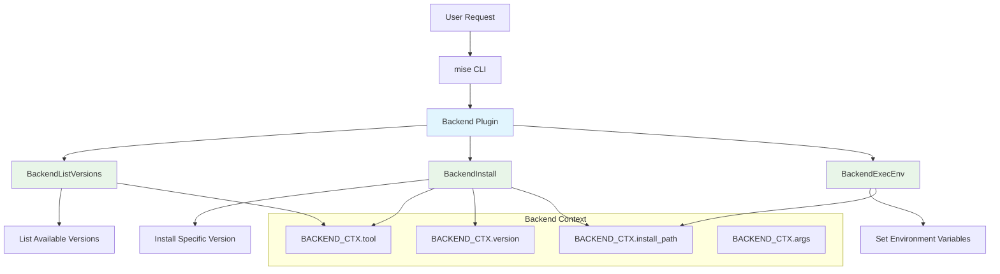

# Backend Plugin Development

Backend plugins in mise use enhanced backend methods to manage multiple tools using the `plugin:tool` format. These plugins are perfect for package managers, tool families, and custom installations that need to manage multiple related tools.

## What are Backend Plugins?

Backend plugins extend the standard vfox plugin system with enhanced backend methods. They support:

- **Multiple Tools**: One plugin can manage multiple tools (e.g., `vfox-npm:prettier`, `vfox-npm:eslint`)
- **Enhanced Performance**: Optimized backend methods for better performance
- **Cross-Platform Support**: Works on Windows, macOS, and Linux
- **Modern Architecture**: CamelCase method names and structured responses

## Plugin Architecture

Backend plugins use three main methods:



## Backend Methods

### BackendListVersions

Lists available versions for a tool:

```lua
BackendListVersions = function(ctx)
    local tool = BACKEND_CTX.tool
    local versions = {}
    
    -- Your logic to fetch versions for the tool
    -- Example: query an API, parse a registry, etc.
    
    return {versions = versions}
end
```

### BackendInstall

Installs a specific version of a tool:

```lua
BackendInstall = function(ctx)
    local tool = BACKEND_CTX.tool
    local version = BACKEND_CTX.version
    local install_path = BACKEND_CTX.install_path
    
    -- Your logic to install the tool
    -- Example: download files, extract archives, etc.
    
    return {}
end
```

### BackendExecEnv

Sets up environment variables for a tool:

```lua
BackendExecEnv = function(ctx)
    local install_path = BACKEND_CTX.install_path
    
    -- Your logic to set up environment variables
    -- Example: add bin directories to PATH
    
    return {
        env_vars = {
            {key = "PATH", value = install_path .. "/bin"}
        }
    }
end
```

## Creating a Backend Plugin

### 1. Plugin Structure

Create a directory with this structure:

```
vfox-npm/
├── metadata.lua          # Plugin metadata and backend methods
└── test/                 # Test scripts (optional)
    └── test.sh
```

### 2. Basic metadata.lua

```lua
PLUGIN = {
    name = "vfox-npm",
    version = "1.0.0",
    description = "Backend plugin for npm packages",
    author = "Your Name",
    
    -- Backend method for listing versions
    BackendListVersions = function(ctx)
        -- Implementation here
    end,
    
    -- Backend method for installing a tool
    BackendInstall = function(ctx)
        -- Implementation here
    end,
    
    -- Backend method for setting environment
    BackendExecEnv = function(ctx)
        -- Implementation here
    end
}
```

## Real-World Example: vfox-npm

Here's the complete implementation of the vfox-npm plugin that manages npm packages:

```lua
PLUGIN = {
    name = "vfox-npm",
    version = "1.0.0", 
    description = "Backend plugin for npm packages",
    author = "jdx",
    
    -- Backend method to list versions
    BackendListVersions = function(ctx)
        local tool = BACKEND_CTX.tool
        local versions = {}
        
        -- Use npm view to get real versions
        local result = os.capture("npm view " .. tool .. " versions --json 2>/dev/null")
        
        if result and result ~= "" and not result:match("npm ERR!") then
            -- Parse JSON response from npm
            local json = require("json")
            local success, npm_versions = pcall(json.decode, result)
            
            if success and npm_versions then
                if type(npm_versions) == "table" then
                    for i = #npm_versions, 1, -1 do
                        local version = npm_versions[i]
                        table.insert(versions, version)
                    end
                end
            end
        end
        
        if #versions == 0 then
            error("Failed to fetch versions for " .. tool .. " from npm registry")
        end
        
        return {versions = versions}
    end,
    
    -- Backend method to install a tool
    BackendInstall = function(ctx)
        local tool = BACKEND_CTX.tool
        local version = BACKEND_CTX.version
        local install_path = BACKEND_CTX.install_path
        
        -- Create install directory
        os.execute("mkdir -p " .. install_path)
        
        -- Install the package using npm
        local npm_cmd = "cd " .. install_path .. " && npm install " .. tool .. "@" .. version .. " --no-package-lock --no-save --silent 2>/dev/null"
        local result = os.execute(npm_cmd)
        
        if result ~= 0 then
            error("Failed to install " .. tool .. "@" .. version)
        end
        
        return {}
    end,
    
    -- Backend method to set environment
    BackendExecEnv = function(ctx)
        local install_path = BACKEND_CTX.install_path
        if install_path then
            -- Add node_modules/.bin to PATH for npm-installed binaries
            local bin_path = install_path .. "/node_modules/.bin"
            return {
                env_vars = {
                    {key = "PATH", value = bin_path}
                }
            }
        else
            return {env_vars = {}}
        end
    end
}

-- Helper function to capture command output
function os.capture(cmd, raw)
    local f = assert(io.popen(cmd, 'r'))
    local s = assert(f:read('*a'))
    f:close()
    if raw then return s end
    s = string.gsub(s, '^%s+', '')
    s = string.gsub(s, '%s+$', '')
    s = string.gsub(s, '[\n\r]+', ' ')
    return s
end
```

## Usage Example

With the vfox-npm plugin installed, you can manage npm packages:

```bash
# Install the plugin
mise plugin install vfox-npm https://github.com/jdx/vfox-npm

# List available versions
mise ls-remote vfox-npm:prettier

# Install a specific version
mise install vfox-npm:prettier@3.0.0

# Use in a project
mise use vfox-npm:prettier@latest

# Execute the tool
mise exec vfox-npm:prettier -- --help
```

## Context Variables

Backend plugins receive context through the `BACKEND_CTX` variable:

| Variable | Description | Example |
|----------|-------------|---------|
| `BACKEND_CTX.tool` | The tool name | `"prettier"` |
| `BACKEND_CTX.version` | The requested version | `"3.0.0"` |
| `BACKEND_CTX.install_path` | Installation directory | `"/home/user/.local/share/mise/installs/vfox-npm/prettier/3.0.0"` |
| `BACKEND_CTX.args` | Additional arguments | `[]` (usually empty) |

## Testing Your Plugin

### Local Development

```bash
# Link your plugin for development
mise plugin link my-plugin /path/to/my-plugin

# Test listing versions
mise ls-remote my-plugin:some-tool

# Test installation
mise install my-plugin:some-tool@1.0.0

# Test execution
mise exec my-plugin:some-tool -- --version
```

### Debug Mode

Use debug mode to see detailed plugin execution:

```bash
mise --debug install my-plugin:some-tool@1.0.0
```

## Best Practices

### Error Handling

Always provide meaningful error messages:

```lua
BackendListVersions = function(ctx)
    local tool = BACKEND_CTX.tool
    
    -- Validate tool name
    if not tool or tool == "" then
        error("Tool name cannot be empty")
    end
    
    -- Execute command with error checking
    local result = os.capture("some-command")
    if not result or result:match("error") then
        error("Failed to fetch versions for " .. tool .. ": " .. (result or "no output"))
    end
    
    -- Return versions or error if none found
    local versions = parse_versions(result)
    if #versions == 0 then
        error("No versions found for " .. tool)
    end
    
    return {versions = versions}
end
```

### Version Parsing

Parse versions consistently:

```lua
local function parse_version(version_string)
    -- Remove prefixes like 'v' or 'release-'
    return version_string:gsub("^[vr]?", ""):gsub("^release%-", "")
end
```

### Path Handling

Use cross-platform path handling:

```lua
local function join_path(...)
    local sep = package.config:sub(1,1) -- Get OS path separator
    return table.concat({...}, sep)
end

local bin_path = join_path(install_path, "bin")
```

### Cross-Platform Commands

Handle different operating systems:

```lua
local function is_windows()
    return package.config:sub(1,1) == '\\'
end

local function create_dir(path)
    local cmd = is_windows() and "mkdir" or "mkdir -p"
    os.execute(cmd .. " " .. path)
end
```

## Advanced Features

### Conditional Installation

Different installation logic based on tool or version:

```lua
BackendInstall = function(ctx)
    local tool = BACKEND_CTX.tool
    local version = BACKEND_CTX.version
    
    if tool == "special-tool" then
        -- Special installation logic
        install_special_tool(version)
    else
        -- Default installation logic
        install_default_tool(tool, version)
    end
    
    return {}
end
```

### Environment Detection

Detect operating system and architecture:

```lua
local function get_platform()
    local uname = os.capture("uname -s"):lower()
    local arch = os.capture("uname -m")
    return {os = uname, arch = arch}
end

BackendInstall = function(ctx)
    local platform = get_platform()
    local tool = BACKEND_CTX.tool
    local version = BACKEND_CTX.version
    
    -- Platform-specific installation
    if platform.os == "darwin" then
        -- macOS installation
    elseif platform.os == "linux" then
        -- Linux installation
    else
        -- Other platforms
    end
    
    return {}
end
```

### Multiple Environment Variables

Set multiple environment variables:

```lua
BackendExecEnv = function(ctx)
    local install_path = BACKEND_CTX.install_path
    local tool = BACKEND_CTX.tool
    
    return {
        env_vars = {
            {key = "PATH", value = install_path .. "/bin"},
            {key = "PATH", value = install_path .. "/scripts"},
            {key = tool:upper() .. "_HOME", value = install_path},
            {key = tool:upper() .. "_VERSION", value = BACKEND_CTX.version}
        }
    }
end
```

## Performance Optimization

### Caching

Cache expensive operations when possible:

```lua
-- Cache versions for a short time
local version_cache = {}
local cache_ttl = 300 -- 5 minutes

BackendListVersions = function(ctx)
    local tool = BACKEND_CTX.tool
    local now = os.time()
    
    -- Check cache first
    if version_cache[tool] and (now - version_cache[tool].timestamp) < cache_ttl then
        return {versions = version_cache[tool].versions}
    end
    
    -- Fetch versions
    local versions = fetch_versions(tool)
    
    -- Cache the result
    version_cache[tool] = {
        versions = versions,
        timestamp = now
    }
    
    return {versions = versions}
end
```

### Parallel Downloads

For plugins that need to download multiple files:

```lua
BackendInstall = function(ctx)
    local tool = BACKEND_CTX.tool
    local version = BACKEND_CTX.version
    local install_path = BACKEND_CTX.install_path
    
    -- Download files in parallel when possible
    local downloads = {
        {url = "https://example.com/file1.zip", dest = install_path .. "/file1.zip"},
        {url = "https://example.com/file2.zip", dest = install_path .. "/file2.zip"}
    }
    
    -- Use parallel downloads if available
    parallel_download(downloads)
    
    return {}
end
```

## Next Steps

- [Learn about Tool Plugin Development](tool-plugin-development.md)
- [Explore available Lua modules](plugin-lua-modules.md)  
- [Publishing your plugin](plugin-publishing.md)
- [View the vfox-npm plugin source](https://github.com/jdx/vfox-npm)
