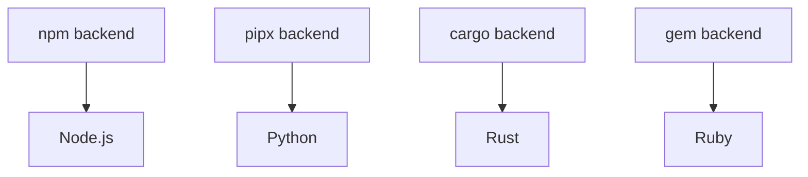

# Backend Architecture

Understanding how mise's backend system works can help you choose the right backend for your tools and troubleshoot issues when they arise. Most users don't need to explicitly choose backends since the [mise registry](../registry.md) defines smart defaults, but understanding the system helps when you need specific tools or want to optimize performance.

## What are Backends?

Backends are mise's way of supporting different tool installation methods. Each backend knows how to:

- List available versions of tools
- Download and install specific versions
- Set up the environment for installed tools
- Manage tool lifecycles (updates, uninstalls)

Think of backends as "adapters" that let mise work with different package managers and installation systems.

## The Backend Trait System

All backends implement a common interface (called a "trait" in Rust), which means they all provide the same basic functionality:

```rust
pub trait Backend {
    async fn list_remote_versions(&self) -> Result<Vec<String>>;
    async fn install_version(&self, ctx: &InstallContext, tv: &ToolVersion) -> Result<()>;
    async fn uninstall_version(&self, tv: &ToolVersion) -> Result<()>;
    // ... other methods
}
```

This design allows mise to treat all backends uniformly while each backend handles the specifics of its installation method.

## Backend Types

### Core Tools

Built directly into mise, written in Rust for performance and reliability:

- **Node.js, Python, Ruby, Go, Java, etc.** - Native implementations
- **Benefits**: Fastest performance, no external dependencies, best integration
- **Drawbacks**: Require much more maintenance; new core tool contributions are likely to be rejected unless they're for very popular tools like Node.js, Python, or Go

**Note**: Core tools like Node.js and Java are implemented as backends even though they represent single tools. This consistent backend architecture allows mise to handle all tools uniformly, whether they're complex ecosystems or individual tools.

### Language Package Managers

Leverage existing language ecosystems:

- **npm** - Node.js packages (`npm:prettier`, `npm:typescript`)
- **pipx** - Python packages (`pipx:black`, `pipx:poetry`)
- **cargo** - Rust packages (`cargo:ripgrep`, `cargo:fd-find`)
- **gem** - Ruby packages (`gem:bundler`, `gem:rails`)
- **go** - Go packages (`go:github.com/golangci/golangci-lint/cmd/golangci-lint`)

### Universal Installers

#### ubi - Universal Binary Installer

Zero-configuration installer that works with any GitHub/GitLab repository following standard conventions:

- **Usage**: `ubi:BurntSushi/ripgrep`
- **Requirements**: Repository must follow standard release tarball conventions
- **Sources**: Primarily GitHub releases, with GitLab support (rarely used in mise)
- **Configuration**: None required - automatically detects and downloads appropriate binaries

#### aqua - Comprehensive Package Manager

Registry-based package manager with strong security features:

- **Usage**: `aqua:golangci/golangci-lint`
- **Requirements**: Tools must be available in the [aqua registry](https://github.com/aquaproj/aqua-registry)
- **Sources**: Primarily GitHub but supports other sources through registry configuration
- **Security**: Comprehensive checksums, signatures, and verification

### Plugin Systems

Support for external plugin ecosystems:

- **Tool Plugins** - Hook-based plugins for single tools (`my-tool`) - a superset of vfox plugins functionality
- **asdf Plugins** - Legacy plugin ecosystem (`asdf:postgres`, `asdf:redis`) - generally Linux/macOS only
- **Backend Plugins** - Enhanced plugins using the `plugin:tool` format (`my-plugin:some-tool`) - enables private/custom tools with backend methods

## How Backend Selection Works

When you specify a tool, mise determines the backend using this priority:

1. **Explicit backend**: `mise use aqua:golangci/golangci-lint`
2. **Registry lookup**: `mise use golangci-lint` → checks registry for default backend
3. **Core tools**: `mise use node` → uses built-in core backend
4. **Fallback**: If not found, suggests available backends

The [mise registry](../registry.md) defines a priority order for which backend to use for each tool, so typically end-users don't need to know which backend to choose unless they want tools not available in the registry or want to override the default selection.

### Registry System

The [registry](../registry.md) (`mise registry`) maps short names to full backend specifications with a preferred priority order:

```toml
# ~/.config/mise/config.toml
[aliases]
go = "core:go"                    # Use core backend
terraform = "aqua:hashicorp/terraform"  # Use aqua backend
```

## Backend Capabilities Comparison

| Feature | Core | npm/pipx/cargo | ubi | aqua | Backend Plugins | Tool Plugins (vfox) | asdf Plugins (legacy) |
|---------|------|----------------|-----|------|---------------|-------------|-------------|
| **Speed** | ✅ | ✅ | ✅ | ✅ | ⚠️ | ⚠️ | ⚠️ |
| **Security** | ✅ | ⚠️ | ⚠️ | ✅ | ⚠️ | ⚠️ | ⚠️ |
| **Windows Support** | ✅ | ✅ | ✅ | ✅ | ✅ | ✅ | ❌ |
| **Env Var Support** | ✅ | ❌ | ❌ | ❌ | ✅ | ✅ | ✅ |
| **Custom Scripts** | ✅ | ❌ | ❌ | ❌ | ✅ | ✅ | ✅ |

## When to Use Each Backend

### Use **Core Tools** when

- Available for your tool (check the [registry](../registry.md))
- You want the fastest performance
- You're using major programming languages

**Note**: Core tools should generally always be used when available, as they provide the best performance and integration with mise.

### Use **Language Package Managers** when

- Installing tools specific to that language ecosystem
- The tool is primarily distributed through that package manager
- You want automatic dependency management

### Use **ubi** when

- Installing pre-compiled binaries from GitHub/GitLab releases
- The repository follows standard conventions for release tarballs
- You want zero configuration - no registry setup required
- You need simple, fast binary installation
- The tool doesn't require complex build processes or environment setup

### Use **aqua** when

- Installing pre-compiled binaries or static packages (no compilation needed)
- You want comprehensive security features (checksums, signatures)
- You need Windows support
- The tool is already available in the [aqua registry](https://github.com/aquaproj/aqua-registry)
- You're willing to contribute tools to the aqua registry for tools not yet available

### Use **Backend Plugins** when

- You need to manage multiple tools with one plugin
- Want enhanced backend methods for better performance
- Need the `plugin:tool` format for flexibility
- Working with custom or private tools
- Want modern plugin architecture with backend methods

### Use **Tool Plugins** when

- Creating traditional single-tool plugins
- Need fine-grained control over installation hooks
- Want to use the vfox hook system
- Tool requires complex installation logic or build processes
- Tool requires environment variable setup (like `JAVA_HOME`, `GOROOT`, etc.)
- You need cross-platform support including Windows

### Use **asdf Plugins** when

- Tool requires compilation from source
- Need complex installation logic or build processes
- Tool requires environment variable setup (like `JAVA_HOME`, `GOROOT`, etc.)
- No other backend supports the tool
- Migrating from existing asdf setup
- Working on Linux/macOS (no Windows support)

## Backend Dependencies

Some backends have dependencies on others:



mise automatically handles these dependencies, installing Node.js before npm tools, Python before pipx tools, etc.

## Configuration and Overrides

### Disable Backends

```toml
# ~/.config/mise/config.toml
[settings]
disable_backends = ["asdf", "vfox"]  # Don't use these backends
```

### Force Backend for Tool

```toml
# mise.toml
[tools]
node = "core:node@20"     # Explicitly use core backend
prettier = "npm:prettier" # Use npm backend instead of default
```

### Backend-Specific Settings

Some backends support additional configuration:

```toml
# mise.toml
[tools]
python = { version = "3.12", virtualenv = ".venv" }  # Core backend options
black = { version = "latest", python = "3.12" }      # pipx backend options
```

## Troubleshooting Backend Issues

### Debug Backend Selection

```bash
mise doctor                   # Check backend configuration
mise tool python              # See which backend is used for a tool
mise config get tools         # Verify tool configurations
```
