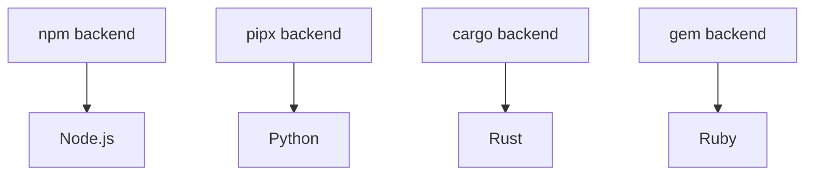

# Backend Architecture

Understanding how mise's backend system works can help you choose the right backend for your tools and troubleshoot issues when they arise.

## What are Backends?

Backends are mise's way of supporting different tool installation methods. Each backend knows how to:

- List available versions of tools
- Download and install specific versions
- Set up the environment for installed tools
- Manage tool lifecycles (updates, uninstalls)

Think of backends as "adapters" that let mise work with different package managers and installation systems.

## The Backend Trait System

All backends implement a common interface (called a "trait" in Rust), which means they all provide the same basic functionality:

```rust
pub trait Backend {
    async fn list_remote_versions(&self) -> Result<Vec<String>>;
    async fn install_version(&self, ctx: &InstallContext, tv: &ToolVersion) -> Result<()>;
    async fn uninstall_version(&self, tv: &ToolVersion) -> Result<()>;
    // ... other methods
}
```

This design allows mise to treat all backends uniformly while each backend handles the specifics of its installation method.

## Backend Types

### Core Backends
Built directly into mise, written in Rust for performance and reliability:
- **Node.js, Python, Ruby, Go, Java, etc.** - Native implementations
- **Benefits**: Fastest performance, no external dependencies, best integration

### Language Package Managers
Leverage existing language ecosystems:
- **npm** - Node.js packages (`npm:prettier`, `npm:typescript`)
- **pipx** - Python packages (`pipx:black`, `pipx:poetry`)
- **cargo** - Rust packages (`cargo:ripgrep`, `cargo:fd-find`)
- **gem** - Ruby packages (`gem:bundler`, `gem:rails`)
- **go** - Go packages (`go:github.com/golangci/golangci-lint/cmd/golangci-lint`)

### Universal Installers
Work with any GitHub/GitLab repository:
- **ubi** - Universal Binary Installer (`ubi:BurntSushi/ripgrep`)
- **aqua** - Comprehensive package manager (`aqua:golangci/golangci-lint`)

### Plugin Systems
Support for external plugin ecosystems:
- **asdf** - Vast ecosystem of community plugins (`asdf:postgres`, `asdf:redis`)
- **vfox** - Cross-platform plugin system (`vfox:nodejs`, `vfox:python`)

## How Backend Selection Works

When you specify a tool, mise determines the backend using this priority:

1. **Explicit backend**: `mise use aqua:golangci/golangci-lint`
2. **Registry lookup**: `mise use golangci-lint` → checks registry for default backend
3. **Core tools**: `mise use node` → uses built-in core backend
4. **Fallback**: If not found, suggests available backends

### Registry System

The registry (`mise registry`) maps short names to full backend specifications:

```toml
# ~/.config/mise/config.toml
[aliases]
go = "core:go"                    # Use core backend
terraform = "aqua:hashicorp/terraform"  # Use aqua backend
```

## Backend Capabilities Comparison

| Feature | Core | npm/pipx/cargo | ubi/aqua | asdf/vfox |
|---------|------|----------------|-----------|-----------|
| **Speed** | ⭐⭐⭐ | ⭐⭐ | ⭐⭐ | ⭐ |
| **Security** | ⭐⭐⭐ | ⭐⭐ | ⭐⭐⭐ | ⭐ |
| **Windows Support** | ⭐⭐⭐ | ⭐⭐⭐ | ⭐⭐⭐ | ⭐ |
| **Tool Availability** | ⭐ | ⭐⭐ | ⭐⭐⭐ | ⭐⭐⭐ |
| **Env Var Support** | ⭐⭐⭐ | ⭐ | ⭐ | ⭐⭐⭐ |
| **Custom Scripts** | ⭐⭐⭐ | ⭐ | ⭐ | ⭐⭐⭐ |

## When to Use Each Backend

### Use **Core Backends** when:
- Available for your tool (check `mise registry -b core`)
- You want the fastest performance
- You're using major programming languages

### Use **Language Package Managers** when:
- Installing tools specific to that language ecosystem
- The tool is primarily distributed through that package manager
- You want automatic dependency management

### Use **ubi/aqua** when:
- Installing from GitHub/GitLab releases
- You want security features (checksums, signatures)
- The tool distributes pre-compiled binaries
- You need Windows support

### Use **asdf/vfox** when:
- Need complex installation logic
- Tool requires environment variable setup
- No other backend supports the tool
- Migrating from existing asdf setup

## Backend Dependencies

Some backends have dependencies on others:



mise automatically handles these dependencies, installing Node.js before npm tools, Python before pipx tools, etc.

## Configuration and Overrides

### Disable Backends
```toml
# ~/.config/mise/config.toml
[settings]
disable_backends = ["asdf", "vfox"]  # Don't use these backends
```

### Force Backend for Tool
```toml
# mise.toml
[tools]
node = "core:node@20"     # Explicitly use core backend
prettier = "npm:prettier" # Use npm backend instead of default
```

### Backend-Specific Settings
Some backends support additional configuration:

```toml
# mise.toml
[tools]
python = { version = "3.12", virtualenv = ".venv" }  # Core backend options
black = { version = "latest", python = "3.12" }      # pipx backend options
```

## Architecture Benefits

This backend system provides several advantages:

1. **Flexibility**: Choose the best installation method for each tool
2. **Performance**: Core backends are optimized for speed
3. **Security**: Multiple verification methods across backends
4. **Compatibility**: Support for existing plugin ecosystems
5. **Evolution**: Easy to add new backends as the ecosystem grows

## Troubleshooting Backend Issues

### Debug Backend Selection
```bash
mise doctor                    # Check backend configuration
mise ls --json                # See which backend is used for each tool
mise config get tools         # Verify tool configurations
```

### Common Issues

**Tool not found**: Check if it's in the registry or try explicit backend syntax
```bash
mise registry | grep terraform
mise use aqua:hashicorp/terraform  # Explicit backend
```

**Slow installations**: Consider switching to a faster backend
```bash
mise use core:node@20          # Use core instead of asdf
```

**Environment issues**: Some backends don't support env vars
```bash
mise use asdf:java             # Use asdf for complex env setup
```

The backend system is designed to be mostly transparent - mise picks good defaults and handles the complexity. Understanding it helps when you need to optimize for specific requirements or troubleshoot issues.