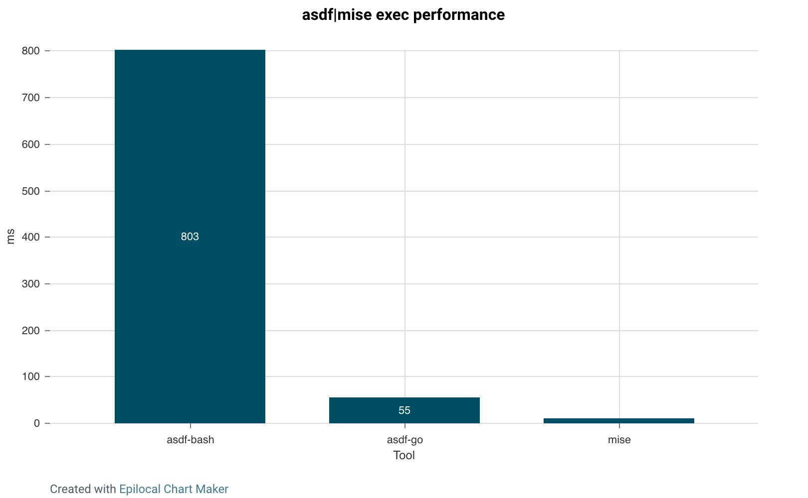

# Comparison to asdf

mise can be used as a drop-in replacement for asdf. It supports the same `.tool-versions` files that
you may have used with asdf and can use asdf plugins through
the [asdf backend](/dev-tools/backends/asdf.html).

It will not, however, reuse existing asdf directories
(so you'll need to either reinstall them or move them), and 100% compatibility is not a design goal.
That said, if you're coming from asdf-bash (0.15 and below), mise actually
has [fewer breaking changes than asdf-go (0.16 and above)](https://asdf-vm.com/guide/upgrading-to-v0-16.html).

Casual users coming from asdf have generally found mise to be a faster, easier-to-use asdf.

:::tip
Have a look at [environments](/environments/) and [tasks](/tasks/), which
are major parts of mise with no asdf equivalent.
:::

## Migrate from asdf to mise

If you're moving from asdf to mise, please
review [#how-do-i-migrate-from-asdf](/faq.html#how-do-i-migrate-from-asdf) for guidance.

## asdf in go (0.16+)

asdf has been rewritten in Go. Because this is quite new as of this writing (2025-01-01),
I'm keeping information about asdf 0.16+ (which I call "asdf-go", as opposed to "asdf-bash") in
this section; the rest of this doc applies to asdf-bash (0.15 and below).

In terms of performance, mise is still faster than asdf-go, but the difference is much
smaller. asdf-go is likely fast enough that you may not even notice the difference in
overhead—after all, there are plenty of people still using asdf-bash who
claim they don't even notice how slow it is (don't ask me how):



Now that asdf-go exists, I don't think performance is a good enough reason to switch. It's
a reason, but a minor one. mise's improved security, better DX, and lack of reliance on
shims all matter more than performance.

The fact that they went through the trouble of rewriting asdf also indicates they want to keep
working on it (which is awesome, by the way). This does mean that some of what's
written here may go out of date if they address some of asdf's problems.

## Supply chain security

asdf plugins are not secure. This is explained
in [SECURITY.md](https://github.com/jdx/mise/blob/main/SECURITY.md), but the short version is
that asdf plugins are shell code that can do essentially anything on your machine. It's
dangerous code. Worse, asdf plugins are rarely written by the tool vendor (whom you need to
trust anyway to use the tool), which means that for every asdf plugin you use, you're trusting a random
developer not to go rogue and not to get hacked and have an exploit published to their plugin.

mise still uses asdf plugins for some tools, but we're actively reducing that count as well as
moving things into the [mise-plugins org](https://github.com/mise-plugins). It might look like asdf has a
similar model with its asdf-community org, but it doesn't: asdf gives plugin authors commit access
to their plugin in [asdf-community](https://github.com/asdf-community) when it moves in, which I
feel defeats the purpose of having a dedicated org in the first place. By the end of 2025, I
would like there to be no asdf plugins in the registry that aren't owned by me.

I've also been adopting extra security verification steps when vendors offer them, such as
GPG verification on node installs and native Cosign/SLSA/Minisign/GitHub attestation verification for aqua tools.

## UX


Some commands are the same as in asdf, but others have changed. Everything that's possible
in asdf should be possible in mise but may use slightly different syntax. mise has more forgiving
commands, such as fuzzy matching, e.g. `mise install node@20`. While in asdf you _can_ run
`asdf install node latest:20`, you can't use `latest:20` in a `.tool-versions` file or many other
places. In `mise` you can use fuzzy matching everywhere.

asdf requires several steps to install a new runtime if the plugin isn't installed, e.g.:

```sh
asdf plugin add node
asdf install node latest:20
asdf local node latest:20
```

In `mise`, this is a single step that installs the plugin, installs the runtime,
and sets the version:

```sh
mise use node@20
```

If you have an existing `.tool-versions` file, or `.mise.toml`, you can install all plugins
and runtimes with a single command:

```sh
mise install
```

I've found asdf to be particularly rigid and difficult to learn. It also made strange decisions like
having `asdf list all` but `asdf latest --all` (why is one a flag and one a positional argument?).
`mise` makes heavy use of aliases so you don't need to remember whether it's `mise plugin add node` or
`mise plugin install node`. If I can guess what you meant, then I'll try to get mise to respond
in the right way.

That said, there are a lot of great things about asdf. It's the best multi-runtime manager out there
and I've really been impressed with the plugin system. Most of the design decisions the authors made
were very good. I really just have two complaints: the shims and the fact that it's written in Bash.

## Performance

asdf made (what I consider) a poor design decision to use shims that sit between a call to a runtime
and the runtime itself. For example, when you call `node`, it calls an asdf shim file
`~/.asdf/shims/node`, which calls `asdf exec`, which then calls the correct version of node.

These shims have terrible performance, adding ~120ms to every runtime call. `mise activate` does not
use shims; instead it updates `PATH`, so there is no overhead when simply calling binaries. These shims are
the main reason I wrote mise. This is also why, in the demo GIF at the top of this README,
`mise` isn't actually used when calling `node -v`: the performance is
identical to running node without mise.

I don't think it's possible for asdf to fix these issues. The author of asdf did a great writeup
of [performance problems](https://stratus3d.com/blog/2022/08/11/asdf-performance/). asdf is written
in Bash, which certainly makes performance challenging, but I think the real problem is the
shim design, and I don't think that can be fixed without a complete rewrite.

mise does call an internal command, `mise hook-env`, every time the directory changes, but because
it's written in Rust, this is very quick—around 10ms on my machine: 4ms if there are no changes,
14ms for a full reload.

tl;dr: asdf adds overhead (~120ms) when calling a runtime; mise adds a small amount of overhead (~5ms)
when the prompt loads.

## Windows support

asdf does not run on Windows at all. With mise, tools using non-asdf backends can support Windows.
Of course, the tool vendor must provide Windows binaries, but if they do and the backend isn't asdf,
the tool should work on Windows.

## Security

asdf plugins are insecure. They are typically written by individuals with no ties to the vendor
of the underlying tool.
Where possible, mise avoids asdf plugins in favor of backends like aqua and github, which do
not require separate plugins.

Aqua tools include native Cosign/SLSA/Minisign/GitHub attestation verification built into mise.
See [SECURITY](https://github.com/jdx/mise/blob/main/SECURITY.md) for more information.

## Command Compatibility

In nearly all places, you can use the exact syntax that works in asdf, though this won't
show up in the help or CLI reference. If you're coming from asdf and are comfortable with that way of
working, you can almost always use the same syntax with mise, e.g.:

```sh
mise install node 20.0.0
mise local node 20.0.0
```

UPDATE (2025-01-01): asdf-go (0.16+) actually got rid of `asdf global|local` entirely in favor of
`asdf set`, which we can't support since we already have a command named `mise set`. mise command
compatibility will likely not be as good with asdf-go 0.16+.

This isn't recommended, though. You almost always want to modify config files and install things, so
`mise use node@20` saves an extra command. The "@" syntax is also preferred since it allows
you to install multiple tools at once: `mise use|install node@20 node@18`. And there are edge cases
where it's not possible—or at least very challenging—for us to know definitively which syntax is
being used, so we default to mise-style. While there aren't many of these, asdf compatibility is
best-effort, meant to make the transition from asdf feel familiar for users who
rely on their muscle memory. Ensuring asdf syntax works with everything is not a design goal.

## Extra backends

mise supports backends other than asdf plugins. For example, you can install CLIs
directly from cargo and npm:

```sh
mise use -g cargo:ripgrep@14
mise use -g npm:prettier@3
```
