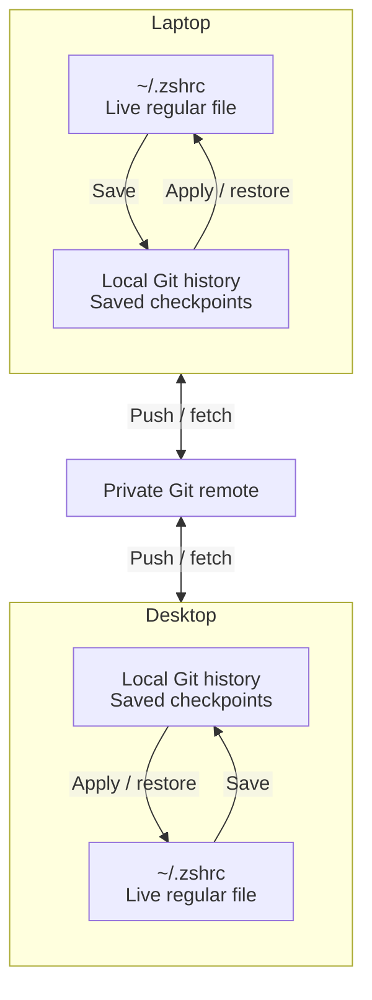

# Sync across machines

Connect a private Git repository, called the origin, and mise shares the
history of your tracked files with every machine that uses it. An edit saved
on your laptop reaches your desktop, and edits on the desktop come back.

Your files stay where they are on each machine. Saved checkpoints travel
through the origin, and mise applies incoming changes to the tracked files on
the other machine. `mise dot status` and `mise dot origin` call the origin the
setup repository.



## Before you connect {#before-you-connect}

Automatic sync needs the [watcher](/dotfiles/history.html#automatic-saves) on
each machine, and Git credentials that the watcher can use; see
[repository authentication](#repository-authentication).

Review your tracked files and their earlier checkpoints first. Connecting
shares the whole history, including intermediate saves made before you
connected, and a secret you delete from the current file stays in older
commits. Use a private repository, and set up
[encryption](/dotfiles/encryption.html) before you first save a file that
needs it. To keep a file out of the shared history, do not track it;
untracking or excluding a file later keeps its earlier versions in history.

## Connect an origin {#sharing-across-machines}

Create an empty private repository, replace `you/setup` with its name, and
connect it with [`mise dot origin set`](/cli/dotfiles/origin/set.html):

```sh
mise dot origin set https://github.com/you/setup.git --sync sync
mise dot status
```

Any Git URL works, including a self-hosted server:

```sh
mise dot origin set git@gitea.example.com:you/setup.git --sync sync
```

The URL must not contain credentials, a query string, or a fragment.
Authenticate with an SSH agent, or with a Git credential helper for HTTPS.

Files that describe one machine, such as a monitor layout, should not be
applied on the others. Track them with a
[`machine` variant](/dotfiles/history.html#machine-variants) so each machine
keeps its own version.

mise prints a preview of the connection and then connects. Without `--sync`,
it asks which sync mode to use first, because `sync` lets the origin write your
live files. With `--sync sync`, the
watcher pushes saved changes and periodically fetches and applies changes from
other machines. mise uses the repository's default branch unless you pass
`--branch`; a repository with no branches gets `main`, which the first push
creates.

mise writes the connection to `[history.origin]` in your
`~/.config/mise/config.local.toml`, so it stays on this machine, and the mode
to the [`history.sync`](/configuration/settings.html#history.sync) setting.
`mise dot origin` shows what is connected, and `mise dot origin --remove`
disconnects; local checkpoints and fetched history stay.

To bring another machine into the same setup, follow
[Set up a machine](/bootstrap/setup.html#set-up-another-machine), which adopts
the repository with
[`mise bootstrap --adopt`](/bootstrap/from-repository.html#shared-dotfile-history).

### Repository authentication {#repository-authentication}

Network commands use your Git configuration, including credential helpers,
SSH, and URL rewrites. For a private GitHub repository, install the GitHub CLI
globally through mise and configure its credential helper:

```sh
mise use -g gh
mise exec gh -- gh auth login --hostname github.com --git-protocol https --web
mise exec gh -- gh auth setup-git --hostname github.com
```

The helper is written to `~/.gitconfig`. Keeping `gh` installed globally keeps
it available to the background watcher. If Git authentication already works in
the service's environment, you can use it as it is.

For SSH remotes, prefer a passphrase-protected key loaded into an SSH agent
that the service can reach. If unattended syncing needs a key without a
passphrase, use a deploy key scoped to this repository, grant write access
only when the machine needs to push, and restrict the private key file to your
user (for example, mode `0600` on Unix or an equivalent Windows ACL). Do not
reuse an unrestricted personal key.

## Choose a sync mode {#choose-a-sync-mode}

The [`history.sync`](/configuration/settings.html#history.sync) setting
controls what the watcher does on its own:

| Mode         | Behavior                                                                                                                                                                                                                         |
| ------------ | -------------------------------------------------------------------------------------------------------------------------------------------------------------------------------------------------------------------------------- |
| `sync`       | Push saved changes within [`history.sync_interval`](/configuration/settings.html#history.sync_interval). Fetch and apply incoming changes every [`history.fetch_interval`](/configuration/settings.html#history.fetch_interval). |
| `manual`     | Keep saving locally. Exchange and apply changes only when you run `mise dot sync` and `mise dot pull`.                                                                                                                           |
| `fetch-only` | Fetch remote changes. Never publish; apply incoming changes only when you run `mise dot pull`.                                                                                                                                   |

Choose a mode with `--sync manual`, `--sync sync`, or `--sync fetch-only` when
you connect, or change it later with `mise settings set history.sync manual`.
Without `--sync`, `origin set` asks whether to turn on automatic sharing, and
declining selects `manual`. With `--yes`, it uses the configured mode, which is
`sync` unless you changed it, so pass `--sync` in scripts.

## Sync now {#sync-immediately}

These commands run in every mode; in `fetch-only` mode, `sync` only fetches:

```sh
mise dot sync
mise dot pull
```

[`mise dot sync`](/cli/dotfiles/sync.html) fetches remote changes and, except
in `fetch-only` mode, pushes saved commits. It never changes your files.
[`mise dot pull`](/cli/dotfiles/pull.html) applies pending changes to your
files. In `sync` mode, use them when you do not want to wait for the next
scheduled run.

Each push includes all accumulated commits, including intermediate saves made
in manual mode. Files waiting for a manual save or a delayed watcher save
contribute their last saved contents.

`pull` applies the complete incoming file set, including configuration and the
sources it uses, together; you cannot pull part of it. It does not install
tools or services or render templates. When those declarations or their
sources change, run `mise bootstrap` to deploy them, or `mise dot apply` if only
`[dotfiles]` changed. You do not need a separate `apply` to restore the
contents of shared tracked files.

Pull saves a checkpoint first, records each file it writes, and runs the
matching [reload commands](/dotfiles/history.html#reload-an-application-after-restoring-files)
afterwards, as `rollback`, `undo`, and `mise dot apply` do. `mise dot undo`
reverses it. Files are written one at a time; an interrupted pull continues
with [`mise dot recover`](/dotfiles/reference.html#recovery-details).

A conflict or an unsaved edit pauses pushing and applying incoming changes for
all tracked files, while local saves and fetching continue. When a network or
authentication attempt fails, automatic sync retries with delays that grow
from one minute to one hour. `mise dot status` and `mise doctor` show the last
error.

## Resolve a conflict {#resolve-a-conflict}

Compare the version saved on this machine with the fetched repository
version:

```sh
mise dot status
mise dot conflicts ~/.zshrc
```

[`mise dot conflicts`](/cli/dotfiles/conflicts.html) prints a unified diff
without changing either side. Pass `--difftool` to open the comparison in
Git's configured diff tool, or its merge tool when no diff tool is set, and
`--difftool --tool <name>` to choose a tool.

Take the remote version of a file, or keep the local one:

```sh
mise dot pull --take-remote ~/.zshrc
mise dot pull --keep-local ~/.zshrc
```

To decide every conflict the same way in one command, use the blanket form.
`--keep-local` and `--take-remote` then name the exceptions:

```sh
mise dot pull --take-remote-all
mise dot pull --take-remote-all --keep-local ~/.zshrc
mise dot pull --keep-local-all
```

`--keep-local-all` requires every file it keeps to be saved already, so run
`mise dot save` first if you have unsaved edits.

To combine both sides, edit the live file using the conflict diff, save the
merged file explicitly (which also covers files tracked with `--no-autosave`),
and then keep the saved local version:

```sh
mise dot conflicts --difftool ~/.zshrc
mise dot save ~/.zshrc
mise dot pull --keep-local ~/.zshrc
```

mise records each decision and applies the incoming files only once every
conflict is resolved. It checks the plan again before it continues, and a
newer local or remote edit can cancel a decision, in which case you choose
again.

Invalid incoming configuration or an unsafe local path also blocks the whole
batch; `mise dot status` and `mise doctor` name the paths and the last
successful application. A few conflicts cannot be resolved with `pull`, such
as changes to tracking or encryption settings, inactive platform variants, or
histories with several Git merge bases. For those, `status` prints Git
commands to run in a separate clone.

### Conflict notifications {#conflict-notifications}

mise shows a desktop notification when a sync conflict pauses sharing, and
points you to `mise dot status`. One pause produces one notification; retries
during the same pause stay quiet, and a new pause after recovery can notify
again. Notifications cover sync conflicts only. Other problems, such as a
watcher that cannot save, appear only in `mise doctor` and `mise dot status`.

| Platform                             | Requirement                                                                                                               |
| ------------------------------------ | ------------------------------------------------------------------------------------------------------------------------- |
| Linux                                | `notify-send` installed                                                                                                   |
| macOS, official release builds       | Allow notifications when first asked. mise appears in System Settings > Notifications only after that first notification. |
| macOS, other builds such as Homebrew | Not supported; mise warns when you connect an origin                                                                      |
| Windows, headless systems            | Not supported; use `mise dot status` or `mise doctor`                                                                     |

Run [`mise dot notify`](/cli/dotfiles/notify.html) to send a test notification
and answer the macOS prompt now; it also reports why a notification cannot be
shown. `mise doctor` reports whether notifications can be delivered. A missing
or failing notifier never stops history or sync. To turn notifications off:

```sh
mise settings set history.notify false
```

## Identify commits by machine {#identify-commits-by-machine}

History commits use `mise <mise@localhost>` as author and committer by
default. To see which machine made each new commit in a shared history, add
this to your system or global config:

```toml
[history]
git_email = "mise@{hostname}"
```

mise replaces `{hostname}` with the machine's hostname when it creates a
commit, so a save on `work-mbp.local` uses `mise <mise@work-mbp.local>`. This
also applies to the watcher's commits and to merge commits that mise makes.
The value can also be a fixed email address. It affects new commits only;
existing commits keep their identity.

## Resolve unrelated histories {#resolve-unrelated-histories}

If your local checkpoints and the origin branch share no Git ancestry,
`mise dot origin set` and `mise dot sync` refuse to combine them. Neither
history is replaced, even if the files have identical contents. Choose which
history to keep before you try again.

### Keep your local checkpoints {#keep-local-checkpoints}

Connect an empty repository:

```sh
mise dot origin set <empty-repository-url>
```

To use the existing repository instead, first push your local history to a
new branch there with Git, then connect that branch:

```sh
mise dot origin set <url> --branch <name>
```

The branch must already exist; `origin set` creates a branch only when the
repository has none.

### Adopt the origin's history {#adopt-the-origins-history}

If the origin holds mise history (a setup repository, such as one that
`mise dot origin set` has published to), you can discard your local
checkpoints and replace them with its history:

```sh
mise bootstrap --adopt <url> --replace-history --yes
```

Back up any local history you want to keep first. The command takes the
history and sync locks, so a running watcher cannot save a checkpoint during
the replacement. Existing files that differ from the incoming setup still
wait for your decision before setup can finish; add `--take-remote-all` to take
the repository's version of each. The replaced versions are saved first, so
`mise dot undo` restores them. A failure restores the previous local branch and
sync state. `--replace-history` applies only to
this adoption; no setting lets the watcher discard divergent history. It
does not work with an ordinary Git repository that holds no mise history. To
replace history in order to remove a secret, see
[remove plaintext from history](/dotfiles/encryption.html#remove-plaintext-from-history).

## How shared history is stored {#how-shared-history-is-stored}

Git stores tracked paths relative to `home/` or `config/`, so each machine
restores them beneath its own home directory or mise config directory. A
[variant](/dotfiles/history.html#variants) gets a suffix, such as
`home@macos/`. The same mapping applies to tracked template sources and
managed files. Other files in the repository, such as a README, stay in Git
and are never restored as live configuration.

Sync uses Git ancestry, fast-forwards, and merge commits. A push keeps the
saved commits and their Git author identities. A rejected push triggers
another fetch and reconciliation. mise never force-pushes, and leaves
divergent or unrelated histories for you to resolve. Before it writes incoming
changes, it checks the complete batch, including configuration, required
sources, committed files, and unsaved local edits.

When you adopt the repository on a new machine, mise restores the shared
configuration and tracked files and then runs bootstrap; later pulls restore
files without running setup. See
[Bootstrap from a repository](/bootstrap/from-repository.html#shared-dotfile-history).

### Mixed mise versions {#mixed-mise-versions}

Run a current mise on every machine that shares a history. Per-entry
`include` and `exclude` lists on tracked directories need mise 2026.9.13 or
later, and `allow_plaintext` needs 2026.9.16 or later; older versions reject a
shared setup that uses them. Checkpoints written by 2026.9.13 and later use a
format that older versions cannot roll back.
