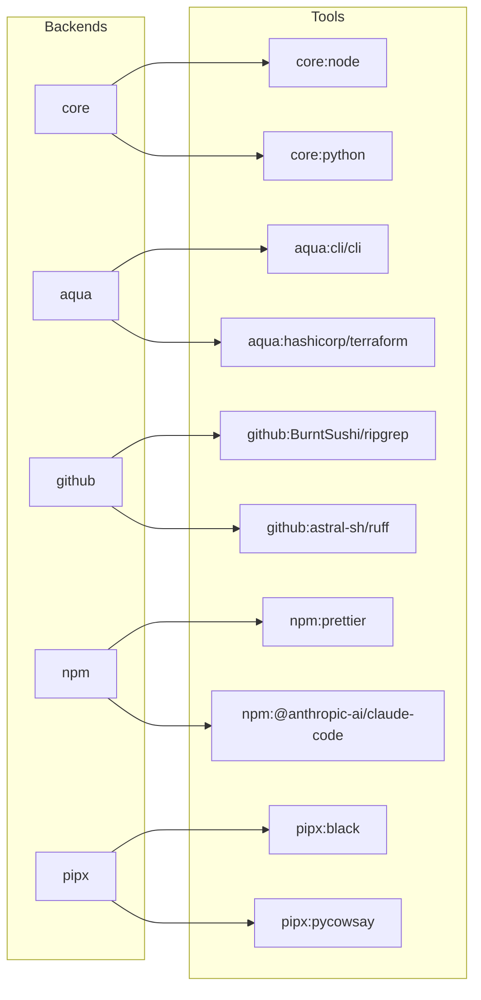

<!-- markdownlint-disable MD034 -->

# Getting Started

Get up and running with mise in minutes.

## 1. Install `mise` CLI {#installing-mise-cli}

See [installing mise](/installing-mise) for other ways to install mise (`macport`, `apt`, `yum`, `nix`, etc.).

:::tabs key:installing-mise
== Linux/macOS

```shell
curl https://mise.run | sh
```

By default, mise installs to `~/.local/bin`, but it can go anywhere.

Verify the installation:

```shell
~/.local/bin/mise --version
# mise 2024.x.x
```

- `~/.local/bin` does not need to be in `PATH`. mise will automatically add its own directory to `PATH`
  when [activated](#activate-mise).

== Brew

```shell
brew install mise
```

== Windows
::: code-group

```shell [winget]
winget install jdx.mise
```

```shell [scoop]
# https://github.com/ScoopInstaller/Main/pull/6374
scoop install mise
```

```shell [chocolatey]
choco install mise
```

== Debian/Ubuntu (apt)

```sh
sudo apt update -y && sudo apt install -y curl
sudo install -dm 755 /etc/apt/keyrings
curl -fSs https://mise.jdx.dev/gpg-key.pub | sudo tee /etc/apt/keyrings/mise-archive-keyring.asc 1> /dev/null
echo "deb [signed-by=/etc/apt/keyrings/mise-archive-keyring.asc] https://mise.jdx.dev/deb stable main" | sudo tee /etc/apt/sources.list.d/mise.list
sudo apt update -y
sudo apt install -y mise
```

== Fedora 41+, RHEL/CentOS Stream 9+ (dnf)

```sh
sudo dnf copr enable jdxcode/mise
sudo dnf install mise
```

See the [copr page](https://copr.fedorainfracloud.org/coprs/jdxcode/mise/) for more information.

== Snap (beta)

```sh
sudo snap install mise --classic --beta
```

See the [snapcraft.io page](https://snapcraft.io/mise) for more information.

:::

`mise` respects [`MISE_DATA_DIR`](/configuration) and [`XDG_DATA_HOME`](/configuration) if you'd like
to change these locations.

## 2. mise `exec` and `run` {#mise-exec-run}

Once installed, you can start using mise right away to install and run [tools](/dev-tools/), launch [tasks](/tasks/), and manage [environment variables](/environments/).

The quickest way to run a tool at a specific version is [`mise x|exec`](/cli/exec.html). For example, to launch a Python 3 REPL:

::: tip
If `mise` isn't on `PATH` yet, use `~/.local/bin/mise` instead.
:::

```sh
mise exec python@3 -- python
# this will download and install Python if it is not already installed
# Python 3.15.0
# >>> ...
```

or run node 26:

```sh
mise exec node@26 -- node -v
# v26.x.x
```

To install a tool permanently, use [`mise u|use`](/cli/use.html):

```shell
mise use --global node@26 # install node 26 and set it as the global default
mise exec -- node my-script.js
# run my-script.js with node 26...
```

[`mise r|run`](/cli/run.html) lets you run [tasks](/tasks/) or scripts with the full mise context (tools + env vars) loaded.

::: tip
You can set a shell alias in your shell's rc file like `alias x="mise x --"` to save some keystrokes.
:::

## 3. Activate `mise` <Badge text="optional" /> {#activate-mise}

`mise exec` works great for one-off commands, but for interactive shells you'll probably want to activate mise so tools and environment variables are loaded automatically.

There are two approaches:

- [`mise activate`](/cli/activate) — updates your `PATH` and environment every time your prompt runs. Recommended for interactive shells.
- [Shims](dev-tools/shims.md) — symlinks that intercept commands and load the right environment. Better for CI/CD, IDEs, and scripts. Note that [shims don't support all features of `mise activate`](/dev-tools/shims.html#shims-vs-path).

You can also skip both and call `mise exec` or `mise run` directly.
See [this guide](dev-tools/shims.md) for more information.

Here is how to activate mise for your shell:

:::tabs key:installing-mise

== https://mise.run

::: code-group

```sh [bash]
echo 'eval "$(~/.local/bin/mise activate bash)"' >> ~/.bashrc
```

```sh [zsh]
echo 'eval "$(~/.local/bin/mise activate zsh)"' >> ~/.zshrc
```

```sh [fish]
echo '~/.local/bin/mise activate fish | source' >> ~/.config/fish/config.fish
```

== Brew

::: code-group

```sh [bash]
echo 'eval "$(mise activate bash)"' >> ~/.bashrc
```

```sh [zsh]
echo 'eval "$(mise activate zsh)"' >> ~/.zshrc
```

```sh [fish]
# do nothing! mise is automatically activated when using brew and fish
# you can disable this behavior with `set -Ux MISE_FISH_AUTO_ACTIVATE 0`
```

== Windows

Add the following to your PowerShell profile (`$PROFILE`):

```powershell
(&mise activate pwsh) | Out-String | Invoke-Expression
```

In case you need to open your PowerShell profile:

```powershell
# create profile if it doesn't already exist
if (-not (Test-Path $profile)) { New-Item $profile -Force }
# open the profile
Invoke-Item $profile
```

- If not using PowerShell, add `<homedir>\AppData\Local\mise\shims` to `PATH`.

== Other package managers

::: code-group

```sh [bash]
echo 'eval "$(mise activate bash)"' >> ~/.bashrc
```

```sh [zsh]
echo 'eval "$(mise activate zsh)"' >> ~/.zshrc
```

```sh [fish]
echo 'mise activate fish | source' >> ~/.config/fish/config.fish
```

:::

Restart your shell session after modifying your rc file. Run [`mise dr|doctor`](/cli/doctor.html) to verify everything is set up correctly.

With mise activated, tools are available directly on `PATH`:

```sh
mise use --global node@26
node -v
# v26.x.x
```

When you ran `mise use --global node@26`, mise updated your global config:

```toml [~/.config/mise/config.toml]
[tools]
node = "26"
```

### Shell Feature Compatibility {#shell-feature-compatibility}

Not all shells support every mise feature:

| Feature                         | Bash | Zsh | Fish | Nushell | Elvish | Xonsh | PowerShell |
| ------------------------------- | ---- | --- | ---- | ------- | ------ | ----- | ---------- |
| `mise activate`                 | Yes  | Yes | Yes  | Yes     | Yes    | Yes   | Yes        |
| `mise shell`                    | Yes  | Yes | Yes  | Yes     | Yes    | Yes   | Yes        |
| Shell aliases (`[shell_alias]`) | Yes  | Yes | Yes  | No      | No     | Yes   | No         |
| `chpwd` hook                    | Yes  | Yes | Yes  | Yes     | Yes    | Yes   | Yes        |

## 4. Use tools from backends (npm, pipx, core, aqua, github) {#tool-backends}



Backends are the package ecosystems that mise pulls tools from. With `mise use`, you can install from any of them.

Install [claude-code](https://www.npmjs.com/package/@anthropic-ai/claude-code) from npm:

```sh
# one-off
mise exec npm:@anthropic-ai/claude-code -- claude --version

# or install globally
mise use --global npm:@anthropic-ai/claude-code
claude --version
```

Install [black](https://github.com/psf/black) from PyPI via pipx:

```sh
# one-off
mise exec pipx:black -- black --version

# or install globally
mise use --global pipx:black
black --version
```

Install [ripgrep](https://github.com/BurntSushi/ripgrep) directly from GitHub releases:

```sh
# one-off
mise exec github:BurntSushi/ripgrep -- rg --version

# or install globally
mise use --global github:BurntSushi/ripgrep
rg --version
```

Each `mise use` command above updates your config file. For example, after running all three globally, your `~/.config/mise/config.toml` would contain:

```toml [~/.config/mise/config.toml]
[tools]
"npm:@anthropic-ai/claude-code" = "latest"
"pipx:black" = "latest"
"github:BurntSushi/ripgrep" = "latest"
```

You can also edit `mise.toml` directly instead of using `mise use` — the effect is the same. Run `mise install` after editing to install the tools.

See [Backends](/dev-tools/backends/) for more ecosystems and details.

## Trusting config files {#trust}

When you or a teammate adds a `mise.toml` to a project, mise will prompt you to trust it before it runs any env directives or hooks:

```
mise ~/my-project/mise.toml is not trusted. Trust it? [y/n]
```

This is a security measure — config files can execute arbitrary code via `[env]` directives, hooks, and tasks. To trust a file, run:

```sh
mise trust
```

This only needs to be done once per file. See [`mise trust`](/cli/trust) for more details.

To disable trust prompts entirely, trust the root path:

```sh
mise settings trusted_config_paths=["/"]
```

Or set the environment variable `MISE_TRUSTED_CONFIG_PATHS=/`.

::: tip
`mise use` automatically trusts the file it creates, so you'll only see this prompt when pulling a config someone else wrote or when editing `mise.toml` by hand.
:::

## 5. Setting environment variables {#environment-variables}

Define environment variables in `mise.toml` — they'll be loaded whenever mise is activated or when using `mise exec`:

```toml [mise.toml]
[env]
NODE_ENV = "production"
```

```sh
mise exec -- node --eval 'console.log(process.env.NODE_ENV)'

# or if mise is activated in your shell
echo "node env: $NODE_ENV"
# node env: production
```

## 6. Run a task {#run-a-task}

Define tasks in `mise.toml` and run them with `mise run`:

```toml [mise.toml]
[tasks]
hello = "echo hello from mise"
```

```sh
mise run hello
# hello from mise
```

:::tip
mise automatically installs all tools from `mise.toml` before running a task.
:::

See [tasks](/tasks/) for more on defining and running tasks.

## 7. Next steps {#next-steps}

Follow the [walkthrough](/walkthrough) for more examples on how to use mise.

### Set up autocompletion {#autocompletion}

See [autocompletion](/installing-mise.html#autocompletion) to learn how to set up autocompletion for your shell.

### GitHub API rate limiting {#github-api-rate-limiting}

::: warning
Many tools in mise require the GitHub API. Unauthenticated requests are often rate limited — if you see 4xx errors, see [GitHub Tokens](/dev-tools/github-tokens.html) for how to configure authentication.
:::
