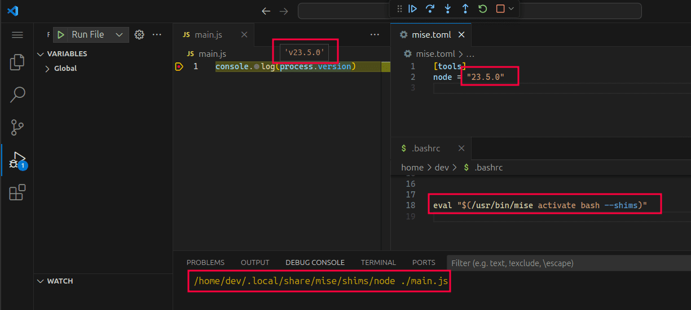
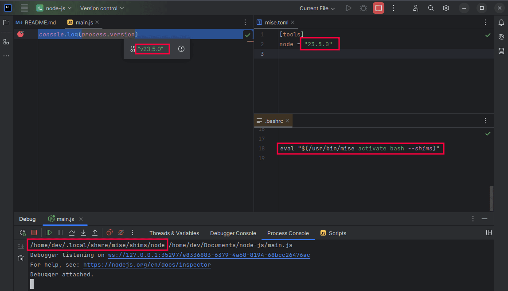
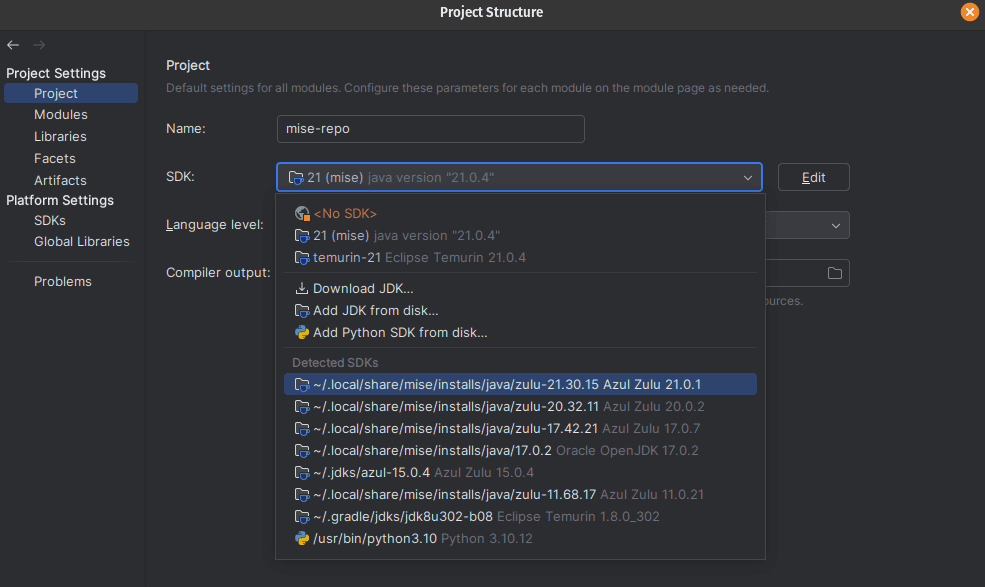

# IDE Integration

Code editors and IDEs work differently than interactive shells.

Usually, they will either inherit the environment from your current shell (this is the case if you start it from a terminal like `nvim .` or `code .`) or will have [their own way](https://github.com/microsoft/vscode-docs/blob/906acccd6180d8425577f8297ed29e221ad3daca/docs/supporting/faq.md?plain=1#L238) to set up the environment.

Once you have launched the IDE, it won't reload the environment variables or the `PATH` provided by `mise` if you update your mise configuration files. Therefore, we cannot rely on the default `mise activate` method to automatically set up the editor.

There are a few ways to make `mise` work with your editor:

- Some editors or IDE plugins have direct support for `mise` and can let you select the tools/sdk path from the IDE settings. This will let you access to the tool binaries but won't load the environment variables.
- Most editors (and language plugins) will look for tools on the `PATH` and run them in the context of your project. Therefore, adding the `mise` shims to the `PATH` might be enough (see [below](#adding-shims-to-path-default-shell)). This will run the tool provided by mise and load the environment variables.
- In other cases, you may need to manually indicate the path to the tools provided by `mise` in the IDE settings. This can be done by using [`mise which <tool>`](./cli/which.md) or [`mise where`](./cli/where). You can also provide the path to the tool shim (e.g. `~/.local/share/mise/shims/node`) if the plugin supports it as this will also load the environment variables when the tool is run.
- Finally, some custom plugins have been developed to work with `mise`. You can find them in the [IDE Plugins](#ide-plugins) section.

## Adding shims to PATH in your default shell profile {#adding-shims-to-path-default-shell}

IDEs work better with [shims](./dev-tools/shims) than they do environment variable modifications. The simplest way is
to add the mise shim directory to `PATH`.

For IntelliJ and VSCode—and likely others, you can modify your default shell's login (aka "profile")
script. Your default shell can be found with:

::: code-group

```shell [macos]
dscl . -read /Users/$USER UserShell
```

```shell [linux]
getent passwd $USER | cut -d: -f7
```

:::

You can change your default shell with `chsh -s /path/to/shell` but you may need
to first add it to `/etc/shells`. Once you know the right one, modify the appropriate file:

::: code-group

```zsh
# ~/.zprofile
eval "$(mise activate zsh --shims)"
```

```bash
# ~/.bash_profile or ~/.bash_login or ~/.profile
eval "$(mise activate bash --shims)"
```

```fish
# ~/.config/fish/config.fish
if status is-interactive
  mise activate fish | source
else
  mise activate fish --shims | source
end
```

:::

::: warning
Do not use /bin/bash or /usr/bin/bash on macOS. bash is complicated, decades old, and mise isn't able to use as many features.
Unless you consider yourself an expert on bash and know why I (and Apple for that matter) admonish using bash, just use zsh on macOS.
:::

On Linux this is read when logging into the machine, so changing it requires logging out and back in for it to work. See #vscode below
for how to get VSCode to read the login file.

This assumes that `mise` is on `PATH`. If it is not, you'll need to use the absolute path (
e.g.: `eval "$($HOME/.local/bin/mise activate zsh --shims)"`).

Here is an example showing that VSCode will use `node` provided by `mise`:

::: tabs
=== VSCode



=== IntelliJ

:::

As mentioned above, using `shims` doesn't work with all mise features. For example, arbitrary [env vars](./environments/) in `[env]` will
only be set if a shim is executed. For this we need tighter integration with the IDE and/or a custom plugin.

## IDE Plugins

Here are some community plugins that have been developed to work with `mise`:

- Emacs: [mise.el](https://github.com/liuyinz/mise.el)
- IntelliJ: [intellij-mise](https://github.com/134130/intellij-mise)
- VSCode: [mise-vscode](https://github.com/hverlin/mise-vscode)

## Vim

```vim
" Prepend mise shims to PATH
let $PATH = $HOME . '/.local/share/mise/shims:' . $PATH
```

## Neovim

```lua
-- Prepend mise shims to PATH
vim.env.PATH = vim.env.HOME .. "/.local/share/mise/shims:" .. vim.env.PATH
```

For a better Treesitter and LSP integration, check out the [neovim cookbook](./mise-cookbook/neovim.md).

## emacs

### Traditional shims way

```lisp
;; CLI tools installed by Mise
;; See: https://www.emacswiki.org/emacs/ExecPath
(setenv "PATH" (concat (getenv "PATH") ":/home/user/.local/share/mise/shims"))
(setq exec-path (append exec-path '("/home/user/.local/share/mise/shims")))
```

### Use with package [mise.el](https://github.com/eki3z/mise.el)

<https://github.com/eki3z/mise.el>

> A GNU Emacs library which uses the mise tool to determine per-directory/project environment variables and then set those environment variables on a per-buffer basis.

```lisp
(require 'mise)
(add-hook 'after-init-hook #'global-mise-mode)
```

## JetBrains Editors (IntelliJ, RustRover, PyCharm, WebStorm, RubyMine, GoLand, etc)

### IntelliJ Plugin

<https://github.com/134130/intellij-mise>

This plugin can automatically configure the IDE to use the tools provided by mise. It has also some support for running mise tasks and loading environment variables in the run configurations.

### Direct SDK selection

Some JetBrains IDEs (or language plugins) have direct support for `mise`. This allows you to select the SDK version from the IDE settings.
Example for Java:



### SDK selection using asdf layout

Some plugins cannot find SDK installed by `mise` yet but might have support for asdf.
In that case, a workaround is to symlink the mise tool directory which has same layout as asdf:

```sh
ln -s ~/.local/share/mise ~/.asdf
```

Then they should show up on in Project Settings:


Or in the case of node (possibly other languages), it's under "Languages & Frameworks":


## VSCode

### VSCode Automation Profile for macOS

Unlike Linux, macOS does not read the login shell profile (`~/.profile`, or `~/.zprofile`) when logging into the machine. You'll likely
want to add this setting to VSCode config in order to have it load your shims:

```json
    "terminal.integrated.automationProfile.osx": {
        "path": "/usr/bin/zsh",
        "args": ["--login"]
    }
```

:::tip
You can also use `["--login", "--interactive"]` if you want to include `~/.zshrc`.
:::

### VSCode Plugin

There is a [VSCode plugin](https://marketplace.visualstudio.com/items?itemName=hverlin.mise-vscode) which can configure other extensions for you, without having to modify your shell profile to add the shims to `PATH`.

In addition, it provides additional features such as:

- Automatic configuration of other extensions to use tools provided by `mise`
- Manage `mise` tasks, tools, and environment variables directly from VSCode
- Load environment variables from `mise.toml` files in VSCode
- Support for autocompletion and snippets for `mise.toml` file
- Integration with VSCode tasks

<https://github.com/hverlin/mise-vscode/> ([Documentation](https://hverlin.github.io/mise-vscode/))

### Use [`mise exec`](./cli/exec) in launch Configuration

While modifying your default shell profile is likely the easiest solution, you can also set
the tools in `launch.json`:

::: details mise exec launch.json example

```json
{
  "configurations": [
    {
      "type": "node",
      "request": "launch",
      "name": "Launch Program",
      "program": "${file}",
      "args": [],
      "osx": {
        "runtimeExecutable": "mise"
      },
      "linux": {
        "runtimeExecutable": "mise"
      },
      "runtimeArgs": ["exec", "--", "node"]
    }
  ]
}
```

:::

## Xcode

Xcode projects can run system commands from script build phases and schemes. Since Xcode sandboxes
the execution of the script using the tool `/usr/bin/sandbox-exec`, don't expect Mise and the
automatically-activated tools to work out of the box. First, you'll need to
add `$(SRCROOT)/mise.toml` to the list of **Input files**. This is necessary for Xcode to allow
reads to that file. Then, you can use `mise activate` to activate the tools you need:

```bash
# -C ensures that Mise loads the configuration from the Mise configuration
# file in the project's root directory.
eval "$($HOME/.local/bin/mise activate -C $SRCROOT bash --shims)"

swiftlint
```
