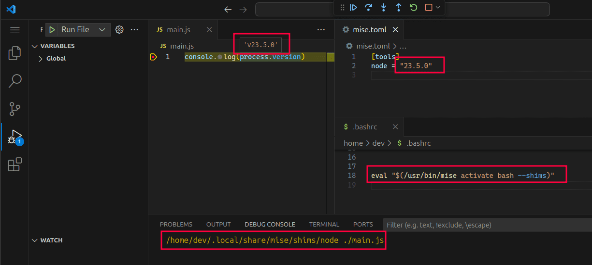
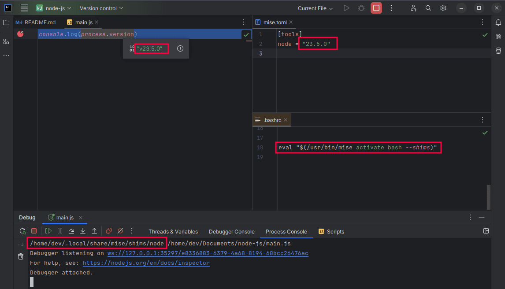
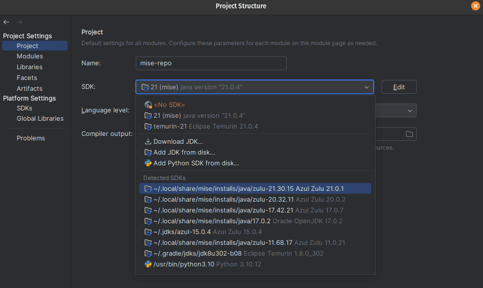

# IDE Integration

An editor's terminal, language server, debugger, and extension host can use different
environments. First identify which process needs a tool or variable, then choose an integration:

| Need                                              | Integration                            | What to expect                                                                                                            |
| ------------------------------------------------- | -------------------------------------- | ------------------------------------------------------------------------------------------------------------------------- |
| A fixed executable or SDK directory               | `mise which node` or `mise where java` | Selects an installed path; update the IDE setting after changing versions.                                                |
| A tool that follows the current project           | [Shims](/dev-tools/shims.html)         | Resolves the tool and loads mise environment variables when the shim runs. The process must run in the project directory. |
| A command with the project environment            | `mise exec -- command`                 | Loads tools and variables for that command and its children.                                                              |
| Editor features that follow configuration changes | A [mise plugin](#ide-plugins)          | Support depends on the editor, extension, and language.                                                                   |

Run `mise install` in the project first. Selecting an SDK path alone does not load `[env]`.
Shims also do not change the environment of the already-running editor. Restart affected
language servers or the editor after changing an inherited environment or a fixed SDK path.

## Adding shims to PATH in your default shell profile {#adding-shims-to-path-default-shell}

Add the [shim directory](/dev-tools/shims.html) to the environment used to launch the editor.
This lets processes find mise-managed tools without requiring an interactive prompt hook.

For IntelliJ and VSCode—and likely others—you can modify your default shell's login (or "profile")
script. Find your default shell with:

::: code-group

```shell [macos]
dscl . -read /Users/$USER UserShell
```

```shell [linux]
getent passwd $USER | cut -d: -f7
```

:::

Edit the startup file for the shell your editor actually loads. For Bash, use the first
existing file among `~/.bash_profile`, `~/.bash_login`, and `~/.profile`; creating a new
`~/.bash_profile` can prevent an existing `~/.profile` from being read.

::: code-group

```zsh
# ~/.zprofile
eval "$(mise activate zsh --shims)"
```

```bash
# ~/.bash_profile or ~/.bash_login or ~/.profile
eval "$(mise activate bash --shims)"
```

```fish
# ~/.config/fish/config.fish
if status is-interactive
  mise activate fish | source
else
  mise activate fish --shims | source
end
```

:::

Restart the editor after editing the profile. Some desktop environments read a login profile
only when you log in, so a logout/login may also be needed. Check the editor's environment
settings if it does not read your shell profile. VS Code's
[environment resolution](https://code.visualstudio.com/docs/terminal/advanced#_environment-inheritance)
and its [task terminal profile](#vscode-automation-profile-for-macos) are separate mechanisms.

This assumes that `mise` is on `PATH`. If it is not, use the absolute path
(e.g. `eval "$($HOME/.local/bin/mise activate zsh --shims)"`).

Here are examples showing VSCode and IntelliJ using the `node` provided by `mise`:

::: tabs
=== VSCode



=== IntelliJ

:::

As mentioned above, using `shims` doesn't work with all mise features. For example, arbitrary [env vars](./environments/) in `[env]` are
only set when a shim is executed. Supporting them requires tighter integration with the IDE or a custom plugin.

## IDE Plugins

Here are some community plugins that have been developed to work with `mise`:

- Emacs: [mise.el](https://github.com/eki3z/mise.el)
- IntelliJ: [intellij-mise](https://github.com/134130/intellij-mise)
- VSCode: [mise-vscode](https://github.com/hverlin/mise-vscode)

## Vim

```vim
" Prepend mise shims to PATH
let $PATH = $HOME . '/.local/share/mise/shims:' . $PATH
```

## Neovim

```lua
-- Prepend mise shims to PATH
vim.env.PATH = vim.env.HOME .. "/.local/share/mise/shims:" .. vim.env.PATH
```

For better Treesitter and LSP integration, see the [neovim cookbook](./mise-cookbook/neovim.md).

## Emacs

### Shims

```lisp
(let ((mise-shims (expand-file-name "~/.local/share/mise/shims")))
  (setenv "PATH" (concat mise-shims path-separator (getenv "PATH")))
  (add-to-list 'exec-path mise-shims))
```

### Use with package mise.el

[mise.el](https://github.com/eki3z/mise.el) loads mise environments per buffer. Install the
package following its README, then enable it:

```lisp
(require 'mise)
(add-hook 'after-init-hook #'global-mise-mode)
```

## JetBrains Editors (IntelliJ, RustRover, PyCharm, WebStorm, RubyMine, GoLand, etc)

### IntelliJ Plugin

<https://github.com/134130/intellij-mise>

This plugin can automatically configure the IDE to use the tools provided by mise. It also has some support for running mise tasks and loading environment variables in run configurations.

### Direct SDK selection

Some JetBrains IDEs (or language plugins) support `mise` directly, allowing you to select the SDK version from the IDE settings.
Example for Java:



### SDK selection using asdf layout

Some plugins cannot yet find SDKs installed by `mise` but do support asdf.
Prefer direct SDK selection when available. If a plugin requires an asdf directory, a symlink
can expose the mise layout. Only use this workaround if `~/.asdf` does not already exist;
do not replace an existing asdf installation or use asdf to modify mise-managed installs:

```sh
ln -s ~/.local/share/mise ~/.asdf
```

They should then show up in Project Settings:


For node (and possibly other languages), the setting is under "Languages & Frameworks":


## VSCode

### VSCode Automation Profile for macOS

To load `~/.zprofile` for task and debug terminals, add this to `settings.json`:

```json
{
  "terminal.integrated.automationProfile.osx": {
    "path": "/bin/zsh",
    "args": ["--login"]
  }
}
```

This [automation profile](https://code.visualstudio.com/docs/terminal/profiles#_configuring-the-taskdebug-profile)
applies to terminals used by tasks and debugging. It does not configure the extension host
or every language server. Keep shim setup in `~/.zprofile`; adding `--interactive` also loads
`~/.zshrc`, including prompt customization that a build process usually does not need.

### VSCode Plugin

The [VSCode plugin](https://marketplace.visualstudio.com/items?itemName=hverlin.mise-vscode)
provides tool and task management, environment loading, and configuration assistance.
It can configure [supported language extensions](https://hverlin.github.io/mise-vscode/reference/supported-extensions/)
to use mise tools. Automatic extension configuration is disabled by default; enable
[`mise.configureExtensionsAutomatically`](https://hverlin.github.io/mise-vscode/reference/settings/#miseconfigureextensionsautomatically)
if you want that behavior.

See the [plugin documentation](https://hverlin.github.io/mise-vscode/) for its environment
and task settings. Configure mise on the machine running the extension: a local installation
does not provide tools inside an SSH host, WSL distribution, or development container.

### Use [`mise exec`](./cli/exec) in launch Configuration

For Node.js debugging, run the runtime through mise in `launch.json`. Set `cwd` to the project
containing `mise.toml`. The editor must be able to find `mise`; otherwise replace
`runtimeExecutable` with its absolute path. This example targets macOS and Linux:

::: details mise exec launch.json example

```json
{
  "version": "0.2.0",
  "configurations": [
    {
      "type": "node",
      "request": "launch",
      "name": "Launch Program",
      "program": "${file}",
      "cwd": "${workspaceFolder}",
      "runtimeExecutable": "mise",
      "runtimeArgs": ["exec", "--", "node"]
    }
  ]
}
```

:::

## Xcode

Xcode build phases do not run your interactive shell startup files. Use an absolute mise
path and select the project directory explicitly. For a project that declares SwiftLint:

```sh
"$HOME/.local/bin/mise" --cd "$SRCROOT" exec -- swiftlint lint
```

Install the project's tools before building. Adjust the mise path if it was installed with
a package manager.

When **User Script Sandboxing** is enabled, declare the script's inputs and outputs in the
build phase. `$(SRCROOT)/mise.toml` is one input, but mise and the tool may also need access
to other configuration files, installed executables, and data directories. Use the sandbox
denial in the build log to identify missing access; allowing just `mise.toml` is not enough
for every tool. Xcode Cloud setup is covered in [continuous integration](/continuous-integration.html#xcode-cloud).

## Diagnose an editor mismatch

From the project directory, compare the selected executable with what the editor uses:

```sh
mise which node
mise exec -- node --version
```

Check the language server or debugger log for its executable path and working directory.
If the commands above work but the editor selects another version, correct that process's
SDK setting, `PATH`, or working directory. A working integrated terminal does not by itself
confirm that a language extension uses the same environment.
