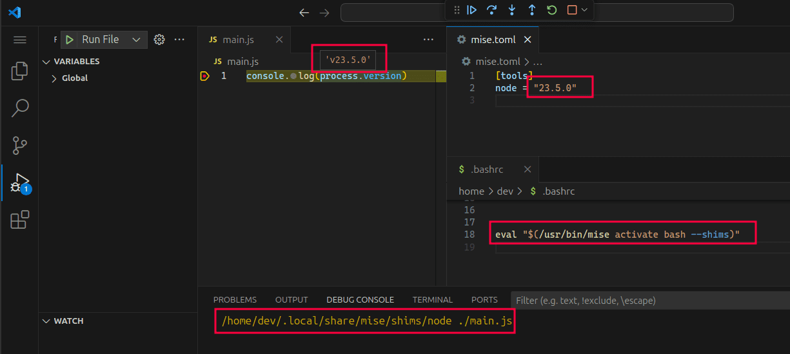
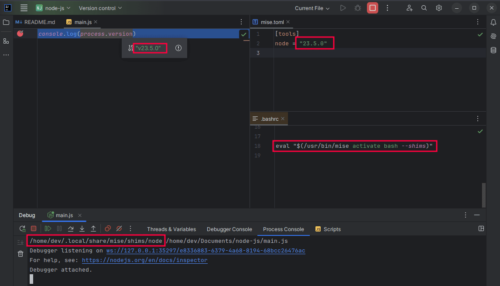
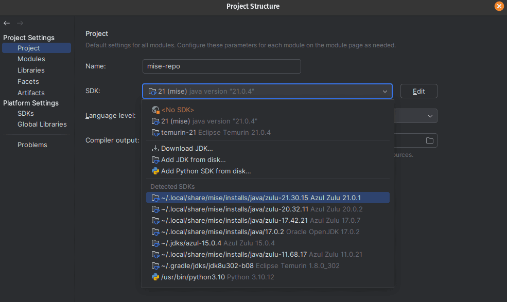

# Editors and IDEs

An editor's integrated terminal, language servers, debugger and extensions can
each run with a different environment. Find out which process needs the tool or
variable, then pick an integration:

| Need                                              | Integration                            | What to expect                                                                                                            |
| ------------------------------------------------- | -------------------------------------- | ------------------------------------------------------------------------------------------------------------------------- |
| A fixed executable or SDK directory               | `mise which node` or `mise where java` | Selects an installed path; update the IDE setting after changing versions.                                                |
| A tool that follows the current project           | [Shims](/dev-tools/shims.html)         | Resolves the tool and loads mise environment variables when the shim runs. The process must run in the project directory. |
| A command with the project environment            | `mise exec -- command`                 | Loads tools and variables for that command and its children.                                                              |
| Editor features that follow configuration changes | An [editor plugin](#ide-plugins)       | Support depends on the editor, extension and language.                                                                    |

Run `mise install` in the project first. Selecting an SDK path alone does not
load `[env]`. Shims also do not change the environment of an editor that is
already running, so restart affected language servers or the editor after
changing an inherited environment or a fixed SDK path.

## A fixed path to the global version {#global-version-link}

A setting that takes an installation directory, such as an IDE's Maven or JDK
home, needs a path that survives version changes. Each tool's install directory
has a `global` link to the version global and system config select:

```sh
~/.local/share/mise/installs/maven/global -> ./3.9.16
```

mise updates it whenever it rebuilds the other runtime symlinks (`latest`, `3`),
such as after `mise use -g` or `mise install`. Project config and `MISE_*_VERSION`
variables do not change it, and a tool no global config selects has no link.
mise leaves a real directory named `global` alone.

## Put shims on PATH for GUI editors {#adding-shims-to-path-default-shell}

Editors started from the desktop, including VS Code and JetBrains IDEs, read the
environment of your login shell. Add mise's [shims](/dev-tools/shims.html) to
that shell's login profile so that these editors find mise tools without a
prompt hook. Find your login shell with:

::: code-group

```sh [macOS]
dscl . -read /Users/$USER UserShell
```

```sh [Linux]
getent passwd $USER | cut -d: -f7
```

:::

Then add `mise activate --shims` to that shell's login profile as shown in
[How to add mise shims to PATH](/dev-tools/shims.html#how-to-add-mise-shims-to-path),
which also explains which file Bash reads. If `mise` is not on `PATH` when the
profile runs, use its absolute path, for example
`eval "$($HOME/.local/bin/mise activate zsh --shims)"`.

Restart the editor after editing the profile. Some desktop environments read a
login profile only when you log in, so you may need to log out and back in. If
the editor does not read your shell profile at all, check its environment
settings. VS Code's
[environment resolution](https://code.visualstudio.com/docs/terminal/advanced#_environment-inheritance)
and its [task terminal profile](#vscode-automation-profile-for-macos) are
separate mechanisms.

VS Code and IntelliJ using the `node` that mise provides through shims:

::: tabs
== VS Code



== IntelliJ

:::

Shims set `[env]` variables only for the tool process they start. The editor
itself, and features that read the environment directly, do not see them; use
an [editor plugin](#ide-plugins) for those.

## Editor plugins {#ide-plugins}

These community plugins integrate with mise:

| Editor         | Plugin                                                                                 | What it does                                                                                                                        |
| -------------- | -------------------------------------------------------------------------------------- | ----------------------------------------------------------------------------------------------------------------------------------- |
| VS Code        | [mise-vscode](https://marketplace.visualstudio.com/items?itemName=hverlin.mise-vscode) | Manages tools and tasks, loads the project environment, helps edit config, and can configure language extensions to use mise tools. |
| JetBrains IDEs | [intellij-mise](https://github.com/134130/intellij-mise)                               | Configures the IDE's SDKs from mise, runs mise tasks, and loads environment variables in run configurations.                        |
| Neovim         | [miser.nvim](https://github.com/carldaws/miser.nvim)                                   | Starts language servers and formatters for the tools in `mise.toml`, and runs mise tasks from Neovim.                               |
| Emacs          | [mise.el](https://github.com/eki3z/mise.el)                                            | Loads the mise environment for each buffer.                                                                                         |

## VS Code {#vscode}

The [mise-vscode extension](https://hverlin.github.io/mise-vscode/) can
configure
[supported language extensions](https://hverlin.github.io/mise-vscode/reference/supported-extensions/)
to use mise tools. That is off by default; enable
[`mise.configureExtensionsAutomatically`](https://hverlin.github.io/mise-vscode/reference/settings/#miseconfigureextensionsautomatically)
to turn it on. See the extension's documentation for its environment and task
settings.

Install mise on the machine that runs the extension. A local installation does
not provide tools inside an SSH host, a WSL distribution or a
[dev container](#dev-containers).

### Task and debug terminals {#vscode-automation-profile-for-macos}

VS Code runs tasks and debug sessions in an automation terminal. To make it
start a login shell that reads your profile, and with it the shims, add an
[automation profile](https://code.visualstudio.com/docs/terminal/profiles#_configuring-the-taskdebug-profile)
to `settings.json`:

::: code-group

```json [macOS]
{
  "terminal.integrated.automationProfile.osx": {
    "path": "/bin/zsh",
    "args": ["--login"]
  }
}
```

```json [Linux]
{
  "terminal.integrated.automationProfile.linux": {
    "path": "/bin/bash",
    "args": ["--login"]
  }
}
```

:::

The automation profile does not configure the extension host or every language
server. Keep the shims in your login profile; adding `--interactive` also loads
your interactive startup file, including prompt customization that a build does
not need.

### Debug with mise exec in launch.json {#use-mise-exec-in-launch-configuration}

To debug Node.js with the project's tools, run the runtime through
[`mise exec`](/cli/exec.html) in `launch.json`. Set `cwd` to the directory that
holds `mise.toml`. If the editor cannot find `mise`, set `runtimeExecutable` to
its absolute path. This example is for macOS and Linux:

```json
{
  "version": "0.2.0",
  "configurations": [
    {
      "type": "node",
      "request": "launch",
      "name": "Launch Program",
      "program": "${file}",
      "cwd": "${workspaceFolder}",
      "runtimeExecutable": "mise",
      "runtimeArgs": ["exec", "--", "node"]
    }
  ]
}
```

## JetBrains IDEs {#jetbrains-editors-intellij-rustrover-pycharm-webstorm-rubymine-goland-etc}

These apply to IntelliJ IDEA, PyCharm, WebStorm, GoLand, RubyMine, RustRover and
other JetBrains IDEs. The [intellij-mise plugin](https://github.com/134130/intellij-mise)
configures SDKs from mise automatically.

### Direct SDK selection

IntelliJ IDEA's Java SDK picker detects JDKs that mise installed:



### SDK selection using asdf layout

Some language plugins cannot find SDKs that mise installed but can find asdf's.
Prefer direct SDK selection when it is available. If a plugin needs an asdf
directory and `~/.asdf` does not exist, a symlink exposes mise's layout. Do not
replace an existing asdf installation, and do not use asdf to change installs
that mise manages:

```sh
ln -s ~/.local/share/mise ~/.asdf
```

The SDKs then appear in Project Settings:


For Node.js and some other languages, the setting is under "Languages &
Frameworks":


## Neovim {#neovim}

The Vim, Neovim and Emacs snippets below use the default data directory. If you
set `MISE_DATA_DIR`, use `$MISE_DATA_DIR/shims` instead.

```lua
-- Prepend mise shims to PATH
vim.env.PATH = vim.env.HOME .. "/.local/share/mise/shims:" .. vim.env.PATH
```

For Treesitter and language server setup, see the
[Neovim cookbook](/mise-cookbook/neovim.html), or use
[miser.nvim](https://github.com/carldaws/miser.nvim).

## Vim {#vim}

```vim
" Prepend mise shims to PATH
let $PATH = $HOME . '/.local/share/mise/shims:' . $PATH
```

## Emacs {#emacs}

To use shims:

```lisp
(let ((mise-shims (expand-file-name "~/.local/share/mise/shims")))
  (setenv "PATH" (concat mise-shims (char-to-string path-separator) (getenv "PATH")))
  (add-to-list 'exec-path mise-shims))
```

To load each buffer's mise environment instead, install
[mise.el](https://github.com/eki3z/mise.el) following its README, then enable
it:

```lisp
(require 'mise)
(add-hook 'after-init-hook #'global-mise-mode)
```

## Xcode {#xcode}

Xcode build phases do not run your interactive shell startup files. Use an
absolute mise path and select the project directory explicitly. For a project
that declares SwiftLint:

```sh
"$HOME/.local/bin/mise" --cd "$SRCROOT" exec -- swiftlint lint
```

Install the project's tools before building. Adjust the mise path if a package
manager installed it.

When User Script Sandboxing is on, declare the script's inputs and outputs in the
build phase. `$(SRCROOT)/mise.toml` is one input, but mise and the tool may also
read other config files, installed executables and data directories, so
allowing only `mise.toml` is not enough for every tool. Use the sandbox denial in
the build log to find what is missing. For Xcode Cloud, see
[Continuous integration](/continuous-integration.html#xcode-cloud).

## Dev containers {#dev-containers}

[`mise generate devcontainer`](/cli/generate/devcontainer.html) creates a
starting `.devcontainer/devcontainer.json` that adds the mise dev container
feature and the mise-vscode extension:

```sh
mise generate devcontainer --write
```

The file sets `postCreateCommand` to `mise install`, so a new container installs
the project's tools. `--mount-mise-data` adds a named volume for mise's data
directory, so installed tools survive rebuilds of the container. Review the
image and mounts before you build it. To pre-install tools in an image whose home
directory is mounted from the host, see
[Docker](/mise-cookbook/docker.html#devcontainers-with-home-directory-mounts).

## Windows {#windows}

Add `%LOCALAPPDATA%\mise\shims` to your user `Path` so that editors find mise
tools, as shown in [Windows shells](/shell-setup.html#windows), then restart the
editor. If an extension reports `spawn EINVAL`, see the
[troubleshooting guide](/troubleshooting.html#vscode-for-windows-extension-with-error-spawn-einval).

## AI coding assistants {#ai-coding-assistants}

Assistants that run commands in a terminal get mise tools the same way as other
processes: through activation, shims or `mise exec`. To let an assistant read
the project's tools, tasks and environment and run its tasks, connect it to the
[mise MCP server](/mcp.html). Tools installed through packslip can also provide
agent skills; see [Man pages, completions, and skills](/dev-tools/packslip-resources.html).

## Diagnose an editor mismatch

From the project directory, compare the selected executable with what the editor
uses:

```sh
mise which node
mise exec -- node --version
```

Check the language server or debugger log for its executable path and working
directory. If these commands work but the editor selects another version,
correct that process's SDK setting, `PATH` or working directory. A working
integrated terminal does not show that a language extension uses the same
environment.
