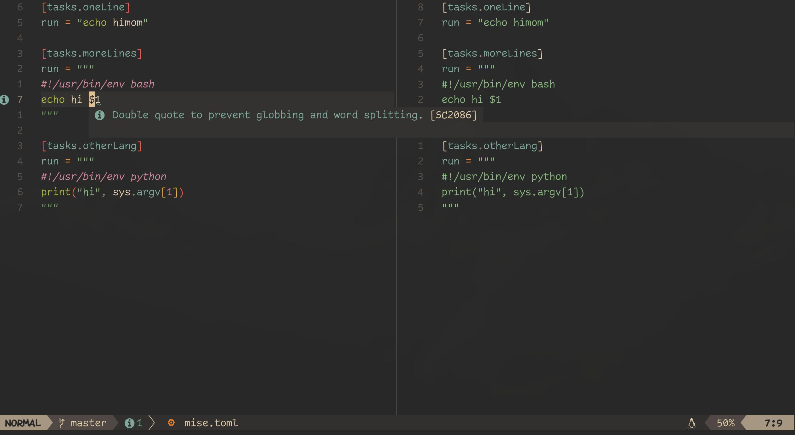
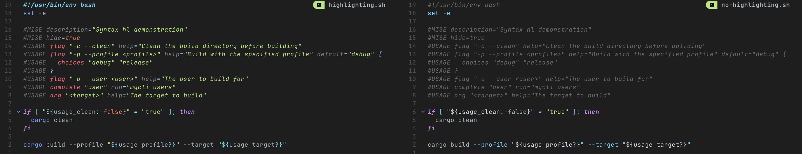

# Neovim Cookbook

Highlight scripts embedded in `mise.toml` and metadata in file tasks, then add
language-server features with otter.nvim. These examples configure the editor;
they do not change how mise executes tasks.

Before adding the queries, install the Treesitter parsers for `toml`, `bash`, and
any injected languages you use (`kdl` for `#USAGE`, for example). Enable Treesitter
highlighting through your Neovim setup. Query files alone do not install parsers
or start highlighting; see [Neovim's Treesitter documentation](https://neovim.io/doc/user/treesitter.html).

Paths below are relative to `stdpath("config")`, normally `~/.config/nvim`. The Lua
plugin specifications assume you already use lazy.nvim.

## Syntax highlighting

### Run commands

Use [Treesitter](https://github.com/nvim-treesitter/nvim-treesitter) to enable syntax highlighting for the code in the run commands of your mise files.
See the left side of the image for an example:



In your Neovim config, create an `after/queries/toml/injections.scm` file with these queries:

```query
; extends

(pair
  (bare_key) @key (#eq? @key "run")
  (string) @injection.content @injection.language

  (#is-mise?)
  (#match? @injection.language "^['\"]{3}\n*#!(/\\w+)+/env\\s+\\w+") ; multiline shebang using env
  (#gsub! @injection.language "^.*#!/.*/env%s+([^%s]+).*" "%1") ; extract lang
  (#offset! @injection.content 0 3 0 -3) ; rm quotes
)

(pair
  (bare_key) @key (#eq? @key "run")
  (string) @injection.content @injection.language

  (#is-mise?)
  (#match? @injection.language "^['\"]{3}\n*#!(/\\w+)+\s*\n") ; multiline shebang
  (#gsub! @injection.language "^.*#!/.*/([^/%s]+).*" "%1") ; extract lang
  (#offset! @injection.content 0 3 0 -3) ; rm quotes
)

(pair
  (bare_key) @key (#eq? @key "run")
  (string) @injection.content

  (#is-mise?)
  (#match? @injection.content "^['\"]{3}\n*.*") ; multiline
  (#not-match? @injection.content "^['\"]{3}\n*#!") ; no shebang
  (#offset! @injection.content 0 3 0 -3) ; rm quotes
  (#set! injection.language "bash") ; default to bash
)

(pair
  (bare_key) @key (#eq? @key "run")
  (string) @injection.content

  (#is-mise?)
  (#not-match? @injection.content "^['\"]{3}") ; not multiline
  (#offset! @injection.content 0 1 0 -1) ; rm quotes
  (#set! injection.language "bash") ; default to bash
)
```

The `is-mise?` predicate restricts the highlighting to mise files instead of all TOML files.
If you don't need this distinction, remove the lines containing `(#is-mise?)`.
Otherwise, make sure to also define the predicate somewhere in your Neovim config.

For example, using [`lazy.nvim`](https://github.com/folke/lazy.nvim):

```lua
{
  "nvim-treesitter/nvim-treesitter",
  init = function()
    require("vim.treesitter.query").add_predicate("is-mise?", function(_, _, bufnr, _)
      local filepath = vim.fs.normalize(vim.api.nvim_buf_get_name(tonumber(bufnr) or 0))
      local filename = vim.fn.fnamemodify(filepath, ":t")
      return filename:match("^%.?mise.*%.toml$") ~= nil
        or filepath:match("/%.?mise/config%.toml$") ~= nil
        or filepath:match("/%.?mise/config%.local%.toml$") ~= nil
        or filepath:match("/%.?mise/config%.[^/]+%.toml$") ~= nil
        or filepath:match("/%.config/mise/mise%.toml$") ~= nil
        or filepath:match("/%.config/mise/mise%.local%.toml$") ~= nil
        or filepath:match("/%.?mise/conf%.d/[^/]+%.toml$") ~= nil
    end, { force = true, all = false })
  end,
},
```

This recognizes mise-named files and grouped config files such as
`.config/mise/config.toml`. Adjust the predicate if your project uses a custom
config filename.

The shebang queries handle a direct interpreter path and `/usr/bin/env <name>`.
The extracted name must match an installed Treesitter language; wrappers such as
`env -S uv run` and versioned names such as `python3` need a custom mapping or
query. The Bash fallback controls highlighting only; mise's actual default shell
is described in [TOML tasks](/tasks/toml-tasks.html#shell-shebang).

### MISE and USAGE comments in file tasks

You can also use Treesitter to enable syntax highlighting for `#MISE` and `#USAGE` comments in file tasks.
See the left side of the image for an example:



In your Neovim config, create an `after/queries/bash/injections.scm` file with these queries:

```query
; extends

; ============================================================================
; #MISE comments - TOML injection
; ============================================================================
; This injection captures comment lines starting with "#MISE " or "#[MISE]" or
; "# [MISE]" and treats them as TOML code blocks for syntax highlighting.
;
; #MISE format
; The (#offset!) directive skips the "#MISE " prefix (6 characters) from the source
((comment) @injection.content
  (#lua-match? @injection.content "^#MISE ")
  (#offset! @injection.content 0 6 0 1)
  (#set! injection.language "toml"))

; #[MISE] format
((comment) @injection.content
  (#lua-match? @injection.content "^#%[MISE%] ")
  (#offset! @injection.content 0 8 0 1)
  (#set! injection.language "toml"))

; # [MISE] format
((comment) @injection.content
  (#lua-match? @injection.content "^# %[MISE%] ")
  (#offset! @injection.content 0 9 0 1)
  (#set! injection.language "toml"))

; ============================================================================
; #USAGE comments - KDL injection
; ============================================================================
; This injection captures consecutive comment lines starting with "#USAGE " or
; "#[USAGE]" or "# [USAGE]" and treats them as a single KDL code block for
; syntax highlighting.
;
; #USAGE format
((comment) @injection.content
  (#lua-match? @injection.content "^#USAGE ")
  ; Extend the range one byte to the right, to include the trailing newline.
  ; see https://github.com/neovim/neovim/discussions/36669#discussioncomment-15054154
  (#offset! @injection.content 0 7 0 1)
  (#set! injection.combined)
  (#set! injection.language "kdl"))

; #[USAGE] format
((comment) @injection.content
  (#lua-match? @injection.content "^#%[USAGE%] ")
  (#offset! @injection.content 0 9 0 1)
  (#set! injection.combined)
  (#set! injection.language "kdl"))

; # [USAGE] format
((comment) @injection.content
  (#lua-match? @injection.content "^# %[USAGE%] ")
  (#offset! @injection.content 0 10 0 1)
  (#set! injection.combined)
  (#set! injection.language "kdl"))

; NOTE: on neovim >= 0.12, you can use the multi node pattern instead of
; combining injections:
;
; ((comment)+ @injection.content
;   (#lua-match? @injection.content "^#USAGE ")
;   (#offset! @injection.content 0 7 0 1)
;   (#set! injection.language "kdl"))
;
; this is the preferred way as combined injections have multiple
; limitations:
; https://github.com/neovim/neovim/issues/32635

```

These queries can also work with other grammars that represent `#` comments as
`comment` nodes. Use `:InspectTree` to check the node names in your parser.
Because Treesitter injections are per language, you need to add the same queries to each language's query file.
For example, put them in `after/queries/python/injections.scm` to enable them for `Python` in addition to `bash`.

For languages that use `//` as a comment delimiter, adjust the queries slightly:

```query
((comment) @injection.content
  (#lua-match? @injection.content "^//MISE ")
  (#offset! @injection.content 0 7 0 1)
  (#set! injection.language "toml"))
((comment) @injection.content
  (#lua-match? @injection.content "^//%[MISE%] ")
  (#offset! @injection.content 0 9 0 1)
  (#set! injection.language "toml"))
((comment) @injection.content
  (#lua-match? @injection.content "^// %[MISE%] ")
  (#offset! @injection.content 0 10 0 1)
  (#set! injection.language "toml"))
((comment) @injection.content
  (#lua-match? @injection.content "^//USAGE ")
  (#offset! @injection.content 0 8 0 1)
  (#set! injection.combined)
  (#set! injection.language "kdl"))
((comment) @injection.content
  (#lua-match? @injection.content "^//%[USAGE%] ")
  (#offset! @injection.content 0 10 0 1)
  (#set! injection.combined)
  (#set! injection.language "kdl"))
((comment) @injection.content
  (#lua-match? @injection.content "^// %[USAGE%] ")
  (#offset! @injection.content 0 11 0 1)
  (#set! injection.combined)
  (#set! injection.language "kdl"))
```

## Enable LSP for embedded lang in run commands

Use [`otter.nvim`](https://github.com/jmbuhr/otter.nvim) to enable LSP features and code completion for code embedded in your mise files.

Again using [`lazy.nvim`](https://github.com/folke/lazy.nvim):

```lua
{
  "jmbuhr/otter.nvim",
  dependencies = {
    "nvim-treesitter/nvim-treesitter",
  },
  config = function()
    vim.api.nvim_create_autocmd({ "FileType" }, {
      pattern = { "toml" },
      group = vim.api.nvim_create_augroup("EmbedToml", {}),
      callback = function()
        require("otter").activate()
      end,
    })
  end,
},
```

This requires both the [injection queries](#run-commands) and a configured language
server for each embedded language. otter.nvim creates the embedded buffers and
routes requests; it does not install the language servers. See
[otter.nvim's setup guide](https://github.com/jmbuhr/otter.nvim#how-do-i-use-otternvim).

## Troubleshooting

- Run `:checkhealth vim.treesitter` to check parser availability.
- Use `:InspectTree` to confirm the TOML `run` value or file-task comment matches
  the query's node types. These queries cover string `run` values; task arrays and
  `run_windows` need additional patterns.
- If a predicate is unknown, load the Lua registration before opening the file,
  or remove `(#is-mise?)` to apply the query to all TOML files.
- If highlighting works but LSP features do not, verify that the same language
  server works in an ordinary file before debugging the embedded buffer.
