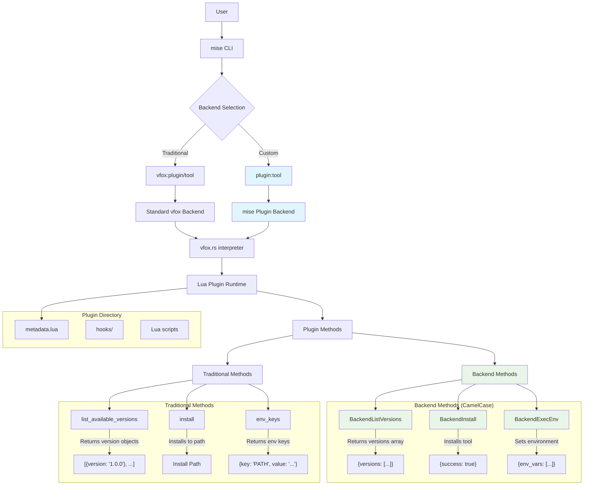

# Plugin Development

This guide shows how to create plugins for mise using the extended vfox plugin system. These plugins can manage multiple tools using the `plugin:tool` format, making them perfect for package managers, tool families, and custom installations.

## Plugin Architecture

Plugins in mise use an extended version of the vfox plugin system with enhanced backend methods. Here's the architecture overview:



## Backend Methods vs Traditional Methods

The new backend methods (CamelCase) provide better performance and are preferred for the `plugin:tool` format:

- **BackendListVersions**: List available versions for a tool
- **BackendInstall**: Install a specific version of a tool
- **BackendExecEnv**: Set up environment variables for a tool

## Creating a Plugin

### 1. Plugin Structure

Create a directory for your plugin with the following structure:

```
my-plugin/
├── metadata.lua          # Plugin metadata and backend methods
├── README.md            # Plugin documentation
└── LICENSE              # Plugin license
```

### 2. metadata.lua

This is the main plugin file that defines metadata and backend methods:

```lua
PLUGIN = {
    name = "my-plugin",
    version = "1.0.0",
    description = "Description of your plugin",
    author = "Your Name",
    license = "MIT",
    
    -- Backend method for listing versions
    BackendListVersions = function(ctx)
        local tool = BACKEND_CTX.tool
        local versions = {}
        
        -- Your logic to fetch versions for the tool
        -- Example: query an API, parse a registry, etc.
        
        return {versions = versions}
    end,
    
    -- Backend method for installing a tool
    BackendInstall = function(ctx)
        local tool = BACKEND_CTX.tool
        local version = BACKEND_CTX.version
        local install_path = BACKEND_CTX.install_path
        
        -- Your logic to install the tool
        -- Example: download files, extract archives, etc.
        
        return {}
    end,
    
    -- Backend method for setting environment
    BackendExecEnv = function(ctx)
        local install_path = BACKEND_CTX.install_path
        
        -- Your logic to set up environment variables
        -- Example: add bin directories to PATH
        
        return {
            env_vars = {
                {key = "PATH", value = install_path .. "/bin"}
            }
        }
    end
}
```

### 3. Available Lua Modules

Your plugin can use these built-in Lua modules:

#### Core Modules
- `cmd` - Execute shell commands
- `json` - Parse and generate JSON
- `http` - Make HTTP requests
- `file` - File operations
- `env` - Environment variable operations
- `strings` - String manipulation

#### HTTP Module
```lua
local http = require("http")

-- GET request
local resp, err = http.get({
    url = "https://api.github.com/repos/owner/repo/releases",
    headers = {
        ['User-Agent'] = "mise-plugin"
    }
})
assert(err == nil)
assert(resp.status_code == 200)
local body = resp.body

-- HEAD request
resp, err = http.head({
    url = "https://example.com/file.tar.gz"
})
assert(err == nil)
local size = resp.content_length

-- Download file
err = http.download_file({
    url = "https://github.com/owner/repo/archive/v1.0.0.tar.gz",
    headers = {}
}, "/path/to/download.tar.gz")
assert(err == nil)
```

#### JSON Module
```lua
local json = require("json")

-- Encode/decode JSON
local obj = { "a", 1, "b", 2, "c", 3 }
local jsonStr = json.encode(obj)
local jsonObj = json.decode(jsonStr)
```

#### Strings Module
```lua
local strings = require("vfox.strings")

-- String manipulation
local parts = strings.split("hello world", " ")
print(parts[1]) -- "hello"

assert(strings.has_prefix("hello world", "hello"))
assert(strings.has_suffix("hello world", "world"))
assert(strings.trim("hello world", "world") == "hello ")
assert(strings.contains("hello world", "hello "))

local trimmed = strings.trim_space("  hello  ") -- "hello"
local joined = strings.join({"1", "3", "4"}, ";") -- "1;3;4"
```

#### HTML Module
```lua
local html = require("html")

-- Parse HTML and extract information
local doc = html.parse("<html><body><div id='version'>1.2.3</div></body></html>")
local version = doc:find("#version"):text() -- "1.2.3"
```

#### Archiver Module
```lua
local archiver = require("vfox.archiver")

-- Decompress files (supports tar.gz, tgz, tar.xz, zip, 7z)
local err = archiver.decompress("archive.zip", "extracted/")
assert(err == nil)
```

## Example: npm Package Plugin

Here's a complete example of a plugin that installs npm packages:

```lua
PLUGIN = {
    name = "vfox-npm",
    version = "1.0.0", 
    description = "mise plugin for npm packages",
    author = "Your Name",
    license = "MIT",
    
    -- Backend method to list versions
    BackendListVersions = function(ctx)
        local tool = BACKEND_CTX.tool
        local versions = {}
        
        -- Use npm view to get real versions
        local cmd = require("cmd")
        local result = cmd.exec("npm view " .. tool .. " versions --json 2>/dev/null")
        
        if result and result ~= "" and not result:match("npm ERR!") then
            -- Parse JSON response from npm
            local json = require("json")
            local success, npm_versions = pcall(json.decode, result)
            
            if success and npm_versions then
                if type(npm_versions) == "table" then
                    for i = #npm_versions, 1, -1 do
                        local version = npm_versions[i]
                        table.insert(versions, version)
                    end
                end
            end
        end
        
        if #versions == 0 then
            error("Failed to fetch versions for " .. tool .. " from npm registry")
        end
        
        return {versions = versions}
    end,
    
    -- Backend method to install a tool
    BackendInstall = function(ctx)
        local tool = BACKEND_CTX.tool
        local version = BACKEND_CTX.version
        local install_path = BACKEND_CTX.install_path
        
        -- Create install directory
        os.execute("mkdir -p " .. install_path)
        
        -- Install the package using npm
        local cmd = require("cmd")
        local npm_cmd = "cd " .. install_path .. " && npm install " .. tool .. "@" .. version .. " --no-package-lock --no-save --silent 2>/dev/null"
        local result = cmd.exec(npm_cmd)
        
        return {}
    end,
    
    -- Backend method to set environment
    BackendExecEnv = function(ctx)
        local install_path = BACKEND_CTX.install_path
        if install_path then
            -- Add node_modules/.bin to PATH for npm-installed binaries
            local bin_path = install_path .. "/node_modules/.bin"
            return {
                env_vars = {
                    {key = "PATH", value = bin_path}
                }
            }
        else
            return {env_vars = {}}
        end
    end
}
```

## Context Variables

The `BACKEND_CTX` variable provides access to the current operation context:

- `BACKEND_CTX.tool` - The tool name (e.g., "prettier" in "vfox-npm:prettier")
- `BACKEND_CTX.version` - The requested version (e.g., "3.0.0")
- `BACKEND_CTX.install_path` - The installation path
- `BACKEND_CTX.args` - Additional arguments (usually empty)

## Testing Your Plugin

### 1. Local Development

```bash
# Link your plugin for development
mise plugin link my-plugin /path/to/my-plugin

# Test listing versions
mise ls-remote my-plugin:some-tool

# Test installation
mise install my-plugin:some-tool@1.0.0

# Test execution
mise exec my-plugin:some-tool -- --version
```

### 2. Automated Testing

Create a test script in your plugin repository:

```bash
#!/bin/bash
set -e

# Install the plugin
mise plugin install my-plugin .

# Test basic functionality
mise install my-plugin:test-tool@1.0.0
mise exec my-plugin:test-tool -- --version

# Clean up
mise plugin remove my-plugin
```

## Best Practices

### Error Handling

```lua
-- Always check for errors and provide meaningful messages
local result = cmd.exec("some-command")
if not result or result:match("error") then
    error("Command failed: " .. (result or "no output"))
end
```

### Version Parsing

```lua
-- Parse versions consistently
local function parse_version(version_string)
    -- Remove prefixes like 'v' or 'release-'
    return version_string:gsub("^v?", "")
end
```

### Path Handling

```lua
-- Use proper path separators
local function join_path(...)
    local sep = package.config:sub(1,1) -- Get OS path separator
    return table.concat({...}, sep)
end
```

### Cross-Platform Compatibility

```lua
-- Use cross-platform commands when possible
local function is_windows()
    return package.config:sub(1,1) == '\\'
end

local mkdir_cmd = is_windows() and "mkdir" or "mkdir -p"
```

## Publishing Your Plugin

### 1. Repository Setup

Create a Git repository with:

```
my-plugin/
├── metadata.lua
├── README.md
├── LICENSE
├── .gitignore
└── test/
    └── test.sh
```

### 2. Documentation

Your README.md should include:

- Plugin description and purpose
- Installation instructions
- Usage examples
- Requirements
- License information

### 3. Example README.md

```markdown
# my-plugin

A mise plugin for managing custom tools.

## Installation

```bash
mise plugin install my-plugin https://github.com/username/my-plugin
```

## Usage

```bash
# Install a tool
mise install my-plugin:tool-name@latest

# Use the tool
mise use my-plugin:tool-name@1.0.0

# Execute the tool
mise exec my-plugin:tool-name -- --help
```

## Requirements

- Network access to download tools
- Additional dependencies as needed

## License

MIT
```

## Example Plugins

### Simple GitHub Release Plugin

```lua
PLUGIN = {
    name = "github-release",
    version = "1.0.0",
    
    BackendListVersions = function(ctx)
        local tool = BACKEND_CTX.tool
        local http = require("http")
        
        -- Parse tool as "owner/repo"
        local owner, repo = tool:match("([^/]+)/([^/]+)")
        if not owner or not repo then
            error("Tool must be in format 'owner/repo'")
        end
        
        local url = "https://api.github.com/repos/" .. owner .. "/" .. repo .. "/releases"
        local response = http.get(url)
        
        local json = require("json")
        local releases = json.decode(response.body)
        
        local versions = {}
        for _, release in ipairs(releases) do
            if not release.prerelease then
                table.insert(versions, release.tag_name)
            end
        end
        
        return {versions = versions}
    end,
    
    BackendInstall = function(ctx)
        -- Implementation for downloading and installing from GitHub releases
        -- This would involve finding the right asset, downloading, and extracting
        return {}
    end,
    
    BackendExecEnv = function(ctx)
        local install_path = BACKEND_CTX.install_path
        return {
            env_vars = {
                {key = "PATH", value = install_path .. "/bin"}
            }
        }
    end
}
```

## Advanced Features

### Custom Configuration

```lua
-- Access mise.toml configuration
local config = mise.config()
local custom_setting = config.plugins["my-plugin"].custom_setting
```

### Conditional Installation

```lua
BackendInstall = function(ctx)
    local tool = BACKEND_CTX.tool
    local version = BACKEND_CTX.version
    
    -- Different installation logic based on tool or version
    if tool == "special-tool" then
        -- Special installation logic
    else
        -- Default installation logic
    end
    
    return {}
end
```

### Environment Detection

```lua
-- Detect operating system and architecture
local function get_platform()
    local cmd = require("cmd")
    local uname = cmd.exec("uname -s"):lower()
    local arch = cmd.exec("uname -m")
    
    return {os = uname, arch = arch}
end
```

## Traditional Plugin Development

In addition to the enhanced backend methods, you can also create traditional plugins that are compatible with the standard vfox ecosystem. These plugins use hook functions and are perfect when you want broader compatibility.

### Hook-Based Plugin Structure

Traditional plugins use a hook-based architecture:

```
my-plugin/
├── metadata.lua          # Plugin metadata and configuration
├── hooks/               # Hook functions directory
│   ├── available.lua    # List available versions [required]
│   ├── pre_install.lua  # Pre-installation hook [required]
│   ├── env_keys.lua     # Environment configuration [required]
│   ├── post_install.lua # Post-installation hook [optional]
│   ├── pre_use.lua      # Pre-use hook [optional]
│   ├── parse_legacy_file.lua # Legacy file parser [optional]
│   └── pre_uninstall.lua # Pre-uninstall hook [optional]
├── lib/                 # Shared library code [optional]
└── README.md
```

### Required Hook Functions

#### Available Hook
Lists all available versions of the tool:

```lua
-- hooks/available.lua
function PLUGIN:Available(ctx)
    local args = ctx.args  -- User arguments
    
    -- Return array of available versions
    return {
        {
            version = "3.0.0",
            note = "Latest"
        },
        {
            version = "2.9.0",
            note = "LTS",
            addition = {
                {
                    name = "bundled-tool",
                    version = "1.2.3"
                }
            }
        }
    }
end
```

#### PreInstall Hook
Handles pre-installation logic and returns download information:

```lua
-- hooks/pre_install.lua
function PLUGIN:PreInstall(ctx)
    local version = ctx.version
    local runtimeVersion = ctx.runtimeVersion
    
    -- Determine download URL and checksums
    local url = "https://github.com/owner/repo/releases/download/v" .. version .. "/tool-" .. version .. ".tar.gz"
    
    return {
        version = version,
        url = url,
        sha256 = "abc123...",  -- Optional checksum
        note = "Installing " .. version,
        -- Additional files can be specified
        addition = {
            {
                name = "extra-file",
                url = "https://example.com/extra.zip"
            }
        }
    }
end
```

#### EnvKeys Hook
Configures environment variables for the installed tool:

```lua
-- hooks/env_keys.lua
function PLUGIN:EnvKeys(ctx)
    local mainPath = ctx.path
    local runtimeVersion = ctx.runtimeVersion
    local sdkInfo = ctx.sdkInfo['tool-name']
    local path = sdkInfo.path
    local version = sdkInfo.version
    local name = sdkInfo.name
    
    return {
        {
            key = "TOOL_HOME",
            value = mainPath
        },
        {
            key = "PATH",
            value = mainPath .. "/bin"
        },
        -- Multiple PATH entries are automatically merged
        {
            key = "PATH", 
            value = mainPath .. "/scripts"
        }
    }
end
```

### Optional Hook Functions

#### PostInstall Hook
Performs additional setup after installation:

```lua
-- hooks/post_install.lua
function PLUGIN:PostInstall(ctx)
    local rootPath = ctx.rootPath
    local runtimeVersion = ctx.runtimeVersion
    local sdkInfo = ctx.sdkInfo['tool-name']
    local path = sdkInfo.path
    local version = sdkInfo.version
    
    -- Compile source code, set permissions, etc.
    local cmd = require("cmd")
    cmd.exec("chmod +x " .. path .. "/bin/*")
    
    -- No return value needed
end
```

#### PreUse Hook
Modifies version before use:

```lua
-- hooks/pre_use.lua
function PLUGIN:PreUse(ctx)
    local runtimeVersion = ctx.runtimeVersion
    local version = ctx.version
    local previousVersion = ctx.previousVersion
    local installedSdks = ctx.installedSdks
    local cwd = ctx.cwd
    local scope = ctx.scope  -- global/project/session
    
    -- Optionally modify the version
    if version == "latest" then
        version = "3.0.0"  -- Resolve to specific version
    end
    
    return {
        version = version
    }
end
```

#### ParseLegacyFile Hook
Parses version files from other tools:

```lua
-- hooks/parse_legacy_file.lua
function PLUGIN:ParseLegacyFile(ctx)
    local filename = ctx.filename
    local filepath = ctx.filepath
    local versions = ctx:getInstalledVersions()
    
    -- Read and parse the file
    local file = require("vfox.file")
    local content = file.read(filepath)
    local version = content:match("([%d%.]+)")
    
    return {
        version = version
    }
end
```

### Legacy File Support

To support legacy version files, configure them in `metadata.lua`:

```lua
-- metadata.lua
PLUGIN = {
    name = "my-tool",
    version = "1.0.0",
    description = "My awesome tool",
    author = "Your Name",
    license = "MIT",
    
    -- Legacy version files this plugin can parse
    legacyFilenames = {
        '.my-tool-version',
        '.tool-version'
    }
}
```

### Testing Traditional Plugins

Test your plugin hooks individually:

```bash
# Test available versions
mise search my-plugin

# Test pre-install
mise install my-plugin@1.0.0

# Test env keys
mise use my-plugin@1.0.0
echo $TOOL_HOME

# Test with debug output
mise --debug install my-plugin@1.0.0
```

## Enhanced Backend Methods vs Traditional Hooks

mise supports both approaches - choose based on your needs:

### Use Enhanced Backend Methods When:
- Creating plugins specifically for mise
- Need the `plugin:tool` format for multiple tools
- Want better performance
- Building new plugins from scratch

### Use Traditional Hooks When:
- Need compatibility with standard vfox
- Porting existing vfox plugins
- Want to support both mise and vfox users
- Need complex installation logic

You can even combine both approaches in a single plugin for maximum compatibility.

## vfox Compatibility

mise plugins are built on an extended version of the vfox plugin system. They maintain compatibility with standard vfox plugins while adding enhanced backend methods for better performance and the `plugin:tool` format.

Key differences from standard vfox plugins:

- **Enhanced Backend Methods**: Support for `BackendListVersions`, `BackendInstall`, and `BackendExecEnv`
- **Plugin:Tool Format**: Ability to manage multiple tools with one plugin
- **Cross-Platform Support**: Works on Windows, macOS, and Linux
- **Extended Lua Modules**: Additional built-in modules for common operations
- **Traditional Hook Support**: Full compatibility with standard vfox hook functions

## Troubleshooting

### Common Issues

1. **Plugin not found**: Ensure the plugin is properly linked or installed
2. **Tool installation fails**: Check network connectivity and permissions
3. **Environment variables not set**: Verify BackendExecEnv returns correct format
4. **Version parsing errors**: Ensure version strings are properly formatted

### Debugging

```lua
-- Add logging to your plugin
local function log(message)
    print("[my-plugin] " .. message)
end

log("Installing tool: " .. BACKEND_CTX.tool)
```

## Next Steps

- [View the example vfox-npm plugin](https://github.com/jdx/vfox-npm)
- [Learn about using plugins](plugin-usage.md)
- [Explore the vfox plugin system](https://github.com/version-fox/vfox)
- [Join the mise community](https://github.com/jdx/mise/discussions) 
