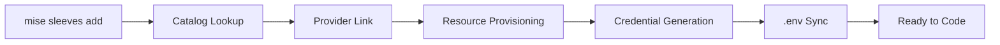

# Sleeves

> _AlteredCarbon Sleeves — add third-party services to your app, sync credentials, and manage upgrades._

Sleeves is mise's **accounts provisioning layer**. It connects your project to managed services — databases, authentication, analytics, hosting — and keeps credentials synced to your local environment automatically.

::: tip Public Preview
AlteredCarbon Sleeves are available in public preview. All CLI commands work locally today.
:::

## Why Sleeves?

Setting up a new project typically means signing up for 3–5 services, copying API keys between dashboards and `.env` files, and hoping everyone on the team has the right credentials. Sleeves eliminates that friction:

- **One command** to provision a database, auth, or analytics
- **Automatic `.env` sync** — credentials flow from provider to your project
- **Credential rotation** without hunting through dashboards
- **Upgrade tiers** from the CLI when you outgrow the free plan
- **Agent-friendly** — every command supports `--json` for structured output

## Quick Start

```bash
# Initialize a project
mise sleeves init my-app

# Link a hosting provider
mise sleeves link vercel

# Add services
mise sleeves add supabase/database
mise sleeves add clerk/auth
mise sleeves add posthog/analytics

# Check what you've got
mise sleeves status
```

After running these commands, your `.env` contains:

```bash
SUPABASE_DATABASE_URL=postgresql://...
SUPABASE_ANON_KEY=eyJ_...
CLERK_SECRET_KEY=sk_live_...
NEXT_PUBLIC_CLERK_PUBLISHABLE_KEY=pk_live_...
POSTHOG_PROJECT_API_KEY=phc_...
POSTHOG_HOST=https://us.i.posthog.com
```

## How It Works



1. **`init`** creates a `.projects/` directory that tracks your project state
2. **`add`** or **`link`** connects provider accounts and provisions resources
3. Credentials are generated and stored in `.projects/state.json`
4. Environment variables are automatically merged into your `.env` file
5. **`rotate`**, **`upgrade`**, and **`remove`** manage the lifecycle

## Available Providers

Browse the full catalog with `mise sleeves catalog` or see the [interactive catalog](/sleeves/catalog).

<SleevesProviders />

## Core Concepts

### Provider Account

Your account with a service like Vercel, Supabase, or Clerk. Once linked to your AlteredCarbon account, it stays authorized until you remove it. Reuse the same provider account across multiple projects.

### Service

A provider's product offering — a database, auth system, analytics platform, etc. Each service has one or more tiers (free, pro, enterprise).

### Resource

A provisioned instance of a service. When you run `mise sleeves add supabase/database`, a resource is created with its own credentials and environment variables.

### Project State

Sleeves tracks everything in `.projects/`:

| File | Purpose |
|------|---------|
| `state.json` | Provider accounts, resources, tiers, env vars |
| `state.local.json` | Resource IDs for team sharing |
| `llm-context.md` | Generated context for coding agents |

## Workflow Examples

### New Project

```bash
mise sleeves init my-saas
mise sleeves add vercel/project
mise sleeves add supabase/database
mise sleeves add clerk/auth
mise sleeves add posthog/analytics
```

### Existing Codebase

Initialize in your existing project directory — Sleeves merges new variables into your existing `.env`:

```bash
cd my-existing-app
mise sleeves init
mise sleeves add neon/database
```

### Credential Rotation

```bash
# Rotate a specific service
mise sleeves rotate clerk/auth

# Or by resource name
mise sleeves rotate clerk-auth
```

### Tier Upgrade

```bash
mise sleeves upgrade supabase/database --tier pro
```

### Agent-Driven Workflow

Every command supports `--json` for structured output:

```bash
mise sleeves status --json
mise sleeves catalog --json
mise sleeves add clerk/auth --json
```

## Command Reference

| Command | Description |
|---------|-------------|
| [`init`](/sleeves/commands#init) | Create a project |
| [`status`](/sleeves/commands#status) | View project status, services, and health |
| [`catalog`](/sleeves/commands#catalog) | Browse available providers and services |
| [`add`](/sleeves/commands#add) | Add a service to your project |
| [`link`](/sleeves/commands#link) | Connect a provider without provisioning |
| [`remove`](/sleeves/commands#remove) | Remove a service |
| [`rotate`](/sleeves/commands#rotate) | Rotate credentials |
| [`upgrade`](/sleeves/commands#upgrade) | Change a service tier |
| [`open`](/sleeves/commands#open) | Open provider dashboard in browser |
| [`env`](/sleeves/commands#env) | List or sync environment variables |
| [`billing show`](/sleeves/commands#billing) | View payment method |
| [`billing add`](/sleeves/commands#billing) | Add or replace payment method |
| [`llm-context`](/sleeves/commands#llm-context) | Generate LLM context file |

## Global Flags

These flags work with every Sleeves command:

| Flag | Description |
|------|-------------|
| `--json` | Return structured JSON output |
| `--no-interactive` | Disable interactive prompts |
| `--auto-confirm` | Accept confirmations automatically |
| `--quiet` | Suppress non-essential output |

<script setup>
import SleevesProviders from '../components/SleevesProviders.vue'
</script>
