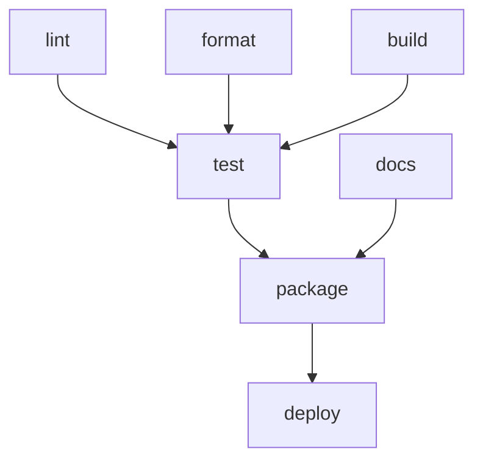

# Task System Architecture

Understanding how mise's task system works helps you write more efficient tasks and troubleshoot dependency issues.

## Task Dependency System

mise uses a sophisticated dependency graph system to manage task execution order and parallelism. This ensures tasks run in the correct order while maximizing performance through parallel execution.

### Dependency Graph Resolution

When you run `mise run build`, mise creates a directed acyclic graph (DAG) of all tasks and their dependencies:



This graph ensures that:

- Dependencies run before dependents
- Independent tasks run in parallel
- No circular dependencies exist
- Failed dependencies prevent dependents from running

### Dependency Types

mise supports three types of task dependencies:

#### `depends` - Prerequisites

Tasks that must complete successfully before this task runs:

```toml
[tasks.test]
depends = ["lint", "build"]
run = "npm test"
```

#### `depends_post` - Cleanup Tasks

Tasks that run after this task completes (whether successful or failed):

```toml
[tasks.deploy]
depends = ["build", "test"]
depends_post = ["cleanup", "notify"]
run = "kubectl apply -f deployment.yaml"
```

#### `wait_for` - Soft Dependencies

Tasks that should run first if they're in the current execution, but don't fail if they're not available:

```toml
[tasks.integration-test]
wait_for = ["start-services"]  # Only waits if start-services is also being run
run = "npm run test:integration"
```

## Parallel Execution Engine

### Job Control

mise executes tasks in parallel up to the configured job limit:

```bash
mise run test --jobs 8        # Use 8 parallel jobs
mise run test -j 1            # Force sequential execution
```

The default is 4 parallel jobs, but you can configure this globally:

```toml
# ~/.config/mise/config.toml
[settings]
jobs = 8
```

### Example Execution Flow

Given these tasks:

```toml
[tasks.lint]
run = "eslint src/"

[tasks.test-unit]
depends = ["lint"]
run = "npm run test:unit"

[tasks.test-integration]
depends = ["lint"]
run = "npm run test:integration"

[tasks.build]
depends = ["test-unit", "test-integration"]
run = "npm run build"
```

Execution with `--jobs 2`:

```
Time →
0s:   [lint]
5s:   [test-unit] [test-integration]  # Run in parallel after lint
15s:  [build]                        # Waits for both tests
```

## Task Discovery and Resolution

### Task Sources

mise discovers tasks from multiple sources in this order:

1. **File tasks**: Executable files in task directories
2. **TOML tasks**: Defined in `mise.toml` files
3. **Inherited tasks**: From parent directories

### Task Resolution Process

When you run `mise run build`, mise:

1. **Discovers all tasks** from all configuration sources
2. **Resolves the task name** (handles aliases and partial matches)
3. **Builds dependency graph** including all dependencies
4. **Validates graph** (checks for circular dependencies)
5. **Executes in dependency order** with parallelism

### Task Inheritance

Tasks are inherited from parent directories but can be overridden:

```
project/
├── mise.toml              # defines: lint, test, build
└── frontend/
    └── mise.toml          # overrides: test, adds: bundle
```

In `frontend/`, you have access to: `lint` (inherited), `test` (overridden), `build` (inherited), `bundle` (local).

## Advanced Dependency Features

### Conditional Dependencies

Use task arguments for conditional behavior:

```toml
[tasks.test]
depends = ["build"]
run = '''
if [ "$1" = "--with-lint" ]; then
  mise run lint
fi
npm test
'''
```

### Dynamic Dependencies

Tasks can specify dependencies at runtime:

```bash
#!/usr/bin/env bash
#MISE depends=["setup"]

# Additional conditional dependency
if [ ! -f ".env" ]; then
  mise run generate-env
fi

npm start
```

### Cross-Project Dependencies

Reference tasks from other directories:

```toml
[tasks.deploy-all]
depends = [
  "../api:build",
  "../frontend:build",
  "deploy-infrastructure"
]
run = "echo 'All services deployed'"
```

## Performance Optimizations

### Source and Output Tracking

Tasks can skip execution if sources haven't changed:

```toml
[tasks.build]
sources = ["src/**/*.ts", "package.json"]
outputs = ["dist/**/*"]
run = "npm run build"
```

mise will only run the task if:

- Source files are newer than output files
- The task has never been run
- Dependencies have changed

### Incremental Execution

Use `mise run --force` to ignore source/output checking:

```bash
mise run build --force     # Always run, ignore source changes
mise run --changed         # Only run tasks with source changes
```

### Parallel File Watching

Use `mise watch` for continuous development:

```bash
mise watch              # Watch all task sources
mise watch build test   # Watch specific tasks
```

This automatically reruns tasks when their source files change.

## Debugging Task Dependencies

### Visualize Dependencies

```bash
mise tasks deps build           # Show build's dependencies
mise tasks deps --dot > deps.dot # Generate graphviz diagram
```

### Execution Tracing

```bash
mise run build --verbose       # Show task execution details
mise run build --dry-run       # Show what would run without executing
```

### Common Issues

**Circular Dependencies**:

```
Error: Circular dependency detected: test → build → test
```

Solution: Remove the circular reference or use `wait_for` instead of `depends`.

**Missing Dependencies**:

```
Error: Task 'build' depends on 'lint' but 'lint' was not found
```

Solution: Define the missing task or remove the dependency.

**Slow Parallel Execution**:

- Check if tasks have unnecessary dependencies
- Use `mise tasks deps` to verify dependency graph
- Consider increasing `--jobs` if you have CPU cores available

The task architecture is designed to scale from simple single-task projects to complex multi-service applications with intricate build dependencies.
