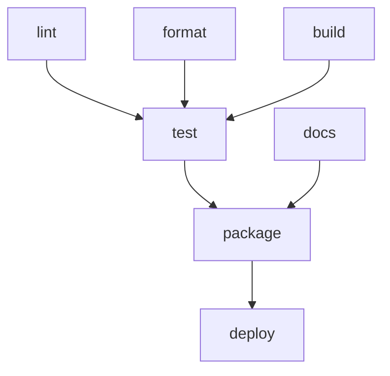

# Task System Architecture

Understanding how mise's task system works helps you write more efficient tasks and troubleshoot dependency issues.

## Task Dependency System

mise uses a dependency graph to manage task execution order and parallelism. This ensures tasks run in the correct order while maximizing parallel execution.

### Dependency Graph Resolution

When you run a task, mise builds a directed graph of the selected tasks and their
declared dependencies, then rejects cycles. In this example, selecting `deploy`
includes all of the prerequisites shown; arrows point from prerequisite to dependent:


```mermaid
graph TD
    A[lint] --> D[test]
    B[format] --> D[test]
    C[build] --> D[test]
    D[test] --> E[package]
    F[docs] --> E[package]
    E[package] --> G[deploy]
```

This graph ensures that:

- Dependencies run before dependents
- Independent tasks run in parallel
- No circular dependencies exist
- Failed dependencies prevent dependents from running

### Dependency Types

mise supports three types of task dependencies:

#### `depends` - Prerequisites

Tasks that must complete successfully before this task runs:

```toml
[tasks.test]
depends = ["lint", "build"]
run = "npm test"
```

#### `depends_post` - Cleanup Tasks

Tasks that run after this task completes (whether it succeeded or failed):

```toml
[tasks.deploy]
depends = ["build", "test"]
depends_post = ["cleanup", "notify"]
run = "kubectl apply -f deployment.yaml"
```

Regular dependencies of cleanup tasks belong to the same post-phase subtree and do not start until
the parent task has completed. mise runs that subtree if the parent started, even when the parent
fails, but skips the entire subtree when a regular dependency fails before the parent can start. A
task used as both a regular dependency and a post-dependency is executed separately in each phase.

#### `wait_for` - Soft Dependencies

Tasks that must finish first if they are already scheduled. `wait_for` does not
schedule them. A missing task definition still causes an error unless the reference
sets `optional = true`; see [`wait_for`](./task-configuration.html#wait-for).

```toml
[tasks.integration-test]
wait_for = ["start-services"]  # Only waits if start-services is also being run
run = "npm run test:integration"
```

## Parallel Execution Engine

### Job Control

mise executes tasks in parallel up to the configured job limit:

```bash
mise run --jobs 8 test        # Use 8 parallel jobs
mise run -j 1 test            # Force sequential execution
```

The default is 4 parallel jobs, but you can configure this globally:

```toml
# ~/.config/mise/config.toml
[settings]
jobs = 8
```

### Example Execution Flow

Given these tasks:

```toml
[tasks.lint]
run = "eslint src/"

[tasks.test-unit]
depends = ["lint"]
run = "npm run test:unit"

[tasks.test-integration]
depends = ["lint"]
run = "npm run test:integration"

[tasks.build]
depends = ["test-unit", "test-integration"]
run = "npm run build"
```

Execution with `--jobs 2`:

```
Time →
0s:   [lint]
5s:   [test-unit] [test-integration]  # Run in parallel after lint
15s:  [build]                        # Waits for both tests
```

## Task Discovery and Resolution

### Task Sources

mise loads inline TOML tasks, included task files, and executable file tasks from
the active configuration hierarchy. A child configuration can override a parent
configuration. An inline metadata-only definition can also add properties to an
existing command or file task.

There is no single source-type ordering that describes every combination. See
[`task_config.includes`](./task-configuration.html#task_config.includes) for include
ordering, command replacement, and metadata overlays. Use `mise tasks info <task>`
to inspect the selected definition.

### Task Resolution Process

When you run `mise run build`, mise:

1. **Discovers all tasks** from all configuration sources
2. **Resolves the task name** (handles aliases and partial matches)
3. **Builds the dependency graph** including all dependencies
4. **Validates the graph** (checks for circular dependencies)
5. **Executes in dependency order** with parallelism

### Task Resolution Across Directories

Tasks from parent directories are available in subdirectories and can be overridden:

```
project/
├── mise.toml              # defines: lint, test, build
└── frontend/
    └── mise.toml          # overrides: test, adds: bundle
```

In `frontend/`, you have access to `lint` (from parent), `test` (overridden), `build` (from parent), and `bundle` (local).

## Advanced Dependency Features

### Conditional Dependencies

Use task arguments for conditional behavior:

```toml
[tasks.test]
depends = ["build"]
run = '''
#!/usr/bin/env bash
if [ "$1" = "--with-lint" ]; then
  mise run lint
fi
npm test
'''
```

The shebang selects Bash, which must be installed on the host. Without
it, mise uses the platform default inline shell (`sh -c` on Unix,
`cmd /c` on Windows), so the bash `[ ... ]` test would fail to parse on a
Windows host. For richer argument handling, prefer the
[`usage` field](/tasks/task-arguments#usage-field) instead of positional
parameters.

### Dynamic Dependencies

A script can invoke another task conditionally. These nested invocations are
separate runs; they are not added to the original dependency graph and do not
appear in `mise tasks deps`:

```bash
#!/usr/bin/env bash
#MISE depends=["setup"]

# Additional conditional dependency
if [ ! -f ".env" ]; then
  mise run generate-env
fi

npm start
```

### Cross-Project Dependencies

Enable [monorepo mode](./monorepo.html#configuration) and declare the project
roots before referencing their tasks. For projects named `api` and `frontend`:

```toml
[tasks.deploy-all]
depends = [
  "//api:build",
  "//frontend:build",
  "deploy-infrastructure"
]
run = "echo 'All services deployed'"
```

## Performance Optimizations

### Source and Output Tracking

Tasks can skip execution if sources haven't changed:

```toml
[tasks.build]
sources = ["src/**/*.ts", "package.json"]
outputs = ["dist/**/*"]
run = "npm run build"
```

mise only runs the task if:

- Source files are newer than output files
- The task has never been run
- Dependencies have changed

### Incremental Execution

Use `mise run --force` to ignore source/output checking:

```bash
mise run --force build     # Always run, ignore source changes
```

### Parallel File Watching

Use `mise watch` for continuous development:

```bash
mise watch              # Watch the default task
mise watch build test   # Watch specific tasks
```

This automatically reruns tasks when their source files change.

## Debugging Task Dependencies

### Visualize Dependencies

```bash
mise tasks deps build           # Show build's declared dependencies
mise tasks deps --dot > deps.dot # Generate graphviz diagram
```

### Execution Tracing

```bash
mise run --verbose build       # Show task execution details
mise run --dry-run build       # Show what would run without executing
```

### Common Issues

**Circular Dependencies**:

```
Error: Circular dependency detected: test → build → test
```

Solution: Remove the cycle or split the shared work into a separate prerequisite.
`wait_for` also creates ordering constraints when both tasks are scheduled, so it
is not a general way to break a cycle.

**Missing Dependencies**:

```
Error: Task 'build' depends on 'lint' but 'lint' was not found
```

Solution: Define the missing task or remove the dependency.

**Slow Parallel Execution**:

- Check if tasks have unnecessary dependencies
- Use `mise tasks deps` to verify the declared dependency graph (`depends`, `wait_for`, `depends_post`)
- Consider increasing `--jobs` if you have spare CPU cores
