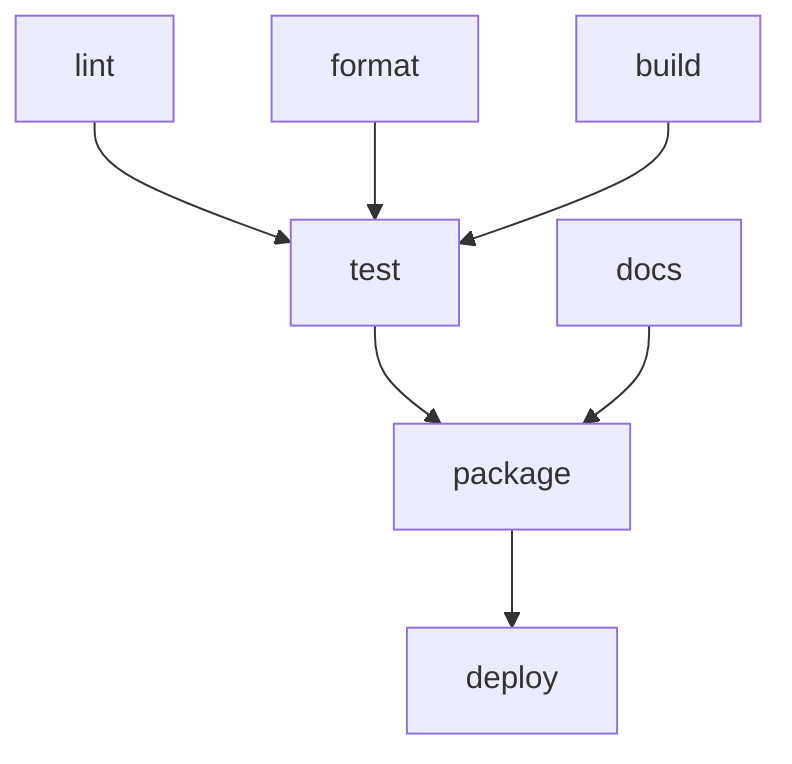

# Dependencies and execution order

When you run a task, mise builds a graph of that task and everything it depends
on, then starts each task as soon as its prerequisites succeed, up to the job
limit. Use this page to choose a dependency type and to debug ordering problems.

## How mise schedules a run

When you run `mise run deploy`, mise loads tasks from every active config, finds
`deploy` by name or alias (or expands a [wildcard pattern](/tasks/running-tasks.html#wildcards)),
adds its dependencies to a graph, rejects cycles, and then starts each task once
its prerequisites have succeeded. In this graph, arrows point from prerequisite
to dependent:


```mermaid
graph TD
    A[lint] --> D[test]
    B[format] --> D[test]
    C[build] --> D[test]
    D[test] --> E[package]
    F[docs] --> E[package]
    E[package] --> G[deploy]
```

`lint`, `format`, `build`, and `docs` start together. `test` starts when `lint`,
`format`, and `build` have succeeded, and `package` starts when `test` and
`docs` have. The scheduling rules are:

- A task starts only after all of its prerequisites succeed.
- Tasks with no path between them run in parallel, up to `--jobs` (the
  [`jobs`](/configuration/settings.html#jobs) setting).
- A task that several others depend on runs once.
- A graph with a cycle is rejected before any task runs.
- A failed task stops the run, so its dependents do not start, unless you pass
  `--continue-on-error`. See
  [When a task fails](/tasks/running-tasks.html#when-a-task-fails).

mise matches task names exactly, by alias, by wildcard pattern, or without an
extension, so `mise run build` finds the file task `build.sh`. It does not match
partial names: `mise run bui` fails with `no task bui found` even when `build`
exists.

[Task discovery and precedence](/tasks/task-discovery.html) explains where mise
finds tasks and [which definition wins](/tasks/task-discovery.html#which-definition-wins)
when two configs define the same name.

## Choose a dependency type

| Mechanism                                 | Adds the task to the run | When it runs                                                          | In `mise tasks deps`        |
| ----------------------------------------- | ------------------------ | --------------------------------------------------------------------- | --------------------------- |
| [`depends`](#depends)                     | Yes                      | Before this task; this task does not start if it fails                | Yes                         |
| [`wait_for`](#wait-for)                   | No                       | Before this task, only when the other task is already in the run      | Only when both are selected |
| [`depends_post`](#depends-post)           | Yes                      | After this task, even if this task fails                              | As `<name> (post)`          |
| [Run steps](#run-steps-in-order) in `run` | Yes, as a step           | In `run` order; a `{ tasks = [...] }` step runs its tasks in parallel | No                          |

`depends`, `wait_for`, and `depends_post` accept task names, aliases, and
patterns, and each entry can pass arguments and environment variables to the
task it names. See
[`depends`](/tasks/task-configuration.html#depends) in the task configuration
reference for the full syntax.

### `depends`

Prerequisites that must succeed before this task runs:

```mise-toml [mise.toml]
[tasks.test]
depends = ["lint", "build"]
run = "npm test"
```

`lint` and `build` run in parallel; their order in the list does not matter.

In a [monorepo](/tasks/monorepo.html#task-path-syntax), depend on another
project's task by its path, such as `depends = ["//api:build"]`.

### `depends_post` {#depends-post}

Tasks that run after this task finishes, whether it succeeded or failed:

```mise-toml [mise.toml]
[tasks.deploy]
depends = ["build", "test"]
depends_post = ["cleanup", "notify"]
run = "kubectl apply -f deployment.yaml"
```

`cleanup`, `notify`, and their own dependencies run after `deploy` finishes,
even if it failed. See [`depends_post`](/tasks/task-configuration.html#depends-post)
for what happens when `deploy`'s own dependencies fail.

### `wait_for` {#wait-for}

Tasks that must finish first, but only when something else already put them in
the run. `wait_for` does not add them:

```mise-toml [mise.toml]
[tasks.integration-test]
wait_for = ["start-services"]
run = "npm run test:integration"
```

`mise run integration-test` runs only `integration-test`.
`mise run start-services ::: integration-test` runs `start-services` first. A
name that matches no task is still an error unless the entry sets
`optional = true`; see [`wait_for`](/tasks/task-configuration.html#wait-for).

### Run steps in order {#run-steps-in-order}

A `run` array can call other tasks as steps. Each step finishes before the next
one starts, and a `{ tasks = [...] }` step runs its tasks in parallel:

```mise-toml [mise.toml]
[tasks.example1]
run = "echo example1"

[tasks.example2]
run = "echo example2"

[tasks.example3]
run = "echo example3"

[tasks.one_by_one]
run = [
  { task = "example1" },                # finishes before the next step starts
  { tasks = ["example2", "example3"] }, # these two run in parallel
]
```

Use run steps when the order matters. `depends = ["example1", "example2",
"example3"]` would also run all three first, but in parallel, with no order
among them.

Run steps belong to this task, not to the graph, so
`mise tasks deps one_by_one` shows `one_by_one` with no dependencies. The tasks
in each step still run with their own `depends`. A step can pass arguments and
environment variables, such as `{ task = "build", args = ["--release"] }`; see
[`run`](/tasks/task-configuration.html#run).

## Run a task from a script

A script can call `mise run` itself, for example to run a task only when a file
is missing:

```bash [mise-tasks/start]
#!/usr/bin/env bash
#MISE depends=["setup"]
if [ ! -f .env ]; then
  mise run generate-env
fi
npm start
```

The nested `mise run` is a separate run. It does not join the current graph and
does not appear in `mise tasks deps`. To choose behavior from a flag such as
`--with-lint`, define the flag with a [usage spec](/tasks/task-arguments.html)
instead of reading `$1`.

## Inspect and debug

### See the graph

```sh
mise tasks deps deploy             # tree of deploy's dependencies
mise tasks deps --dot > deps.dot   # every task, in Graphviz format
mise run --dry-run deploy          # each command, in execution order, without running it
```

[`mise tasks deps`](/cli/tasks/deps.html) shows `depends`, `depends_post`, and
`wait_for` edges, but not run steps. A `wait_for` edge appears only when both
tasks are selected. A post-dependency appears as `<name> (post)`, including
in the tree for a single task.

### Why a task ran or was skipped

A task with `sources` and `outputs` is skipped while its outputs are up to date.
See [Skip tasks that are up to date](/tasks/running-tasks.html#skip-tasks-that-are-up-to-date)
and [Task caching](/tasks/caching.html). `mise run --force` runs it anyway, and
`mise run --verbose` prints debug logs, including each command mise starts.

### `circular dependency detected`

```text
mise ERROR circular dependency detected: test -> build -> test
```

The path after the colon is the cycle. Remove one of the edges, or move the
shared work into a separate task that both depend on. `wait_for` also orders
two tasks when both are in the run, so it does not break a cycle.

### `task not found`

```text
mise ERROR task not found: lint
```

A `depends`, `depends_post`, or `wait_for` entry names a task that does not
exist. Define the task, fix the name, or mark the entry
`{ task = "lint", optional = true }`. A name you type on the command line that
matches nothing fails with `no task <name> found` and lists the available
tasks.

### Tasks run one at a time

Run `mise tasks deps <task>` to find a chain where you expected siblings. Check
the `--jobs` value and `MISE_JOBS`, and whether a task sets
[`raw`](/tasks/task-configuration.html#raw) or
[`interactive`](/tasks/task-configuration.html#interactive), which take
exclusive access to the terminal. `mise run --raw` and the global
[`raw`](/configuration/settings.html#raw) setting also run one command at a time.
