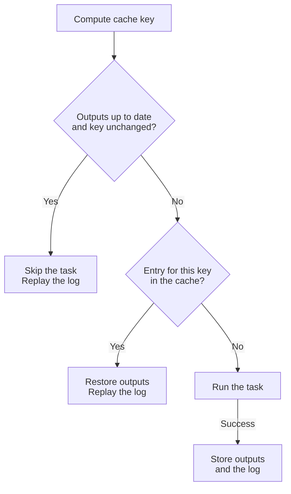

# Task caching

mise can skip a task whose inputs have not changed in two ways. Freshness
checks compare file modification times and need only `sources` and `outputs`.
The artifact cache also brings back outputs you deleted and results from earlier
inputs, for example after you switch back to a branch you already built.

| Mechanism        | Compares                                       | When nothing changed                          | Status       |
| ---------------- | ---------------------------------------------- | --------------------------------------------- | ------------ |
| Freshness checks | Modification times of sources and outputs      | Skips the task and leaves its outputs alone   | Stable       |
| Artifact cache   | Source contents and the other cache-key inputs | Restores the outputs and replays the task log | Experimental |

To share artifact cache results between CI and developer machines, see
[Remote task cache](/tasks/remote-cache.html).

## Skip up-to-date tasks

Give a task `sources` and `outputs`:

```mise-toml
[tasks.build]
run = "cargo build"
sources = ["Cargo.toml", "src/**/*.rs"]
outputs = ["target/debug/mycli"]
```

[`mise run build`](/cli/run.html) runs `cargo build` the first time. On later
runs it prints `[build] sources up-to-date, skipping` until the task becomes
[stale](#what-makes-a-task-stale). Use `mise run --force build` to run it
anyway; `--force` also reruns the task's dependencies.

[`sources`](/tasks/task-configuration.html#sources) and
[`outputs`](/tasks/task-configuration.html#outputs) accept globs, `!`
exclusions, and usage arguments; the task configuration reference describes the
pattern syntax. [`mise watch`](/cli/watch.html) uses the same `sources` to decide
which files to watch.

### What makes a task stale

A task with `sources` is up to date only when all of these hold:

- Every declared output exists.
- The newest source file is older than the newest output file.
- The list of source files, and the size and modification time of each, match
  what mise recorded after the task last succeeded. Deleting a source, adding
  one, or restoring an older copy therefore makes the task stale.
- No source has a modification time of zero (1970-01-01), which some archive
  tools set.
- No dependency that has its own `sources` ran or restored outputs in the same
  `mise run`.

mise adds the config file that defines the task to its sources. Editing that
file, even to change a different task, makes the task stale.

A failed run records nothing, so the task stays stale until it succeeds.

### Outputs

- Explicit paths or globs, such as `outputs = ["dist"]`, are compared by the
  [freshness rules](#what-makes-a-task-stale).
- When a task has `sources` but no `outputs`, mise uses
  `outputs = { auto = true }`. It touches a marker file in its state directory
  after each successful run, so the task reruns when a source changes after
  that run.
- `outputs = []` declares that the task writes no files. Freshness checks then
  never skip it. With the [artifact cache](#enable-artifact-caching), mise
  caches its result and log instead.

### Dependencies

When a dependency that has `sources` runs or restores its outputs from the
artifact cache, for any reason including `--force`, every task that depends on
it also runs, even when its own sources are unchanged:

```mise-toml
[tasks."core:build"]
run = "tsc -p packages/core"
sources = ["packages/core/src/**/*.ts"]
outputs = ["packages/core/dist/**/*.js"]

[tasks."frontend:build"]
run = "tsc -p packages/frontend"
sources = ["packages/frontend/src/**/*.ts"]
outputs = ["packages/frontend/dist/**/*.js"]
depends = ["core:build"]
```

A change in `packages/core/src/` runs both tasks. With no changes, both are
skipped. A dependency without `sources` runs every time, so it does not
invalidate the tasks that depend on it.

### Inputs shared by every task

[`task_config.global_inputs`](/tasks/task-configuration.html#task_config.global_inputs)
<Badge type="warning" text="experimental" /> adds source patterns to every task
in a config scope, such as lockfiles that should invalidate everything. A task
without its own `sources` then gets those inputs and automatic outputs, so mise
skips it while they are unchanged.

### Freshness settings

- [`task.source_freshness_hash_contents`](/configuration/settings.html#task.source_freshness_hash_contents)
  compares BLAKE3 hashes of the source contents with those recorded after the
  last successful run, and ignores modification times. A task is also stale when
  its outputs changed since that run. The first run after you enable it always
  runs the task.
- [`task.source_freshness_equal_mtime_is_fresh`](/configuration/settings.html#task.source_freshness_equal_mtime_is_fresh)
  treats a source and output with the same modification time as up to date.
  Enable it on filesystems with coarse timestamps.

## Enable the artifact cache <Badge type="warning" text="experimental" /> {#enable-artifact-caching}

::: warning Experimental
The artifact cache requires `experimental = true`.
:::

Set `cache = { enabled = true }` on a task with `sources` and `outputs`. After a
successful run, mise stores the outputs and the task's log under a key computed
from the task's inputs. When the same inputs come back, mise restores them
instead of running the task.

```mise-toml
[settings]
experimental = true

[tasks.build]
run = "npm run build"
sources = ["package.json", "src/**"]
outputs = ["dist"]
cache = { enabled = true, env = ["NODE_ENV"] }
```

| Situation                                      | mise prints                                   | What happens                                              |
| ---------------------------------------------- | --------------------------------------------- | --------------------------------------------------------- |
| First run                                      | `[build] cache miss: no matching cache entry` | Runs `npm run build` and stores `dist` and the log        |
| Next run, nothing changed                      | `[build] sources up-to-date, skipping`        | Skips the task and replays the stored log                 |
| `dist` deleted                                 | `[build] restored outputs from cache 7ede…`   | Restores `dist` and replays the log without running       |
| `src` changed and built, then changed back     | `[build] restored outputs from cache 7ede…`   | Finds the entry for the earlier inputs and restores it    |
| `NODE_ENV=production`, a value not seen before | `[build] cache miss: no matching cache entry` | Runs the task and stores a second entry for the new value |

For checks such as lint or tests that write no files, set `outputs = []` to
cache only the result and the log. A rerun with unchanged inputs prints
`sources up-to-date, skipping` and replays the log. Restoring the result for
earlier inputs, for example after you revert a change, prints
`restored result from cache <key>`:

```mise-toml
[tasks.lint]
run = "eslint ."
sources = ["package.json", "src/**"]
outputs = []
cache = { enabled = true }
```

### Requirements

- [`experimental`](/configuration/settings.html#experimental) is `true`.
- The task has at least one entry in `sources`.
- The task has explicit `outputs` or `outputs = []`. Automatic outputs cannot be
  stored.
- Every output pattern, including the part after a `!` exclusion, is a relative
  path inside the task directory, and no output contains a source.

A task that sets `cache.enabled = true` without meeting these fails with an
error such as `task build cache requires at least one source`.

### When mise does not use the cache

- `mise run --task-cache off` or `MISE_TASK_CACHE=off` turns the artifact cache
  off for the run. Freshness checks still apply.
- `mise run --dry-run` does not read, write, or compute cache keys, unless you
  also ask for an [explanation](#inspect-and-diagnose-cached-results).
- `mise run --force` skips cache reads and runs the task, then stores the new
  result.
- A task that receives [`secrets`](/tasks/task-configuration.html#secrets) is
  never cached, because its log or outputs could contain them. mise warns, and
  freshness checks still apply.
- A `raw` or `interactive` task, or any task run with `--raw`, keeps the
  terminal and is not cached. mise warns, and the task runs every time.
- A task runs instead of restoring when one of its dependencies has `sources`
  but no artifact cache and ran in the same `mise run`.

### Cache every eligible task in a project

Set `task_config.cache` to give every task in a config scope a default `cache`
value. Only tasks with at least one source and explicit outputs or
`outputs = []` receive it; other tasks stay uncached. A task's own `cache` value
replaces the default entirely.

```mise-toml
[settings]
experimental = true

[task_config.cache]
enabled = true
env = ["NODE_ENV"]
command_inputs = ["node --version"]

[tasks.build]
run = "npm run build"
sources = ["package.json", "src/**"]
outputs = ["dist"]

[tasks.deploy]
run = "./deploy.sh"
cache = { enabled = false }
```

In a monorepo, [`[monorepo.task_defaults]`](/tasks/workspace-graph.html#root-task-defaults)
can set `cache` for a task name in every project, and the Node.js workspace
provider reads `cache` from
[`turbo.json`](/tasks/workspace-graph.html#provider-task-suggestions).

## How a cached run works {#artifact-cache-flow}



mise computes the key first, so `cache.command_inputs` run even when the task is
then skipped. The skip requires both a
[freshness check](#what-makes-a-task-stale) and a key equal to the one stored by
the last run; for `outputs = []`, the key alone decides.
A lookup checks the local cache and then, when one is configured, the
[remote cache](/tasks/remote-cache.html). Failed runs are not stored.

When the task runs instead of restoring, mise prints the reason after
`cache miss:`:

- `no matching cache entry`
- `cache entry was corrupt`
- `cache entry exceeded its age limit`
- `forced execution`
- `cache reads are disabled`
- `dependency completed without a cache key`

## What goes into the cache key

- The paths and contents of the source files, plus the config file that defines
  the task. Paths are relative to the outermost config root, so checkouts at
  different locations share entries.
- The task definition: its name, `run` entries, arguments, shell, output
  patterns, directory, and whether it runs as a `depends_post` dependency.
- The values of the task's own `env` entries.
- The values, or absence, of the variables named in `cache.env` and
  `task_config.global_env`.
- The mise variables the task can see, from `[vars]` and the task's `vars`.
- The output of each `cache.command_inputs` command.
- The resolved tool versions.
- The cache keys of cached dependencies.
- The operating system and architecture.

Other environment variables, whether inherited from your shell or set in
`[env]`, are part of the key only when you list them in `cache.env`. A source
outside the outermost config root, such as `../../shared/file`, is keyed by its
absolute path, so only checkouts at the same path share that entry.

## External dependencies and lockfiles

Declare dependency manifests and lockfiles as sources so dependency updates
invalidate the cache. List them in a task's `sources`, share them through an
input group, or apply them to every task in a config scope with
`task_config.global_inputs`:

```mise-toml
[settings]
experimental = true

[task_config]
global_inputs = ["@group:node-dependencies"]

[task_config.input_groups]
node-dependencies = ["package.json", "pnpm-lock.yaml"]

[tasks.build]
run = "pnpm build"
sources = ["src/**"]
outputs = ["dist"]
cache = { enabled = true }
```

The lockfile describes the resolved dependency graph, so do not list installed
dependency directories such as `node_modules`. Resolved mise tools are already
part of the key.

### Command inputs

Use `cache.command_inputs` for external state that committed files do not
capture, such as a package registry selection or a compiler wrapper version:

```mise-toml
[tasks.build]
run = "pnpm build"
sources = ["package.json", "pnpm-lock.yaml", "src/**"]
outputs = ["dist"]
cache = { enabled = true, command_inputs = ["pnpm config get registry"] }
```

Each command runs before the cache lookup, with the task's shell (including a
`--shell` override on the command line), environment, tools, working directory,
and sandbox. Its command text, stdout, and stderr become part of the key; mise
hashes the output without printing or keeping it.

A command input must be non-empty and exit successfully. It inherits the task's
`timeout`, or 30 seconds when the task has none, and may print at most 16 MiB
across stdout and stderr. Keep command inputs fast, deterministic, and free of
side effects, because they run every time mise computes the key. They do not run
during a dry run or for `raw` and `interactive` tasks, unless you request a
cache-key explanation with `--task-cache-explain` or
`--task-cache-explain-json`.

### Environment variables and cache keys

`task_config.global_env` adds variable names to the `cache.env` of every
cache-enabled task in the config scope, including tasks that set their own
`cache`:

```mise-toml
[task_config]
global_env = ["CI", "NODE_ENV"]
```

Pass credentials and other values that must not affect the key with
[`pass_through_env`](/tasks/task-configuration.html#sandbox) on a
task, or `task_config.global_pass_through_env` for every task in the scope:

```mise-toml
[task_config]
global_pass_through_env = ["CI_JOB_TOKEN"]

[tasks.build]
pass_through_env = ["NPM_TOKEN"]
```

These lists matter when environment sandboxing is active through `allow_env`,
`deny_env`, `deny_all`, or the matching command-line options. Without a sandbox,
tasks inherit your whole environment anyway. In a sandbox, a cache-enabled task
still receives the variables named in `cache.env` and `task_config.global_env`;
a task without an enabled cache does not.

A pass-through variable can change what the task does without changing the key,
so do not use one for a value that affects the outputs. mise does not store
pass-through values, but a task can still write them into its log or outputs.

## Cache correctness and deterministic tasks

Enabling `cache` asserts that the same cache-key inputs always produce the same
log and outputs. Every value that can change the result must be in the key: a
source or input group, a resolved mise tool, `cache.env`,
`cache.command_inputs`, or a cached dependency. That includes configuration and
lockfiles, locale and feature flags, compiler wrappers, generated inputs, and
the state of external services the task reads. The operating system and
architecture are added automatically; nothing else about the machine is.

A cached task must not depend on undeclared files, the clock, randomness,
changing network responses, or ambient environment variables. When you cannot
capture such an input reliably, do not cache the task. A task that uses a
credential only to download content must key on a lockfile or digest of that
content, not on the credential.

Declared outputs must describe everything a hit needs to reproduce. mise does
not replay side effects outside them, such as database writes, deployments,
notifications, or changes elsewhere in the workspace. `outputs = []` is correct
only when the task changes no files that later work depends on.

When you are unsure, run with `--task-cache off` while you investigate, add the
missing inputs, and run with `--force` once before you trust new entries. On
Linux, an [audit](#find-undeclared-inputs-on-linux) can show many undeclared
reads and writes, but it cannot prove that a task is deterministic.

## Per-run cache access

`mise run --task-cache <mode>`, or `MISE_TASK_CACHE`, controls the artifact
cache for one run:

| Mode                   | Reads cached results | Stores new results | Notes                                                         |
| ---------------------- | -------------------- | ------------------ | ------------------------------------------------------------- |
| `read-write` (default) | Yes                  | Yes                |                                                               |
| `read-only`            | Yes                  | No                 | For runs that must not publish entries, such as pull requests |
| `write-only`           | No                   | Yes                | Always runs the task; use it to warm a cache                  |
| `off`                  | No                   | No                 | Freshness checks still apply                                  |
| `local-only`           | Yes                  | Yes                | Uses only the local cache and ignores a configured remote     |

```sh
# Do not publish entries from an untrusted pull request
mise run --task-cache read-only test

# Rebuild and store fresh entries without reading existing ones
mise run --task-cache write-only build

# Investigate a task without the cache
mise run --task-cache off --force build
```

`--task-cache` affects only the artifact cache. The unrelated `--no-cache` flag
refetches remote task files.

## Inspect and diagnose cached results

### Explain a cache key

`mise run --task-cache-explain <task>` lists the inputs that produced the key.
Add `--dry-run` to see them without running, restoring, or storing anything:

```sh
mise run --dry-run --task-cache-explain build
```

```text
[build] cache key inputs:
[build]   cache format: 2
[build]   action version: 1
[build]   task definition: included
[build]   sources: 2 files
[build]     source: mise.toml
[build]     source: src/a.txt
[build]   output patterns: 1
[build]     pattern: dist
[build]   resolved outputs: 1
[build]     output: dist
[build]   dependencies: 0 artifact keys
[build]   environment NODE_ENV: unset
[build]   command inputs: 0
[build]   variable: channel
[build]   tools: 0 resolved versions
[build]   platform: linux-x86_64
```

Values that could be secret appear only as names or counts: environment
variables show whether they are set, mise variables show their names, and the
task definition, source contents, command output, dependency keys, and tool
versions show a count or `included`. Command inputs still run, because their
output is part of the key.

`mise run --dry-run --task-cache-explain-json <task>` prints the same
information as one compact JSON object per task on stdout, with the same
redaction. Each object includes the opaque `cache_key`, so tools can tell runs
of the same task apart without seeing its arguments or environment.

### Measure hits

`mise run --task-cache-stats <task>` prints a summary after the run:

```text
Task cache: 1/2 hits (50%), 11 B restored, 5.5ms saved
```

It counts artifact cache lookups, the bytes of outputs and logs restored, and
the run time recorded when each restored entry was created. A task skipped by
the freshness check does no lookup, so a run where every task was up to date
prints `Task cache: no lookups`.

### List and clear entries

[`mise cache task <task>`](/cli/cache/task.html) lists every local entry for a
task: its key, whether it is the current entry, its stored and restorable sizes,
the recorded run time, the last access time, and the output roots. Add `--json`
for an array that includes each entry's checksum.

[`mise cache clear --task <task>`](/cli/cache/clear.html) deletes that task's
local entries and its record of the current entry. It leaves the outputs in your
working directory, other tasks' entries, and copies on a remote server alone. It
skips entries whose owner it cannot verify; `mise cache clear` without `--task`
removes everything.

### Find undeclared inputs on Linux

Set `cache.audit = true` to have mise trace the task with `strace` and warn about
undeclared files:

```mise-toml
[tasks.build]
run = "npm run build"
sources = ["package.json", "src/**"]
outputs = ["dist"]
cache = { enabled = true, audit = true }
```

A restored task does not run, so force a run to audit it:

```sh
mise run --force build
```

mise reports reads beneath the workspace root that no `sources` entry matches,
and writes beneath the task directory that no `outputs` entry matches. Paths are
relative to the task directory, using `..` for reads above it, so you can copy a
reported read into `sources` as printed. Reads of directories and of files
outside those roots, such as system libraries, are not reported. The audit only
warns: it does not stop the task or keep a successful result out of the cache.

The audit needs Linux and `strace` on `PATH`. Elsewhere, or without `strace`,
mise warns and runs the task without auditing.

The console shows at most 20 paths per task. To get every path, set
[`task.cache.audit_report`](/configuration/settings.html#task.cache.audit_report)
to a file. mise writes one JSON object per line with `task`, `kind`, and `path`
fields. Each `mise` invocation replaces the file, and every audited task in that
invocation adds its lines:

```sh
MISE_TASK_CACHE_AUDIT_REPORT=audit.jsonl mise run --force build
```

## Storage, retention, and output replay

mise stores entries in `$MISE_CACHE_DIR/task-artifacts/v2`. Set
[`task.cache_dir`](/configuration/settings.html#task.cache_dir) or
`MISE_TASK_CACHE_DIR` to use another parent directory; mise keeps the entries in
its `v2` subdirectory. `mise cache clear` and cache pruning include the task
cache wherever it lives.

Each entry holds the declared outputs as an archive and the task's stdout and
stderr. mise applies [redactions](/environments/secrets/#redaction) to the log
before storing it, but it does not scan output files or catch a credential it
does not know about. Do not cache a task that prints or writes secrets.

Set [`task.cache_max_size`](/configuration/settings.html#task.cache_max_size) to
bound the total size of the cache, or
[`task.cache_max_age`](/configuration/settings.html#task.cache_max_age) to drop
entries not used within a period. mise enforces both after storing a new entry,
removing the least recently used entries first, and treats an entry older than
the age limit as a miss.

mise verifies each entry's checksum before restoring it, and concurrent `mise`
processes can share the cache safely. A corrupt, partial, or unreadable entry
counts as a miss, so the task runs. Errors while reading or writing the cache
never turn a successful task into a failure.

mise replays a restored log with the output mode of the current run, so
`prefix`, `interleave`, `keep-order`, `timed`, `replacing`, `quiet`, `silent`,
and per-stream silencing apply to it as they do to live output.

When a task depends on cached tasks, their keys are part of its key, so it can
restore its own entry after its dependencies run, are skipped, or are restored.
