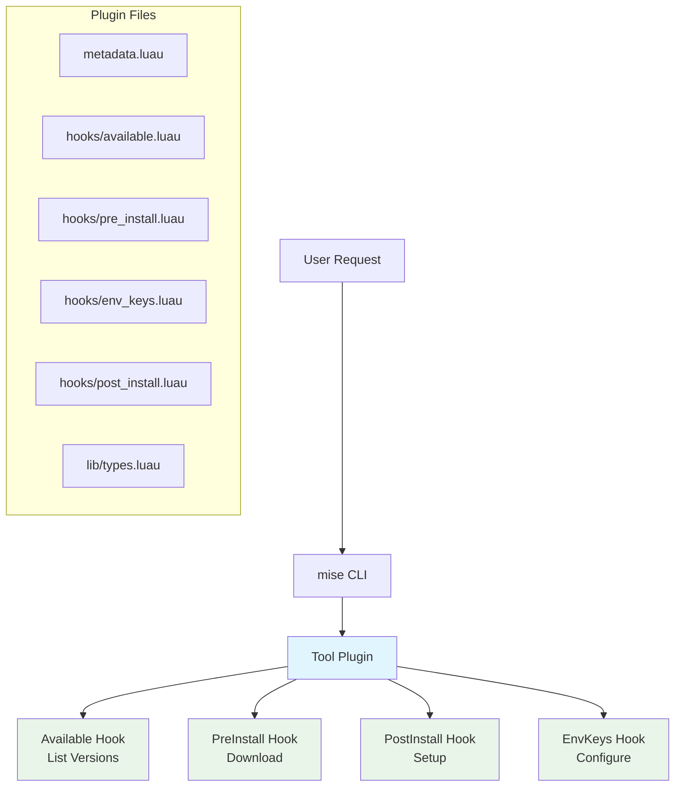

# Tool Plugin Development

Tool plugins use a hook-based architecture to manage individual tools. They are compatible with the standard vfox ecosystem and are perfect for tools that need complex installation logic, environment configuration, or legacy file parsing.

> [!TIP]
> The fastest way to get started is with the [mise-tool-plugin-template](https://github.com/jdx/mise-tool-plugin-template) repository.

## What are Tool Plugins?

Tool plugins use traditional hook functions to manage a single tool. They provide:

- **Standard vfox Compatibility**: Works with both mise and vfox
- **Complex Installation Logic**: Handle source compilation, custom builds, and complex setups
- **Environment Configuration**: Set up complex environment variables beyond just PATH
- **Legacy File Support**: Parse version files from other tools (`.nvmrc`, `.tool-version`, etc.)
- **Cross-Platform Support**: Works on Windows, macOS, and Linux

## Plugin Architecture

Tool plugins are implemented in [Luau](https://luau.org/), a fast, small, safe, gradually typed embeddable scripting language derived from Lua. They use a hook-based architecture with specific functions for different lifecycle events:



## Type Definitions

Luau supports gradual typing with the `--!strict` directive. The recommended pattern is to create a shared type definitions file:

### lib/types.luau

```lua
--!strict
export type AvailableResult = {
    version: string,
    note: string?,
    addition: { { name: string, version: string } }?,
    rolling: boolean?,
    checksum: string?,
}

export type PreInstallResult = {
    version: string,
    url: string?,
    sha256: string?,
    sha512: string?,
    md5: string?,
    sha1: string?,
    note: string?,
    addition: { { name: string, url: string } }?,
    attestation: {
        github_owner: string?,
        github_repo: string?,
        github_signer_workflow: string?,
        cosign_sig_or_bundle_path: string?,
        cosign_public_key_path: string?,
        slsa_provenance_path: string?,
        slsa_min_level: number?,
    }?,
}

export type EnvKeysResult = {
    key: string,
    value: string,
}

export type SdkInfo = {
    path: string,
    version: string,
    name: string,
}

export type PluginType = {
    Available: (self: PluginType, ctx: { args: { string }? }) -> { AvailableResult },
    PreInstall: (self: PluginType, ctx: { version: string, runtimeVersion: string }) -> PreInstallResult,
    PostInstall: (self: PluginType, ctx: { rootPath: string, runtimeVersion: string, sdkInfo: { [string]: SdkInfo } }) -> (),
    EnvKeys: (self: PluginType, ctx: { path: string, runtimeVersion: string, sdkInfo: { [string]: SdkInfo } }) -> { EnvKeysResult },
    PreUse: (self: PluginType, ctx: { version: string, previousVersion: string?, cwd: string, scope: string, installedSdks: { SdkInfo } }) -> { version: string }?,
    ParseLegacyFile: (self: PluginType, ctx: { filename: string, filepath: string, getInstalledVersions: (self: any) -> { string } }) -> { version: string? },
}

export type HttpModule = {
    get: (opts: { url: string, headers: { [string]: string }? }) -> ({ status_code: number, headers: { [string]: string }, body: string }, string?),
    head: (opts: { url: string, headers: { [string]: string }? }) -> ({ status_code: number, headers: { [string]: string } }, string?),
    download_file: (opts: { url: string, headers: { [string]: string }? }, path: string) -> string?,
}

export type JsonModule = {
    encode: (value: any) -> string,
    decode: (str: string) -> any,
}

export type FileModule = {
    read: (path: string) -> string?,
    exists: (path: string) -> boolean,
    join_path: (...string) -> string,
    symlink: (source: string, target: string) -> (),
}

export type CmdModule = {
    exec: (command: string, opts: { cwd: string?, env: { [string]: string }? }?) -> string,
}

export type EnvModule = {
    getenv: (key: string) -> string?,
    setenv: (key: string, value: string) -> (),
}

export type LogModule = {
    trace: (...any) -> (),
    debug: (...any) -> (),
    info: (...any) -> (),
    warn: (...any) -> (),
    error: (...any) -> (),
}

return nil
```

### .luaurc Configuration

Create a `.luaurc` file in your plugin root to configure type checking:

```json
{
  "languageMode": "strict",
  "globals": ["PLUGIN", "RUNTIME"],
  "aliases": {
    "@lib": "lib"
  }
}
```

This allows you to use `require("@lib/types")` to import your type definitions.

## Hook Functions

### Required Hooks

These hooks must be implemented for a functional plugin:

#### Available Hook

Lists all available versions of the tool:

```lua
--!strict
-- hooks/available.luau
local Types = require("@lib/types")

local plugin = PLUGIN :: Types.PluginType

function plugin:Available(_ctx: { args: { string }? }): { Types.AvailableResult }
    -- Return array of available versions
    return {
        {
            version = "20.0.0",
            note = "Latest",
        },
        {
            version = "18.18.0",
            note = "LTS",
            addition = {
                {
                    name = "npm",
                    version = "9.8.1",
                },
            },
        },
    }
end
```

##### Rolling Releases

For tools that have rolling releases like "nightly" or "stable" where the version string stays the same but the content changes, you can mark versions as rolling and provide a checksum for update detection:

```lua
--!strict
local Types = require("@lib/types")

local plugin = PLUGIN :: Types.PluginType

function plugin:Available(_ctx: { args: { string }? }): { Types.AvailableResult }
    return {
        {
            version = "nightly",
            note = "Latest development build",
            rolling = true, -- Mark as rolling release
            checksum = "abc123...", -- SHA256 of the release asset
        },
        {
            version = "stable",
            note = "Latest stable release",
            rolling = true,
            checksum = "def456...",
        },
        {
            version = "1.0.0",
            note = "Fixed release",
            -- No rolling or checksum needed for fixed versions
        },
    }
end
```

When `rolling = true` is set:

- `mise upgrade` will check if the checksum has changed to detect updates
- `mise upgrade --bump` will preserve the version name (e.g., "nightly") instead of converting it to a semver

The checksum should be the SHA256 hash of the release asset for the user's platform. See the [vfox-neovim plugin](https://github.com/mise-plugins/vfox-neovim) for a complete example.

#### PreInstall Hook

Handles pre-installation logic and returns download information:

```lua
--!strict
-- hooks/pre_install.luau
local Types = require("@lib/types")

local plugin = PLUGIN :: Types.PluginType

function plugin:PreInstall(ctx: { version: string, runtimeVersion: string }): Types.PreInstallResult
    local version = ctx.version

    -- Determine download URL and checksums
    local url = `https://nodejs.org/dist/v{version}/node-v{version}-linux-x64.tar.gz`

    return {
        version = version,
        url = url,
        sha256 = "abc123...", -- Optional checksum
        note = `Installing Node.js {version}`,
        -- Optional attestation metadata, choose a verification type
        attestation = {
            -- GitHub
            github_owner = "ownername",
            github_repo = "reponame",
            -- Cosign
            cosign_sig_or_bundle_path = "/path/to/sig/or/bundle/file",
            -- SLSA
            slsa_provenance_path = "/path/to/provenance/file",
        },
    }
end
```

#### EnvKeys Hook

Configures environment variables for the installed tool:

```lua
--!strict
-- hooks/env_keys.luau
local Types = require("@lib/types")

local plugin = PLUGIN :: Types.PluginType

function plugin:EnvKeys(ctx: { path: string, runtimeVersion: string, sdkInfo: { [string]: Types.SdkInfo } }): { Types.EnvKeysResult }
    local mainPath = ctx.path
    local sdkInfo = ctx.sdkInfo["nodejs"]
    local path = sdkInfo.path
    local version = sdkInfo.version

    return {
        {
            key = "NODE_HOME",
            value = mainPath,
        },
        {
            key = "PATH",
            value = `{mainPath}/bin`,
        },
        -- Multiple PATH entries are automatically merged
        {
            key = "PATH",
            value = `{mainPath}/lib/node_modules/.bin`,
        },
    }
end
```

### Optional Hooks

These hooks provide additional functionality:

#### PostInstall Hook

Performs additional setup after installation:

```lua
--!strict
-- hooks/post_install.luau
local Types = require("@lib/types")
local cmd = require("cmd") :: Types.CmdModule

local plugin = PLUGIN :: Types.PluginType

function plugin:PostInstall(ctx: { rootPath: string, runtimeVersion: string, sdkInfo: { [string]: Types.SdkInfo } })
    local sdkInfo = ctx.sdkInfo["nodejs"]
    local path = sdkInfo.path

    -- Set executable permissions on Unix systems
    if RUNTIME.osType ~= "windows" then
        cmd.exec(`chmod +x {path}/bin/*`)
    end

    -- Create npm cache directory
    local npm_cache_dir = `{path}/.npm`
    cmd.exec(`mkdir -p {npm_cache_dir}`)
end
```

#### PreUse Hook

Modifies version before use:

```lua
--!strict
-- hooks/pre_use.luau
local Types = require("@lib/types")

local plugin = PLUGIN :: Types.PluginType

function plugin:PreUse(ctx: { version: string, previousVersion: string?, cwd: string, scope: string, installedSdks: { Types.SdkInfo } }): { version: string }?
    local version = ctx.version

    -- Optionally modify the version
    if version == "latest" then
        version = "20.0.0" -- Resolve to specific version
    end

    return {
        version = version,
    }
end
```

#### ParseLegacyFile Hook

Parses version files from other tools:

```lua
--!strict
-- hooks/parse_legacy_file.luau
local Types = require("@lib/types")
local file = require("file") :: Types.FileModule

local plugin = PLUGIN :: Types.PluginType

function plugin:ParseLegacyFile(ctx: { filename: string, filepath: string, getInstalledVersions: (self: any) -> { string } }): { version: string? }
    local filename = ctx.filename
    local filepath = ctx.filepath

    -- Read and parse the file
    local content = file.read(filepath)
    if not content then
        error(`Failed to read {filepath}`)
    end

    local version = content:match("v?([%d%.]+)")

    return {
        version = version,
    }
end
```

## Creating a Tool Plugin

### Using the Template Repository

The easiest way to create a new tool plugin is to use the [mise-tool-plugin-template](https://github.com/jdx/mise-tool-plugin-template) repository as a starting point:

```bash
# Clone the template
git clone https://github.com/jdx/mise-tool-plugin-template my-tool-plugin
cd my-tool-plugin

# Remove the template's git history and start fresh
rm -rf .git
git init

# Customize the plugin for your tool
# Edit metadata.luau, hooks/*.luau files, etc.
```

The template includes:

- Pre-configured plugin structure with all required hooks
- Type definitions in `lib/types.luau`
- Linting configuration (`.luaurc`, `stylua.toml`)
- Testing setup with mise tasks
- GitHub Actions workflow for CI

### 1. Plugin Structure

Create a directory with this structure (or use the template above):

```
my-tool-plugin/
├── metadata.luau         # Plugin metadata and configuration
├── .luaurc               # Luau type checking configuration
├── hooks/                # Hook functions directory
│   ├── available.luau    # List available versions [required]
│   ├── pre_install.luau  # Pre-installation hook [required]
│   ├── env_keys.luau     # Environment configuration [required]
│   ├── post_install.luau # Post-installation hook [optional]
│   ├── pre_use.luau      # Pre-use hook [optional]
│   └── parse_legacy_file.luau # Legacy file parser [optional]
├── lib/                  # Shared library code
│   ├── types.luau        # Type definitions [recommended]
│   └── util.luau         # Helper functions [optional]
└── test/                 # Test scripts [optional]
    └── test.sh
```

### 2. metadata.luau

Configure plugin metadata and legacy file support:

```lua
-- metadata.luau
PLUGIN = {
    name = "nodejs",
    version = "1.0.0",
    description = "Node.js runtime environment",
    author = "Plugin Author",

    -- Legacy version files this plugin can parse
    legacyFilenames = {
        ".nvmrc",
        ".node-version",
    },
}
```

### 3. Helper Libraries

Create shared functions in the `lib/` directory:

```lua
--!strict
-- lib/util.luau
local M = {}

function M.get_arch(): string
    if RUNTIME.archType == "amd64" then
        return "x64"
    elseif RUNTIME.archType == "386" then
        return "x86"
    elseif RUNTIME.archType == "arm64" then
        return "arm64"
    else
        return RUNTIME.archType
    end
end

function M.get_os(): string
    if RUNTIME.osType == "windows" then
        return "win"
    elseif RUNTIME.osType == "darwin" then
        return "darwin"
    else
        return "linux"
    end
end

function M.get_platform(): string
    return `{M.get_os()}-{M.get_arch()}`
end

return M
```

## Real-World Example: vfox-nodejs

Here's a complete example based on the vfox-nodejs plugin that demonstrates all the concepts:

### Available Hook Example

```lua
--!strict
-- hooks/available.luau
local Types = require("@lib/types")
local http = require("http") :: Types.HttpModule
local json = require("json") :: Types.JsonModule

local plugin = PLUGIN :: Types.PluginType

function plugin:Available(_ctx: { args: { string }? }): { Types.AvailableResult }
    -- Fetch versions from Node.js API
    local resp, err = http.get({
        url = "https://nodejs.org/dist/index.json",
    })

    if err ~= nil then
        error(`Failed to fetch versions: {err}`)
    end

    local versions = json.decode(resp.body)
    local result: { Types.AvailableResult } = {}

    for _, v in ipairs(versions) do
        local version = v.version:gsub("^v", "") -- Remove 'v' prefix
        local note: string? = nil

        if v.lts then
            note = "LTS"
        end

        table.insert(result, {
            version = version,
            note = note,
            addition = {
                {
                    name = "npm",
                    version = v.npm,
                },
            },
        })
    end

    return result
end
```

### PreInstall Hook Example

```lua
--!strict
-- hooks/pre_install.luau
local Types = require("@lib/types")
local http = require("http") :: Types.HttpModule

local plugin = PLUGIN :: Types.PluginType

function plugin:PreInstall(ctx: { version: string, runtimeVersion: string }): Types.PreInstallResult
    local version = ctx.version

    -- Determine platform
    local arch_token: string
    if RUNTIME.archType == "amd64" then
        arch_token = "x64"
    elseif RUNTIME.archType == "386" then
        arch_token = "x86"
    elseif RUNTIME.archType == "arm64" then
        arch_token = "arm64"
    else
        arch_token = RUNTIME.archType
    end

    local os_token: string
    if RUNTIME.osType == "windows" then
        os_token = "win"
    elseif RUNTIME.osType == "darwin" then
        os_token = "darwin"
    else
        os_token = "linux"
    end

    local platform = `{os_token}-{arch_token}`
    local extension = if RUNTIME.osType == "windows" then "zip" else "tar.gz"

    -- Build download URL
    local filename = `node-v{version}-{platform}.{extension}`
    local url = `https://nodejs.org/dist/v{version}/{filename}`

    -- Fetch checksum
    local shasums_url = `https://nodejs.org/dist/v{version}/SHASUMS256.txt`
    local resp, err = http.get({ url = shasums_url })

    local sha256: string? = nil
    if err == nil then
        -- Extract SHA256 for our file
        for line in resp.body:gmatch("[^\n]+") do
            if line:match(filename) then
                sha256 = line:match("^(%w+)")
                break
            end
        end
    end

    return {
        version = version,
        url = url,
        sha256 = sha256,
        note = `Installing Node.js {version} ({platform})`,
    }
end
```

### EnvKeys Hook Example

```lua
--!strict
-- hooks/env_keys.luau
local Types = require("@lib/types")

local plugin = PLUGIN :: Types.PluginType

function plugin:EnvKeys(ctx: { path: string, runtimeVersion: string, sdkInfo: { [string]: Types.SdkInfo } }): { Types.EnvKeysResult }
    local mainPath = ctx.path

    local env_vars: { Types.EnvKeysResult } = {
        {
            key = "NODE_HOME",
            value = mainPath,
        },
        {
            key = "PATH",
            value = `{mainPath}/bin`,
        },
    }

    -- Add npm global modules to PATH
    local npm_global_path = `{mainPath}/lib/node_modules/.bin`
    if RUNTIME.osType == "windows" then
        npm_global_path = `{mainPath}/node_modules/.bin`
    end

    table.insert(env_vars, {
        key = "PATH",
        value = npm_global_path,
    })

    return env_vars
end
```

### PostInstall Hook Example

```lua
--!strict
-- hooks/post_install.luau
local Types = require("@lib/types")
local cmd = require("cmd") :: Types.CmdModule

local plugin = PLUGIN :: Types.PluginType

function plugin:PostInstall(ctx: { rootPath: string, runtimeVersion: string, sdkInfo: { [string]: Types.SdkInfo } })
    local sdkInfo = ctx.sdkInfo["nodejs"]
    local path = sdkInfo.path

    -- Set executable permissions on Unix systems
    if RUNTIME.osType ~= "windows" then
        cmd.exec(`chmod +x {path}/bin/*`)
    end

    -- Create npm cache directory
    local npm_cache_dir = `{path}/.npm`
    cmd.exec(`mkdir -p {npm_cache_dir}`)

    -- Configure npm to use local cache
    local npm_cmd = `{path}/bin/npm`
    if RUNTIME.osType == "windows" then
        npm_cmd = `{path}/npm.cmd`
    end

    cmd.exec(`{npm_cmd} config set cache {npm_cache_dir}`)
    cmd.exec(`{npm_cmd} config set prefix {path}`)
end
```

### Legacy File Support

```lua
--!strict
-- hooks/parse_legacy_file.luau
local Types = require("@lib/types")
local file = require("file") :: Types.FileModule

local plugin = PLUGIN :: Types.PluginType

function plugin:ParseLegacyFile(ctx: { filename: string, filepath: string, getInstalledVersions: (self: any) -> { string } }): { version: string? }
    local filename = ctx.filename
    local filepath = ctx.filepath

    -- Read file content
    local content = file.read(filepath)
    if not content then
        error(`Failed to read {filepath}`)
    end

    -- Parse version from different file formats
    local version: string? = nil

    if filename == ".nvmrc" then
        -- .nvmrc can contain version with or without 'v' prefix
        version = content:match("v?([%d%.]+)")
    elseif filename == ".node-version" then
        -- .node-version typically contains just the version number
        version = content:match("([%d%.]+)")
    end

    -- Remove any whitespace
    if version then
        version = version:gsub("%s+", "")
    end

    return {
        version = version,
    }
end
```

## Testing Your Plugin

### Local Development

```bash
# Link your plugin for development
mise plugin link my-tool /path/to/my-tool-plugin

# Test listing versions
mise ls-remote my-tool

# Test installation
mise install my-tool@1.0.0

# Test environment setup
mise use my-tool@1.0.0
my-tool --version

# Test legacy file parsing (if applicable)
echo "2.0.0" > .my-tool-version
mise use my-tool
```

If you're using the template repository, you can run the included tests:

```bash
# Run linting (uses luau-analyze and stylua)
mise run lint

# Run tests
mise run test
```

### Debug Mode

Use debug mode to see detailed plugin execution:

```bash
mise --debug install nodejs@20.0.0
```

### Plugin Test Script

Create a comprehensive test script:

```bash
#!/bin/bash
# test/test.sh
set -e

echo "Testing nodejs plugin..."

# Install the plugin
mise plugin install nodejs .

# Test basic functionality
mise install nodejs@18.18.0
mise use nodejs@18.18.0

# Verify installation
node --version | grep "18.18.0"
npm --version

# Test legacy file support
echo "20.0.0" > .nvmrc
mise use nodejs
node --version | grep "20.0.0"

# Clean up
rm -f .nvmrc
mise plugin remove nodejs

echo "All tests passed!"
```

## Best Practices

### Error Handling

Always provide meaningful error messages:

```lua
--!strict
local Types = require("@lib/types")
local http = require("http") :: Types.HttpModule

local plugin = PLUGIN :: Types.PluginType

function plugin:Available(_ctx: { args: { string }? }): { Types.AvailableResult }
    local resp, err = http.get({
        url = "https://api.example.com/versions",
    })

    if err ~= nil then
        error(`Failed to fetch versions from API: {err}`)
    end

    if resp.status_code ~= 200 then
        error(`API returned status {resp.status_code}: {resp.body}`)
    end

    -- Process response...
    return {}
end
```

### Platform Detection

Handle different operating systems properly using the global variables:

```lua
--!strict
-- lib/platform.luau
local M = {}

function M.is_windows(): boolean
    return RUNTIME.osType == "windows"
end

function M.get_exe_extension(): string
    return if M.is_windows() then ".exe" else ""
end

function M.get_path_separator(): string
    return if M.is_windows() then "\\" else "/"
end

return M
```

### Version Normalization

Normalize versions consistently:

```lua
--!strict
local function normalize_version(version: string): string
    -- Remove 'v' prefix if present
    version = version:gsub("^v", "")

    -- Remove pre-release suffixes
    version = version:gsub("%-.*", "")

    return version
end
```

### Caching

Cache expensive operations:

```lua
--!strict
local Types = require("@lib/types")
local http = require("http") :: Types.HttpModule

-- Cache versions
local cache: { versions: { Types.AvailableResult }?, timestamp: number? } = {}
local cache_ttl = 12 * 60 * 60 -- 12 hours in seconds

local plugin = PLUGIN :: Types.PluginType

function plugin:Available(_ctx: { args: { string }? }): { Types.AvailableResult }
    local now = os.time()

    -- Check cache first
    if cache.versions and cache.timestamp and (now - cache.timestamp) < cache_ttl then
        return cache.versions
    end

    -- Fetch fresh data
    local resp, err = http.get({ url = "https://api.example.com/versions" })
    if err then
        error(`Failed to fetch versions: {err}`)
    end

    local versions: { Types.AvailableResult } = {} -- parse response...

    -- Update cache
    cache.versions = versions
    cache.timestamp = now

    return versions
end
```

## Advanced Features

### Conditional Installation

Different installation logic based on platform or version:

```lua
--!strict
local Types = require("@lib/types")

local plugin = PLUGIN :: Types.PluginType

local function install_windows(version: string): Types.PreInstallResult
    return { version = version, url = `https://example.com/win/{version}.zip` }
end

local function install_macos(version: string): Types.PreInstallResult
    return { version = version, url = `https://example.com/mac/{version}.tar.gz` }
end

local function install_linux(version: string): Types.PreInstallResult
    return { version = version, url = `https://example.com/linux/{version}.tar.gz` }
end

function plugin:PreInstall(ctx: { version: string, runtimeVersion: string }): Types.PreInstallResult
    local version = ctx.version

    -- Different logic for different platforms
    if RUNTIME.osType == "windows" then
        return install_windows(version)
    elseif RUNTIME.osType == "darwin" then
        return install_macos(version)
    else
        return install_linux(version)
    end
end
```

### Source Compilation

For plugins that need to compile from source:

```lua
--!strict
-- hooks/post_install.luau
local Types = require("@lib/types")
local cmd = require("cmd") :: Types.CmdModule

local plugin = PLUGIN :: Types.PluginType

function plugin:PostInstall(ctx: { rootPath: string, runtimeVersion: string, sdkInfo: { [string]: Types.SdkInfo } })
    local sdkInfo = ctx.sdkInfo["tool-name"]
    local path = sdkInfo.path

    -- Change to source directory
    local build_dir = `{path}/src`

    -- Configure build
    cmd.exec(`./configure --prefix={path}`, { cwd = build_dir })

    -- Compile
    cmd.exec("make -j$(nproc)", { cwd = build_dir })

    -- Install
    cmd.exec("make install", { cwd = build_dir })
end
```

### Environment Configuration

Complex environment variable setup:

```lua
--!strict
-- hooks/env_keys.luau
local Types = require("@lib/types")

local plugin = PLUGIN :: Types.PluginType

function plugin:EnvKeys(ctx: { path: string, runtimeVersion: string, sdkInfo: { [string]: Types.SdkInfo } }): { Types.EnvKeysResult }
    local mainPath = ctx.path
    local version = ctx.sdkInfo["tool-name"].version

    local env_vars: { Types.EnvKeysResult } = {
        -- Standard environment variables
        {
            key = "TOOL_HOME",
            value = mainPath,
        },
        {
            key = "TOOL_VERSION",
            value = version,
        },

        -- PATH entries
        {
            key = "PATH",
            value = `{mainPath}/bin`,
        },
        {
            key = "PATH",
            value = `{mainPath}/scripts`,
        },

        -- Library paths
        {
            key = "LD_LIBRARY_PATH",
            value = `{mainPath}/lib`,
        },
        {
            key = "PKG_CONFIG_PATH",
            value = `{mainPath}/lib/pkgconfig`,
        },
    }

    -- Platform-specific additions
    if RUNTIME.osType == "darwin" then
        table.insert(env_vars, {
            key = "DYLD_LIBRARY_PATH",
            value = `{mainPath}/lib`,
        })
    end

    return env_vars
end
```

## Next Steps

- [Start with the plugin template](https://github.com/jdx/mise-tool-plugin-template)
- [Learn about Backend Plugin Development](backend-plugin-development.md)
- [Explore available Lua modules](plugin-lua-modules.md)
- [Publishing your plugin](plugin-publishing.md)
- [View the vfox-nodejs plugin source](https://github.com/version-fox/vfox-nodejs)
