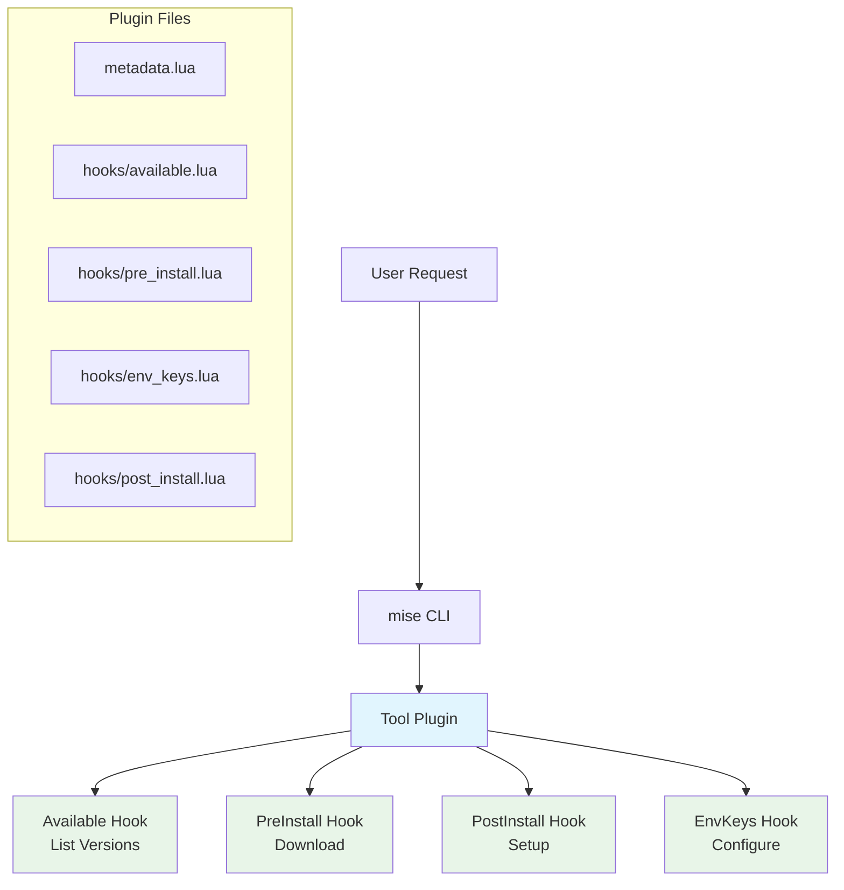

# Tool Plugin Development

Tool plugins use a hook-based architecture to manage individual tools. They are compatible with the standard vfox ecosystem and are perfect for tools that need complex installation logic, environment configuration, or legacy file parsing.

## What are Tool Plugins?

Tool plugins use traditional hook functions to manage a single tool. They provide:

- **Standard vfox Compatibility**: Works with both mise and vfox
- **Complex Installation Logic**: Handle source compilation, custom builds, and complex setups
- **Environment Configuration**: Set up complex environment variables beyond just PATH
- **Legacy File Support**: Parse version files from other tools (`.nvmrc`, `.tool-version`, etc.)
- **Cross-Platform Support**: Works on Windows, macOS, and Linux

## Plugin Architecture

Tool plugins use a hook-based architecture with specific functions for different lifecycle events:



## Hook Functions

### Required Hooks

These hooks must be implemented for a functional plugin:

#### Available Hook

Lists all available versions of the tool:

```lua
-- hooks/available.lua
function PLUGIN:Available(ctx)
    local args = ctx.args  -- User arguments
    
    -- Return array of available versions
    return {
        {
            version = "20.0.0",
            note = "Latest"
        },
        {
            version = "18.18.0",
            note = "LTS",
            addition = {
                {
                    name = "npm",
                    version = "9.8.1"
                }
            }
        }
    }
end
```

#### PreInstall Hook

Handles pre-installation logic and returns download information:

```lua
-- hooks/pre_install.lua
function PLUGIN:PreInstall(ctx)
    local version = ctx.version
    local runtimeVersion = ctx.runtimeVersion
    
    -- Determine download URL and checksums
    local url = "https://nodejs.org/dist/v" .. version .. "/node-v" .. version .. "-linux-x64.tar.gz"
    
    return {
        version = version,
        url = url,
        sha256 = "abc123...",  -- Optional checksum
        note = "Installing Node.js " .. version,
        -- Additional files can be specified
        addition = {
            {
                name = "npm",
                url = "https://registry.npmjs.org/npm/-/npm-" .. npm_version .. ".tgz"
            }
        }
    }
end
```

#### EnvKeys Hook

Configures environment variables for the installed tool:

```lua
-- hooks/env_keys.lua
function PLUGIN:EnvKeys(ctx)
    local mainPath = ctx.path
    local runtimeVersion = ctx.runtimeVersion
    local sdkInfo = ctx.sdkInfo['nodejs']
    local path = sdkInfo.path
    local version = sdkInfo.version
    local name = sdkInfo.name
    
    return {
        {
            key = "NODE_HOME",
            value = mainPath
        },
        {
            key = "PATH",
            value = mainPath .. "/bin"
        },
        -- Multiple PATH entries are automatically merged
        {
            key = "PATH", 
            value = mainPath .. "/lib/node_modules/.bin"
        }
    }
end
```

### Optional Hooks

These hooks provide additional functionality:

#### PostInstall Hook

Performs additional setup after installation:

```lua
-- hooks/post_install.lua
function PLUGIN:PostInstall(ctx)
    local rootPath = ctx.rootPath
    local runtimeVersion = ctx.runtimeVersion
    local sdkInfo = ctx.sdkInfo['nodejs']
    local path = sdkInfo.path
    local version = sdkInfo.version
    
    -- Compile native modules, set permissions, etc.
    local result = os.execute("chmod +x " .. path .. "/bin/*")
    if result ~= 0 then
        error("Failed to set permissions")
    end
    
    -- No return value needed
end
```

#### PreUse Hook

Modifies version before use:

```lua
-- hooks/pre_use.lua
function PLUGIN:PreUse(ctx)
    local version = ctx.version
    local previousVersion = ctx.previousVersion
    local installedSdks = ctx.installedSdks
    local cwd = ctx.cwd
    local scope = ctx.scope  -- global/project/session
    
    -- Optionally modify the version
    if version == "latest" then
        version = "20.0.0"  -- Resolve to specific version
    end
    
    return {
        version = version
    }
end
```

#### ParseLegacyFile Hook

Parses version files from other tools:

```lua
-- hooks/parse_legacy_file.lua
function PLUGIN:ParseLegacyFile(ctx)
    local filename = ctx.filename
    local filepath = ctx.filepath
    local versions = ctx:getInstalledVersions()
    
    -- Read and parse the file
    local file = require("file")
    local content = file.read(filepath)
    local version = content:match("v?([%d%.]+)")
    
    return {
        version = version
    }
end
```

## Creating a Tool Plugin

### 1. Plugin Structure

Create a directory with this structure:

```
nodejs-plugin/
├── metadata.lua          # Plugin metadata and configuration
├── hooks/               # Hook functions directory
│   ├── available.lua    # List available versions [required]
│   ├── pre_install.lua  # Pre-installation hook [required]
│   ├── env_keys.lua     # Environment configuration [required]
│   ├── post_install.lua # Post-installation hook [optional]
│   ├── pre_use.lua      # Pre-use hook [optional]
│   └── parse_legacy_file.lua # Legacy file parser [optional]
├── lib/                 # Shared library code [optional]
│   └── helper.lua       # Helper functions
└── test/               # Test scripts [optional]
    └── test.sh
```

### 2. metadata.lua

Configure plugin metadata and legacy file support:

```lua
-- metadata.lua
PLUGIN = {
    name = "nodejs",
    version = "1.0.0",
    description = "Node.js runtime environment",
    author = "Plugin Author",
    
    -- Legacy version files this plugin can parse
    legacyFilenames = {
        '.nvmrc',
        '.node-version'
    }
}
```

### 3. Helper Libraries

Create shared functions in the `lib/` directory:

```lua
-- lib/helper.lua
local M = {}

function M.get_arch()
    local arch = os.getenv("PROCESSOR_ARCHITECTURE") or os.capture("uname -m")
    if arch:match("x86_64") or arch:match("AMD64") then
        return "x64"
    elseif arch:match("i386") or arch:match("i686") then
        return "x86"
    elseif arch:match("arm64") or arch:match("aarch64") then
        return "arm64"
    else
        return "x64"  -- default
    end
end

function M.get_os()
    if package.config:sub(1,1) == '\\' then
        return "win"
    else
        local os_name = os.capture("uname"):lower()
        if os_name:find("darwin") then
            return "darwin"
        else
            return "linux"
        end
    end
end

function M.get_platform()
    return M.get_os() .. "-" .. M.get_arch()
end

return M
```

## Real-World Example: vfox-nodejs

Here's a complete example based on the vfox-nodejs plugin that demonstrates all the concepts:

### Available Hook Example

```lua
-- hooks/available.lua
function PLUGIN:Available(ctx)
    local http = require("http")
    local json = require("json")
    
    -- Fetch versions from Node.js API
    local resp, err = http.get({
        url = "https://nodejs.org/dist/index.json"
    })
    
    if err ~= nil then
        error("Failed to fetch versions: " .. err)
    end
    
    local versions = json.decode(resp.body)
    local result = {}
    
    for i, v in ipairs(versions) do
        local version = v.version:gsub("^v", "")  -- Remove 'v' prefix
        local note = nil
        
        if v.lts then
            note = "LTS"
        end
        
        table.insert(result, {
            version = version,
            note = note,
            addition = {
                {
                    name = "npm",
                    version = v.npm
                }
            }
        })
    end
    
    return result
end
```

### PreInstall Hook Example

```lua
-- hooks/pre_install.lua
function PLUGIN:PreInstall(ctx)
    local version = ctx.version
    local helper = require("lib/helper")
    
    -- Determine platform
    local platform = helper.get_platform()
    local extension = platform:match("win") and "zip" or "tar.gz"
    
    -- Build download URL
    local filename = "node-v" .. version .. "-" .. platform .. "." .. extension
    local url = "https://nodejs.org/dist/v" .. version .. "/" .. filename
    
    -- Fetch checksum
    local http = require("http")
    local shasums_url = "https://nodejs.org/dist/v" .. version .. "/SHASUMS256.txt"
    local resp, err = http.get({ url = shasums_url })
    
    local sha256 = nil
    if err == nil then
        -- Extract SHA256 for our file
        for line in resp.body:gmatch("[^\n]+") do
            if line:match(filename) then
                sha256 = line:match("^(%w+)")
                break
            end
        end
    end
    
    return {
        version = version,
        url = url,
        sha256 = sha256,
        note = "Installing Node.js " .. version .. " (" .. platform .. ")"
    }
end
```

### EnvKeys Hook Example

```lua
-- hooks/env_keys.lua
function PLUGIN:EnvKeys(ctx)
    local mainPath = ctx.path
    local helper = require("lib/helper")
    local os_type = helper.get_os()
    
    local env_vars = {
        {
            key = "NODE_HOME",
            value = mainPath
        },
        {
            key = "PATH",
            value = mainPath .. "/bin"
        }
    }
    
    -- Add npm global modules to PATH
    local npm_global_path = mainPath .. "/lib/node_modules/.bin"
    if os_type == "win" then
        npm_global_path = mainPath .. "/node_modules/.bin"
    end
    
    table.insert(env_vars, {
        key = "PATH",
        value = npm_global_path
    })
    
    return env_vars
end
```

### PostInstall Hook Example

```lua
-- hooks/post_install.lua
function PLUGIN:PostInstall(ctx)
    local sdkInfo = ctx.sdkInfo['nodejs']
    local path = sdkInfo.path
    local helper = require("lib/helper")
    
    -- Set executable permissions on Unix systems
    if helper.get_os() ~= "win" then
        os.execute("chmod +x " .. path .. "/bin/*")
    end
    
    -- Create npm cache directory
    local npm_cache_dir = path .. "/.npm"
    os.execute("mkdir -p " .. npm_cache_dir)
    
    -- Configure npm to use local cache
    local npm_cmd = path .. "/bin/npm"
    if helper.get_os() == "win" then
        npm_cmd = path .. "/npm.cmd"
    end
    
    os.execute(npm_cmd .. " config set cache " .. npm_cache_dir)
    os.execute(npm_cmd .. " config set prefix " .. path)
end
```

### Legacy File Support

```lua
-- hooks/parse_legacy_file.lua
function PLUGIN:ParseLegacyFile(ctx)
    local filename = ctx.filename
    local filepath = ctx.filepath
    local file = require("file")
    
    -- Read file content
    local content = file.read(filepath)
    if not content then
        error("Failed to read " .. filepath)
    end
    
    -- Parse version from different file formats
    local version = nil
    
    if filename == ".nvmrc" then
        -- .nvmrc can contain version with or without 'v' prefix
        version = content:match("v?([%d%.]+)")
    elseif filename == ".node-version" then
        -- .node-version typically contains just the version number
        version = content:match("([%d%.]+)")
    end
    
    -- Remove any whitespace
    if version then
        version = version:gsub("%s+", "")
    end
    
    return {
        version = version
    }
end
```

## Testing Your Plugin

### Local Development

```bash
# Link your plugin for development
mise plugin link nodejs /path/to/nodejs-plugin

# Test listing versions
mise ls-remote nodejs

# Test installation
mise install nodejs@20.0.0

# Test environment setup
mise use nodejs@20.0.0
node --version

# Test legacy file parsing
echo "18.18.0" > .nvmrc
mise use nodejs
```

### Debug Mode

Use debug mode to see detailed plugin execution:

```bash
mise --debug install nodejs@20.0.0
```

### Plugin Test Script

Create a comprehensive test script:

```bash
#!/bin/bash
# test/test.sh
set -e

echo "Testing nodejs plugin..."

# Install the plugin
mise plugin install nodejs .

# Test basic functionality
mise install nodejs@18.18.0
mise use nodejs@18.18.0

# Verify installation
node --version | grep "18.18.0"
npm --version

# Test legacy file support
echo "20.0.0" > .nvmrc
mise use nodejs
node --version | grep "20.0.0"

# Clean up
rm -f .nvmrc
mise plugin remove nodejs

echo "All tests passed!"
```

## Best Practices

### Error Handling

Always provide meaningful error messages:

```lua
function PLUGIN:Available(ctx)
    local http = require("http")
    local resp, err = http.get({
        url = "https://api.example.com/versions"
    })
    
    if err ~= nil then
        error("Failed to fetch versions from API: " .. err)
    end
    
    if resp.status_code ~= 200 then
        error("API returned status " .. resp.status_code .. ": " .. resp.body)
    end
    
    -- Process response...
end
```

### Platform Detection

Handle different operating systems properly:

```lua
-- lib/platform.lua
local M = {}

function M.is_windows()
    return package.config:sub(1,1) == '\\'
end

function M.get_exe_extension()
    return M.is_windows() and ".exe" or ""
end

function M.get_path_separator()
    return M.is_windows() and "\\" or "/"
end

return M
```

### Version Normalization

Normalize versions consistently:

```lua
local function normalize_version(version)
    -- Remove 'v' prefix if present
    version = version:gsub("^v", "")
    
    -- Remove pre-release suffixes
    version = version:gsub("%-.*", "")
    
    return version
end
```

### Caching

Cache expensive operations:

```lua
-- Cache versions for 12 hours
local cache = {}
local cache_ttl = 12 * 60 * 60  -- 12 hours in seconds

function PLUGIN:Available(ctx)
    local now = os.time()
    
    -- Check cache first
    if cache.versions and cache.timestamp and (now - cache.timestamp) < cache_ttl then
        return cache.versions
    end
    
    -- Fetch fresh data
    local versions = fetch_versions_from_api()
    
    -- Update cache
    cache.versions = versions
    cache.timestamp = now
    
    return versions
end
```

## Advanced Features

### Conditional Installation

Different installation logic based on platform or version:

```lua
function PLUGIN:PreInstall(ctx)
    local version = ctx.version
    local helper = require("lib/helper")
    local platform = helper.get_platform()
    
    -- Different logic for different platforms
    if platform:match("win") then
        -- Windows-specific installation
        return install_windows(version)
    elseif platform:match("darwin") then
        -- macOS-specific installation
        return install_macos(version)
    else
        -- Linux installation
        return install_linux(version)
    end
end
```

### Source Compilation

For plugins that need to compile from source:

```lua
-- hooks/post_install.lua
function PLUGIN:PostInstall(ctx)
    local sdkInfo = ctx.sdkInfo['tool-name']
    local path = sdkInfo.path
    local version = sdkInfo.version
    
    -- Change to source directory
    local build_dir = path .. "/src"
    
    -- Configure build
    local configure_result = os.execute("cd " .. build_dir .. " && ./configure --prefix=" .. path)
    if configure_result ~= 0 then
        error("Configure failed")
    end
    
    -- Compile
    local make_result = os.execute("cd " .. build_dir .. " && make -j$(nproc)")
    if make_result ~= 0 then
        error("Compilation failed")
    end
    
    -- Install
    local install_result = os.execute("cd " .. build_dir .. " && make install")
    if install_result ~= 0 then
        error("Installation failed")
    end
end
```

### Environment Configuration

Complex environment variable setup:

```lua
function PLUGIN:EnvKeys(ctx)
    local mainPath = ctx.path
    local version = ctx.sdkInfo['tool-name'].version
    
    local env_vars = {
        -- Standard environment variables
        {
            key = "TOOL_HOME",
            value = mainPath
        },
        {
            key = "TOOL_VERSION",
            value = version
        },
        
        -- PATH entries
        {
            key = "PATH",
            value = mainPath .. "/bin"
        },
        {
            key = "PATH",
            value = mainPath .. "/scripts"
        },
        
        -- Library paths
        {
            key = "LD_LIBRARY_PATH",
            value = mainPath .. "/lib"
        },
        {
            key = "PKG_CONFIG_PATH",
            value = mainPath .. "/lib/pkgconfig"
        }
    }
    
    -- Platform-specific additions
    local helper = require("lib/helper")
    if helper.get_os() == "darwin" then
        table.insert(env_vars, {
            key = "DYLD_LIBRARY_PATH",
            value = mainPath .. "/lib"
        })
    end
    
    return env_vars
end
```

## Next Steps

- [Learn about Backend Plugin Development](backend-plugin-development.md)
- [Explore available Lua modules](plugin-lua-modules.md)
- [Publishing your plugin](plugin-publishing.md)
- [View the vfox-nodejs plugin source](https://github.com/version-fox/vfox-nodejs)
