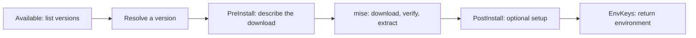

# Tool plugins

A tool plugin is a set of Lua hooks that tells mise how to list a tool's
versions, download and verify one, and set up its environment. Write one when
no [backend](/dev-tools/backends/) can install the tool; for a family of tools,
write a [backend plugin](/backend-plugin-development.html) instead.

A tool plugin can download archives, build from source, set environment
variables and read version files such as `.example-version`. Tool plugins use
the same hooks as [vfox](https://vfox.dev) plugins and run on mise's built-in
Lua 5.1. If you also publish for the vfox CLI, test there too; see
[Differences from vfox](#differences-from-vfox).

## Quick start {#quick-start}

Create a repository from the
[tool plugin template](https://github.com/jdx/mise-tool-plugin-template), either
with **Use this template** on GitHub or with the GitHub CLI:

```sh
gh repo create mise-example --template jdx/mise-tool-plugin-template --public --clone
```

A tool plugin has this layout:

```text
mise-example/
├── metadata.lua                    # name, version, version files, dependencies
├── hooks/
│   ├── available.lua               # required: list versions
│   ├── pre_install.lua             # required: describe the download
│   ├── env_keys.lua                # required: set the environment
│   ├── post_install.lua            # optional: finish the install
│   ├── mise_install_satisfied.lua  # optional: check an install against its options
│   ├── pre_uninstall.lua           # optional: clean up before removal
│   └── parse_legacy_file.lua       # optional: read idiomatic version files
└── lib/                            # optional: modules for require()
```

Link your working copy under the name users type, then try it in an empty
project:

```sh
mise plugins link example ./mise-example
mise ls-remote example
mise use example@1.10.0
mise exec -- example --version
```

## Complete example {#complete-example}

This plugin installs a CLI named `example` whose publisher lists its releases,
newest first, in `releases.json` and puts each release's archives and a
`SHA256SUMS` file in a directory named after the version:

```text
https://downloads.example.com/example/releases.json
https://downloads.example.com/example/1.10.0/example-1.10.0-linux-x64.tar.gz
https://downloads.example.com/example/1.10.0/SHA256SUMS
```

```lua [metadata.lua]
PLUGIN = {
    name = "example",
    version = "0.1.0",
    description = "Install the example CLI",
    legacyFilenames = { ".example-version" },
}
```

```lua [lib/release.lua]
local M = {}

M.base_url = "https://downloads.example.com/example"

-- The publisher names macOS "macos" and x86-64 "x64"; RUNTIME says
-- "darwin" and "amd64". Map only the platforms the publisher builds for.
function M.asset_name(version)
    local os_names = { darwin = "macos", linux = "linux", windows = "windows" }
    local arch_names = { amd64 = "x64", arm64 = "arm64" }
    local os_name = os_names[RUNTIME.osType] or error("unsupported OS: " .. RUNTIME.osType)
    local arch = arch_names[RUNTIME.archType] or error("unsupported architecture: " .. RUNTIME.archType)
    return "example-" .. version .. "-" .. os_name .. "-" .. arch .. ".tar.gz"
end

-- Find one file's SHA-256 in a SHA256SUMS body. Compare names exactly:
-- "." and "-" are pattern characters, so line:match(filename) is not exact.
function M.find_checksum(body, filename)
    for line in body:gmatch("[^\r\n]+") do
        local digest, name = line:match("^(%x+)%s+%*?(.+)$")
        if name == filename and #digest == 64 then
            return digest
        end
    end
    error("no SHA-256 for " .. filename)
end

return M
```

```lua [hooks/available.lua]
local http = require("http")
local json = require("json")
local release = require("release")

function PLUGIN:Available(ctx)
    local resp = http.get({ url = release.base_url .. "/releases.json" })
    if resp.status_code ~= 200 then
        error("fetching releases.json failed: HTTP " .. resp.status_code)
    end
    local result = {}
    -- releases.json lists the newest release first; keep that order
    for _, r in ipairs(json.decode(resp.body)) do
        table.insert(result, { version = r.version })
    end
    return result
end
```

```lua [hooks/pre_install.lua]
local http = require("http")
local release = require("release")

function PLUGIN:PreInstall(ctx)
    local dir = release.base_url .. "/" .. ctx.version .. "/"
    local filename = release.asset_name(ctx.version)
    local sums = http.get({ url = dir .. "SHA256SUMS" })
    if sums.status_code ~= 200 then
        error("fetching SHA256SUMS failed: HTTP " .. sums.status_code)
    end
    return {
        version = ctx.version,
        url = dir .. filename,
        sha256 = release.find_checksum(sums.body, filename),
    }
end
```

```lua [hooks/env_keys.lua]
function PLUGIN:EnvKeys(ctx)
    local file = require("file")
    return {
        { key = "EXAMPLE_HOME", value = ctx.path },
        { key = "PATH", value = file.join_path(ctx.path, "bin") },
    }
end
```

`mise use example@1.10.0` calls `Available` to resolve the request, then
`PreInstall`. mise downloads the archive, checks it against the SHA-256,
extracts it into the install directory and calls `EnvKeys` to put `bin` on
`PATH` and set `EXAMPLE_HOME`. `mise ls-remote example` lists the versions
oldest first.

## How mise runs a tool plugin {#plugin-architecture}


```mermaid
flowchart LR
    A[Available: list versions] --> B[Resolve a version]
    B --> C[PreInstall: describe the download]
    C --> D[mise: download, verify, extract]
    D --> E[PostInstall: optional setup]
    E --> F[EnvKeys: return environment]
```

`Available`, `PreInstall` and `PostInstall` run only while mise lists or installs
versions. `EnvKeys` runs when mise builds the environment for an installed
version. mise caches its result for each version and set of options, so keep it
fast and free of side effects.

Hooks can use the `http`, `json`, `file`, `archiver`, `cmd` and other modules
in the [Plugin Lua reference](/plugin-lua-modules.html), and the
[`RUNTIME`](/plugin-lua-modules.html#runtime) global that describes the
platform.

## Hooks {#hook-functions}

| Hook                   | File                               | Required | mise calls it                                                     |
| ---------------------- | ---------------------------------- | -------- | ----------------------------------------------------------------- |
| `Available`            | `hooks/available.lua`              | yes      | to list versions (`mise ls-remote`, resolving `latest` or `1.10`) |
| `PreInstall`           | `hooks/pre_install.lua`            | yes      | to get the download for one version                               |
| `EnvKeys`              | `hooks/env_keys.lua`               | yes      | to build the environment for an installed version                 |
| `PostInstall`          | `hooks/post_install.lua`           | no       | after the download is extracted                                   |
| `MiseInstallSatisfied` | `hooks/mise_install_satisfied.lua` | no       | to check an installed version against its options                 |
| `PreUninstall`         | `hooks/pre_uninstall.lua`          | no       | before mise removes an installed version                          |
| `ParseLegacyFile`      | `hooks/parse_legacy_file.lua`      | no       | to read a version file listed in `legacyFilenames`                |

A hook fails by raising an error with `error()`. mise stops and shows the
message, except where a hook's section below says otherwise.

### Available {#available-hook}

| `ctx` field | Value                        |
| ----------- | ---------------------------- |
| `args`      | Always an empty list in mise |

Return a list of tables, newest first, ordered by the publisher's release
policy:

| Field      | Required | Value                                                              |
| ---------- | -------- | ------------------------------------------------------------------ |
| `version`  | yes      | The version string, unchanged apart from a documented prefix       |
| `rolling`  | no       | `true` for a channel whose contents change, such as `nightly`      |
| `checksum` | no       | For a rolling channel, the SHA-256 of the current platform's asset |

mise reverses the list into its own oldest-first order. `BackendListVersions` in
a backend plugin returns oldest first instead. `Available` receives no tool
options, so the version list cannot depend on them.

#### Rolling releases {#rolling-releases}

For a channel whose contents change without its name changing, return
`rolling = true` and the checksum of the asset it currently points to:

```lua [hooks/available.lua]
function PLUGIN:Available(ctx)
    return {
        -- nightly_sha256() is your own helper that reads the publisher's
        -- checksum for this platform's nightly asset
        { version = "nightly", rolling = true, checksum = nightly_sha256() },
        { version = "1.10.0" },
    }
end
```

`mise upgrade` and `mise outdated` compare this checksum with the `sha256` that
`PreInstall` returned when the channel was installed, so both hooks must report
the same SHA-256 of the current platform's asset. If `PreInstall` returns no
`sha256`, the channel is always reported as outdated. If `Available` returns no
checksum, mise cannot tell that the channel changed. `mise upgrade --bump` keeps
the channel name.

### PreInstall {#preinstall-hook}

| `ctx` field | Value                                                 |
| ----------- | ----------------------------------------------------- |
| `version`   | The resolved version to install, such as `"1.10.0"`   |
| `options`   | The tool's options; see [Tool options](#tool-options) |

Return a table:

| Field                | Required | Value                                                                          |
| -------------------- | -------- | ------------------------------------------------------------------------------ |
| `version`            | yes      | The version, normally `ctx.version`                                            |
| `url`                | no       | The file to download                                                           |
| `sha256` or `sha512` | no       | The file's checksum; return one with every `url`                               |
| `sha1` or `md5`      | no       | Weaker checksums, also checked                                                 |
| `attestation`        | no       | A signature or provenance to verify; see [Verify downloads](#verify-downloads) |

mise downloads `url`, checks every checksum and attestation you return, and
extracts the file into the install directory. It extracts `.tar.gz`, `.tgz`,
`.tar.xz`, `.txz`, `.tar.bz2`, `.tbz2`, `.tbz` and `.zip` archives, and when an
archive holds a single top-level directory, that directory's contents become
the install directory. Any other file is moved into the install directory and
marked executable. Without a `url`, mise downloads nothing and `PostInstall`
does the install, as in a build from source.

mise also calls `PreInstall` to record download URLs in `mise.lock` for other
platforms. `RUNTIME` then describes the target platform, so build the URL from
`RUNTIME` and do not probe the host or install anything in this hook.

#### Verify downloads {#verify-downloads}

Return `sha256` or `sha512` for every URL. mise also checks `sha1` and `md5`,
but only SHA-256 and SHA-512 are strong enough to stand in for an attestation
that `mise.lock` recorded. A checksum fetched from the same server as the
download catches a corrupted file, not a compromised server; a signature or
attestation does.

When the publisher signs its releases, return an `attestation` table as well.
mise verifies it during the install and records the method in `mise.lock`, so a
later install that cannot verify the same way fails instead of downgrading:

```lua
return {
    version = ctx.version,
    url = url,
    sha256 = sha256,
    attestation = {
        github_owner = "your-org",
        github_repo = "example",
        -- optional: accept only artifacts built by this workflow
        github_signer_workflow = "your-org/example/.github/workflows/release.yml",
    },
}
```

| Fields                                                                                                                                        | Verifies                                                                                                                                              |
| --------------------------------------------------------------------------------------------------------------------------------------------- | ----------------------------------------------------------------------------------------------------------------------------------------------------- |
| `github_owner`, `github_repo`, optional `github_signer_workflow`                                                                              | A GitHub artifact attestation. Users need `MISE_GITHUB_TOKEN` or `GITHUB_TOKEN` in the environment; without one the install fails.                    |
| `cosign_sig_or_bundle_path`, `cosign_public_key_path`                                                                                         | A cosign signature made with a key.                                                                                                                   |
| `cosign_sig_or_bundle_path`, `cosign_certificate_identity` or `cosign_certificate_identity_regexp`, optional `cosign_certificate_oidc_issuer` | A keyless cosign signature. The identity is required, because any GitHub Actions workflow can get a valid Fulcio certificate.                         |
| `slsa_provenance_path`, `slsa_signer_identity`, `slsa_signer_issuer`, optional `slsa_min_level`                                               | SLSA provenance. `slsa_signer_identity` is the exact certificate subject URI, including the workflow ref. mise skips SLSA without both signer fields. |

### EnvKeys {#envkeys-hook}

| `ctx` field | Value                                                 |
| ----------- | ----------------------------------------------------- |
| `path`      | The install directory                                 |
| `version`   | The installed version                                 |
| `main`      | `{ name, version, path }` for this install            |
| `sdkInfo`   | The same table, keyed by the plugin name              |
| `options`   | The tool's options; see [Tool options](#tool-options) |

Return a list of `{ key = ..., value = ... }` tables. Return each `PATH`
directory as its own entry, not a full `PATH`; mise joins repeated keys with the
platform's path separator. If you return no `PATH` entry, mise adds the install
directory's `bin`.

Executables are often in `bin` on Linux and macOS but at the top of the archive
on Windows:

```lua [hooks/env_keys.lua]
function PLUGIN:EnvKeys(ctx)
    local file = require("file")
    local bin = RUNTIME.osType == "windows" and ctx.path or file.join_path(ctx.path, "bin")
    return {
        { key = "EXAMPLE_HOME", value = ctx.path },
        { key = "PATH", value = bin },
    }
end
```

Return only the variables the tool needs. A variable such as `LD_LIBRARY_PATH`
affects every program started in the environment. For variables that do not
belong to a tool version, write an [environment plugin](/env-plugin-development.html).

### PostInstall {#postinstall-hook}

| `ctx` field      | Value                                                                     |
| ---------------- | ------------------------------------------------------------------------- |
| `rootPath`       | The install directory                                                     |
| `runtimeVersion` | The resolved version being installed, the same as `sdkInfo[name].version` |
| `sdkInfo`        | `{ name, version, path }` for this install, keyed by the plugin name      |
| `options`        | The tool's options; see [Tool options](#tool-options)                     |

`PostInstall` returns nothing. mise calls it after it extracts the download, or
instead of a download when `PreInstall` returns no `url`:

```lua [hooks/post_install.lua]
function PLUGIN:PostInstall(ctx)
    local file = require("file")
    if not file.exists(file.join_path(ctx.rootPath, "bin", "example")) then
        error("expected bin/example in the archive")
    end
end
```

To build from source, compile here, not in `PreInstall`. Declare the compilers
and libraries the build needs in [`systemDependencies`](#system-dependencies),
run commands with `cmd.exec` and its `cwd` option, and pass paths as quoted
arguments or environment variables. Say in your README whether the build needs
a POSIX shell: `nproc`, `chmod` and `./configure` do not work on Windows.

### MiseInstallSatisfied {#miseinstallsatisfied-hook}

| `ctx` field | Value                                                       |
| ----------- | ----------------------------------------------------------- |
| `path`      | The install directory                                       |
| `version`   | The installed version                                       |
| `options`   | The current tool options; see [Tool options](#tool-options) |

Some tools keep install state that depends on tool options, such as add-on
components that `PostInstall` installs. Without this hook, mise treats a version
as installed once its directory exists, so a changed option has no effect until
the user runs `mise install --force`, which downloads the tool again.

`MiseInstallSatisfied` reports whether an installed version still matches the
request. mise calls it whenever it decides whether a tool needs installing,
including `mise install` and auto-install, so inspect files under `ctx.path`
rather than running the tool or making network requests:

```lua [hooks/mise_install_satisfied.lua]
function PLUGIN:MiseInstallSatisfied(ctx)
    local file = require("file")
    for _, name in ipairs(ctx.options.components or {}) do
        if not file.exists(file.join_path(ctx.path, "components", name)) then
            return { satisfied = false, reason = "missing component " .. name }
        end
    end
    return { satisfied = true }
end
```

Return `{ satisfied = false, reason = "..." }` or `false` when the install needs
updating, and `{ satisfied = true }`, `true` or nothing when it does not. On
`false`, mise runs `PostInstall` again on the existing install, without
`PreInstall`, a download or removing the install directory, so `PostInstall`
must be safe to run twice. After that and the tool's `postinstall` command, mise
calls `MiseInstallSatisfied` again and fails with `reason` if the install still
does not match. The install stays in place either way, and
`mise install --force` still reinstalls from scratch.

`reason` appears in debug output (`MISE_DEBUG=1`). If the hook raises an error,
mise warns and treats the install as current, so a broken check cannot trigger
work on every command.

### PreUninstall {#preuninstall-hook}

| `ctx` field | Value                                                   |
| ----------- | ------------------------------------------------------- |
| `main`      | `{ name, version, path }` for the install being removed |
| `sdkInfo`   | The same table, keyed by the plugin name                |

mise calls `PreUninstall` before it removes an installed version, in
`mise uninstall`, `mise upgrade` and `mise prune`. Use it to undo changes the
plugin made outside the install directory; the directory still exists while the
hook runs. The hook returns nothing and receives no tool options. If it raises
an error, mise stops and keeps the install directory, so the user can retry.

```lua [hooks/pre_uninstall.lua]
function PLUGIN:PreUninstall(ctx)
    -- PostInstall recorded this version in a file outside the install directory
    os.remove(os.getenv("HOME") .. "/.example/versions/" .. ctx.main.version)
end
```

### ParseLegacyFile {#parselegacyfile-hook}

| `ctx` field              | Value                                                                                  |
| ------------------------ | -------------------------------------------------------------------------------------- |
| `filename`               | The file's name, such as `.example-version`                                            |
| `filepath`               | The file's full path                                                                   |
| `getInstalledVersions()` | Despite its name, calls `Available` and returns those versions; it can use the network |

vfox calls these legacy files; mise calls them
[idiomatic version files](/dev-tools/versions.html#idiomatic-version-files). List
the file names in `legacyFilenames` in `metadata.lua`, and return
`{ version = ... }` with the request as written:

```lua [hooks/parse_legacy_file.lua]
function PLUGIN:ParseLegacyFile(ctx)
    local file = require("file")
    local line = file.read(ctx.filepath):match("^%s*([^\r\n]+)")
    return { version = line and line:match("^(.-)%s*$") }
end
```

This parser reads the first line as the request, including channels and
prereleases, and trims the spaces around it. Adapt it to the file's real format.
mise splits the returned string on whitespace, so `"1.2.0 1.10.0"` requests
both versions.

mise reads idiomatic version files only for tools listed in the
[`idiomatic_version_file_enable_tools`](/configuration/settings.html#idiomatic_version_file_enable_tools)
setting, so tell users to add your plugin's name to it.

## metadata.lua {#metadata-lua}

`metadata.lua` sets the global `PLUGIN` table with at least `name` and
`version`; the Lua reference lists [every field](/plugin-lua-modules.html#metadata).
mise caches what a tool plugin declares there until one of the plugin's Lua
files changes. Do not probe the host in `metadata.lua`: a shell-out slows down
many commands, and its cached answer goes stale after an OS upgrade.

### depends {#depends}

`depends` lists tools the plugin needs, by their `mise.toml` names:

```lua [metadata.lua]
PLUGIN = {
    name = "example",
    version = "0.1.0",
    depends = { "go" },
}
```

When the project configures a listed tool, mise installs it before this
plugin's tool and puts it on `PATH` for the commands the hooks run with
`cmd.exec` and `os.execute`, but not `io.popen`. While the tool installs, those
commands also see `[env]` values marked `tools = true`. `depends` does not
choose a version or install a tool the project does not configure; an
unconfigured one can still come from the existing `PATH`. Do not list the
plugin's own tool.

Users can add more with the [`depends` tool option](/dev-tools/#tool-dependencies);
mise combines both lists. Backend plugins declare `depends` the same way.

### System dependencies {#system-dependencies}

Plugins that compile from source can list the libraries and build tools they
need in `systemDependencies`. Before installing, mise checks each one and
handles anything missing according to the
[`system_deps`](/configuration/settings.html#system_deps) setting: report it,
offer to install it, or install it.

```lua [metadata.lua]
PLUGIN = {
    name = "example",
    version = "0.1.0",

    systemDependencies = {
        -- an executable on PATH, with an optional version constraint
        { bin = "bison", version = ">=3.0",
          packages = { brew = "bison", apt = "bison", dnf = "bison" } },
        { bin = "re2c",
          packages = { brew = "re2c", apt = "re2c", dnf = "re2c" } },

        -- a library that pkg-config can find
        { pkgconfig = "libxml-2.0",
          packages = { brew = "libxml2", apt = "libxml2-dev", dnf = "libxml2-devel" } },

        -- a shared library by soname (Linux). apt renamed this package in the
        -- 64-bit time_t transition, so list both names, newest first.
        { sharedlib = "libaio.so.1",
          packages = { apt = { "libaio1t64", "libaio1" }, dnf = "libaio" } },

        -- any shell command that exits 0 when the dependency is present
        { command = "xcode-select -p", optional = "macOS command line tools" },
    },
}
```

Each entry sets exactly one check:

| Check       | Passes when                                    | Use for                                    |
| ----------- | ---------------------------------------------- | ------------------------------------------ |
| `bin`       | the executable is on `PATH`                    | compilers, build tools, `*-config` scripts |
| `pkgconfig` | `pkg-config --exists <name>` succeeds          | C libraries that ship a `.pc` file         |
| `sharedlib` | the dynamic linker can find the soname (Linux) | runtime libraries for prebuilt binaries    |
| `command`   | the shell command exits `0`                    | anything the other checks cannot express   |

- `version`: a constraint for `bin` and `pkgconfig`, such as `>=3.0`, `>3`,
  `<=1.2` or `=3.0`; a bare `3.0` means `>=3.0`. mise reads the version from
  `<bin> --version` or `pkg-config --modversion`, and treats the dependency as
  satisfied when it cannot read one.
- `optional`: a short reason, such as `"wxWidgets GUI"`. A missing optional
  dependency prints one line and never prompts or fails the install.
- `packages`: the package that provides the dependency, for each package
  manager that has one. Keys are any package manager mise knows, such as
  `brew`, `brew-cask`, `apt`, `dnf`, `zypper`, `pacman`, `aur`, `apk`, `nix`,
  `flatpak`, `flatpak-user`, `mas`, `scoop`, `winget`, or an installed package
  manager plugin's name. mise uses the first available manager that has an
  entry. For a list of names, `apt` installs the first one it offers, and the
  other managers use the first entry.

A passing check is enough: mise does not care how the dependency was installed,
and uses `packages` only to install what is missing. Older mise versions ignore
`systemDependencies`.

## Tool options {#tool-options}

`ctx.options` holds the tool's options from `mise.toml` in `PreInstall`,
`PostInstall`, `EnvKeys` and `MiseInstallSatisfied`. `Available` and
`PreUninstall` do not receive them. mise keeps `os`, `depends`, `install_env`,
`lazy`, `lazy_bins` and `auto_update` to itself; every other option reaches the
hooks, including `postinstall` and `minimum_release_age`, which mise also acts
on.

```toml [mise.toml]
[tools]
example = { version = "1.10.0", bundled = false, channels = ["stable", "beta"] }
```

Arrays and tables stay structured, and values inside them keep their TOML types.
Top-level booleans and numbers arrive as strings, so `bundled = false` arrives as
`"false"`, which is truthy in Lua. Compare strings explicitly and convert
numbers with `tonumber`:

```lua [hooks/pre_install.lua]
function PLUGIN:PreInstall(ctx)
    local bundled = ctx.options.bundled == "true"
    for _, channel in ipairs(ctx.options.channels or {}) do
        -- channels is a Lua list
    end
    -- ...
end
```

The install, environment and uninstall hooks, and the commands they run, also
see each option as an environment variable named `MISE_TOOL_OPTS__` and the key
in uppercase, such as `MISE_TOOL_OPTS__BUNDLED`. Arrays and tables appear there
in TOML syntax. Plugins written before `ctx.options` existed read these
variables; new plugins should use `ctx.options`. See
[Plugins](/plugins.html#tool-options) for how users set options.

## Testing {#testing-your-plugin}

Use a separate test project and a plugin name that does not replace a tool you
use:

```sh
mise plugins link example ./mise-example
mise ls-remote example
mise use example@1.10.0
mise exec -- example --version
```

To test a version file, use another empty project with no `[tools]` entry for
the tool, so that the file decides the version:

```toml [mise.toml]
[settings]
idiomatic_version_file_enable_tools = ["example"]
```

Write a request to `.example-version`, run `mise install`, and check
`mise exec -- example --version`. `mise use example` writes a `[tools]` entry, so
it does not test the version file.

When a hook fails, run the command again with debug output. When a cached
version list or environment hides an edit to a hook, clear the tool's cache:

```sh
MISE_DEBUG=1 mise install example@1.10.0
mise cache clear example
```

Before you publish, test version listing, an install, the executable and the
environment on every OS you support, plus an unsupported platform, a missing
checksum, a path with spaces and, if you support them, version files. See
[Publishing plugins](/plugin-publishing.html#testing-before-publication) for an
isolated test setup.

## Common mistakes {#common-mistakes}

- Matching a file name with `line:match(filename)`. `.` and `-` are pattern
  characters; compare strings with `==`, as `find_checksum` does.
- Continuing with `sha256 = nil` after a checksum request fails. Raise an error
  instead.
- Reading a boolean option with `if ctx.options.flag then`. Top-level booleans
  arrive as strings, so `"false"` is true; compare with `== "true"`.
- Stripping more than a documented prefix from versions. Removing `-beta.1` or
  turning `lts/*` into digits changes the request; treat versions as opaque
  strings and do not sort them with a SemVer parser.
- Changing user-wide configuration from `PostInstall`, such as
  `npm config set`. Return environment variables from `EnvKeys` instead.
- Expecting a Lua table to cache data between commands. Each mise command
  starts a new Lua runtime; mise caches version lists and environments itself.
  See [cache behavior](/cache-behavior.html).
- Logging tokens or a response body that contains secrets to explain a failed
  request.

## Differences from vfox {#differences-from-vfox}

- mise never calls `PreUse`. Return environment variables from `EnvKeys`, and
  resolve version requests in `Available`.
- mise installs only the main download from `PreInstall` and ignores
  `addition` entries. Install extra components in `PostInstall`, or declare
  them as tool dependencies.
- mise ignores `headers` in `PreInstall`'s result. It applies its own
  [`url_replacements`](/url-replacements.html) and
  [`netrc`](/configuration/settings.html#netrc) settings to the download.
- mise does not read `minRuntimeVersion`.
- mise ignores `note` in the results of `Available` and `PreInstall`.
- `ctx.args` is always empty.
- `ctx:getInstalledVersions()` in `ParseLegacyFile` calls `Available` instead
  of listing installed versions.
- `rolling` and `checksum` in `Available`, `attestation` in `PreInstall`,
  `ctx.options`, `MiseInstallSatisfied`, `PLUGIN.depends` and
  `systemDependencies` are mise additions that the vfox CLI ignores.

To publish the plugin, see [Publishing plugins](/plugin-publishing.html).
